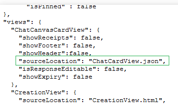

# <a name="customizing-chatcanvascardview"></a><span data-ttu-id="039ee-101">Anpassen von ChatCanvasCardView</span><span class="sxs-lookup"><span data-stu-id="039ee-101">Customizing ChatCanvasCardView</span></span>

<span data-ttu-id="039ee-102">Im Gegensatz zu den Erstellungs-, Antwort-und zusammenfassungsansichten, die HTML sind, sind Chat Ansichten systemeigene Ansichten.</span><span class="sxs-lookup"><span data-stu-id="039ee-102">Unlike the creation, response and summary views that are html, chat views are native views.</span></span> <span data-ttu-id="039ee-103">Zum Anpassen der Chat Kartenansicht müssen Sie eine JSON des Kartenlayouts sowie die Werte in der Ansicht angeben.</span><span class="sxs-lookup"><span data-stu-id="039ee-103">To customize the chat card view, you will need to provide a json of the card layout as well as the values in the view.</span></span> <span data-ttu-id="039ee-104">Fehlt eine angepasste Chat Canvas-Kartenansicht, lautet die standardmäßige Chat Kartenansicht mit dem Text des App-Titels.</span><span class="sxs-lookup"><span data-stu-id="039ee-104">In the absence of a customized chat canvas card view, the default would be chat card view with the text of app title.</span></span> 

## <a name="views-and-their-supported-properties"></a><span data-ttu-id="039ee-105">Ansichten und ihre unterstützten Eigenschaften</span><span class="sxs-lookup"><span data-stu-id="039ee-105">Views and their supported properties</span></span>
<span data-ttu-id="039ee-106">Nachfolgend finden Sie verschiedene Arten von unter Ansichten/Widgets zusammen mit ihren anpassbaren Eigenschaften.</span><span class="sxs-lookup"><span data-stu-id="039ee-106">Below are different types of sub-views/widgets along with their customizable properties.</span></span> <span data-ttu-id="039ee-107">Nur wenige Eigenschaften sind mit <sup>IOS</sup> gekennzeichnet, was darauf hinweist, dass Sie nur für IOS gelten _(und keine Auswirkungen auf Android haben)_.</span><span class="sxs-lookup"><span data-stu-id="039ee-107">Few properties are marked with <sup>iOS</sup>  indicating that they are applicable only on iOS _(and will have no effect on android)_.</span></span>

### <a name="container--view"></a><span data-ttu-id="039ee-108">Container/Ansicht</span><span class="sxs-lookup"><span data-stu-id="039ee-108">Container / View</span></span>

<ol>
<li><span data-ttu-id="039ee-109">ID (optional, muss jedoch eindeutig sein)</span><span class="sxs-lookup"><span data-stu-id="039ee-109">id (optional, but must be unique)</span></span></li>
<li><span data-ttu-id="039ee-110">Visible<sup>IOS</sup></span><span class="sxs-lookup"><span data-stu-id="039ee-110">visible<sup>iOS</sup></span></span></li>
<li><span data-ttu-id="039ee-111">Typ _(einer der unter Ansichtstypen, die wir hier erwähnen)_</span><span class="sxs-lookup"><span data-stu-id="039ee-111">type _(any of the sub-view types we are mentioning here)_</span></span></li>
<li><span data-ttu-id="039ee-112">Margin/marginTop/marginRight/marginBottom/marginLeft</span><span class="sxs-lookup"><span data-stu-id="039ee-112">margin / marginTop / marginRight / marginBottom / marginLeft</span></span></li>
<li><span data-ttu-id="039ee-113">Padding/paddingTop/paddingRight/paddingBottom/paddingLeft</span><span class="sxs-lookup"><span data-stu-id="039ee-113">padding / paddingTop / paddingRight / paddingBottom / paddingLeft</span></span></li>
<li><span data-ttu-id="039ee-114">width</span><span class="sxs-lookup"><span data-stu-id="039ee-114">width</span></span></li>
<li><span data-ttu-id="039ee-115">height</span><span class="sxs-lookup"><span data-stu-id="039ee-115">height</span></span></li>
<li><span data-ttu-id="039ee-116">Gewichtung _(Prozentsatz der Breite/Höhe der übergeordneten Ansicht bei horizontalen/vertikalen Layouts)_</span><span class="sxs-lookup"><span data-stu-id="039ee-116">weight _(%ratio of parent view's width/height in case of horizontal/vertical layouts respectively)_</span></span></li>
<li><span data-ttu-id="039ee-117">Background Color _(nur Hexadezimalcode hier zulässig)_</span><span class="sxs-lookup"><span data-stu-id="039ee-117">backgroundColor  _(only hex code allowed here)_</span></span></li>
<li><span data-ttu-id="039ee-118">cornerRadius</span><span class="sxs-lookup"><span data-stu-id="039ee-118">cornerRadius</span></span></li>
<li><span data-ttu-id="039ee-119">borderWidthiOS/borderColoriOS</span><span class="sxs-lookup"><span data-stu-id="039ee-119">borderWidthiOS / borderColoriOS</span></span></li>
<li><span data-ttu-id="039ee-120">Children _(Array der untergeordneten Ansichten)_</span><span class="sxs-lookup"><span data-stu-id="039ee-120">children _(array of sub-views)_</span></span></li>
<li><span data-ttu-id="039ee-121">Layout _(vertikal/horizontal, wenn nicht angegeben, standardmäßig vertikal)_</span><span class="sxs-lookup"><span data-stu-id="039ee-121">layout _(vertical / horizontal � when unspecified, defaults to vertical)_</span></span></li>
<li><span data-ttu-id="039ee-122">verticalAlignment _(oben/unten/Mitte/stretchiOS – wie untergeordnete Elemente vertikal ausgerichtet werden)_</span><span class="sxs-lookup"><span data-stu-id="039ee-122">verticalAlignment _(top / bottom / center / stretchiOS - how children will be aligned vertically)_</span></span></li>
<li><span data-ttu-id="039ee-123">horizontalAlignment _ (Left/Right/Center/spaceBetween<sup>IOS</sup> /spaceAround<sup>IOS</sup>)-wie untergeordnete Elemente horizontal ausgerichtet werden. _</span><span class="sxs-lookup"><span data-stu-id="039ee-123">horizontalAlignment _(left / right / center / spaceBetween<sup>iOS</sup> / spaceAround<sup>iOS</sup>) - how children will be aligned horizontally._</span></span></li>
<li><span data-ttu-id="039ee-124">initialHeight<sup>IOS</sup> _eine nur-IOS-Eigenschaft, die im obersten Container verwendet wird, die zum Rendern der Karte verwendet wird, bevor die genaue Dimension ermittelt wird. Es wird dringend empfohlen, diese Eigenschaft für eine reibungslosere Erfahrung zu verwenden!_</span><span class="sxs-lookup"><span data-stu-id="039ee-124">initialHeight<sup>iOS</sup> � _an iOS only property used in the topmost container that is used to render the card before the accurate dimension is ascertained. It is strongly advised to use this property for a smoother experience!_</span></span></li>
</ol>

### <a name="text"></a><span data-ttu-id="039ee-125">Text</span><span class="sxs-lookup"><span data-stu-id="039ee-125">Text</span></span>

<ol>
<li><span data-ttu-id="039ee-126">ID (optional, muss jedoch eindeutig sein)</span><span class="sxs-lookup"><span data-stu-id="039ee-126">id (optional, but must be unique)</span></span></li>
<li><span data-ttu-id="039ee-127">Visible<sup>IOS</sup></span><span class="sxs-lookup"><span data-stu-id="039ee-127">visible<sup>iOS</sup></span></span></li>
<li><span data-ttu-id="039ee-128">Typ _(einer der unter Ansichtstypen, die wir hier erwähnen)_</span><span class="sxs-lookup"><span data-stu-id="039ee-128">type _(any of the sub-view types we are mentioning here)_</span></span></li>
<li><span data-ttu-id="039ee-129">Margin/marginTop/marginRight/marginBottom/marginLeft</span><span class="sxs-lookup"><span data-stu-id="039ee-129">margin / marginTop / marginRight / marginBottom / marginLeft</span></span></li>
<li><span data-ttu-id="039ee-130">Padding/paddingTop/paddingRight/paddingBottom/paddingLeft</span><span class="sxs-lookup"><span data-stu-id="039ee-130">padding / paddingTop / paddingRight / paddingBottom / paddingLeft</span></span></li>
<li><span data-ttu-id="039ee-131">width</span><span class="sxs-lookup"><span data-stu-id="039ee-131">width</span></span></li>
<li><span data-ttu-id="039ee-132">height</span><span class="sxs-lookup"><span data-stu-id="039ee-132">height</span></span></li>
<li><span data-ttu-id="039ee-133">Gewichtung _(Prozentsatz der Breite/Höhe der übergeordneten Ansicht bei horizontalen/vertikalen Layouts)_</span><span class="sxs-lookup"><span data-stu-id="039ee-133">weight _(%ratio of parent view's width/height in case of horizontal/vertical layouts respectively)_</span></span></li>
<li><span data-ttu-id="039ee-134">Background Color _(nur Hexadezimalcode hier zulässig)_</span><span class="sxs-lookup"><span data-stu-id="039ee-134">backgroundColor  _(only hex code allowed here)_</span></span></li>
<li><span data-ttu-id="039ee-135">cornerRadius</span><span class="sxs-lookup"><span data-stu-id="039ee-135">cornerRadius</span></span></li>
<li><span data-ttu-id="039ee-136">borderWidthiOS/borderColoriOS</span><span class="sxs-lookup"><span data-stu-id="039ee-136">borderWidthiOS / borderColoriOS</span></span></li>
<li><span data-ttu-id="039ee-137">string</span><span class="sxs-lookup"><span data-stu-id="039ee-137">string</span></span></li>
<li><span data-ttu-id="039ee-138">fontSize _(Schriftfamilie ist immer System Standard, um Probleme beim Rendern zu vermeiden)_</span><span class="sxs-lookup"><span data-stu-id="039ee-138">fontSize _(font family is always System's default, to avoid rendering issues)_</span></span></li>
<li><span data-ttu-id="039ee-139">TextColor _(nur Hexadezimalcode hier zulässig)_</span><span class="sxs-lookup"><span data-stu-id="039ee-139">textColor _(only hex code allowed here)_</span></span></li>
<li><span data-ttu-id="039ee-140">ellipsizeMode _(Head/Middle/Tail)_</span><span class="sxs-lookup"><span data-stu-id="039ee-140">ellipsizeMode _(head / middle / tail)_</span></span></li>
<li><span data-ttu-id="039ee-141">maxNumberOfLines _(0 für keine Begrenzung, andernfalls wird der Text nach ellipsizeMode abgeschnitten)_</span><span class="sxs-lookup"><span data-stu-id="039ee-141">maxNumberOfLines _(0 for no limit, else text will be truncated as per ellipsizeMode)_</span></span></li>
</ol>


### <a name="image"></a><span data-ttu-id="039ee-142">Image</span><span class="sxs-lookup"><span data-stu-id="039ee-142">Image</span></span>

<ol>
<li><span data-ttu-id="039ee-143">ID (optional, muss jedoch eindeutig sein)</span><span class="sxs-lookup"><span data-stu-id="039ee-143">id (optional, but must be unique)</span></span></li>
<li><span data-ttu-id="039ee-144">Visible<sup>IOS</sup></span><span class="sxs-lookup"><span data-stu-id="039ee-144">visible<sup>iOS</sup></span></span></li>
<li><span data-ttu-id="039ee-145">Typ _(einer der unter Ansichtstypen, die wir hier erwähnen)_</span><span class="sxs-lookup"><span data-stu-id="039ee-145">type _(any of the sub-view types we are mentioning here)_</span></span></li>
<li><span data-ttu-id="039ee-146">Margin/marginTop/marginRight/marginBottom/marginLeft</span><span class="sxs-lookup"><span data-stu-id="039ee-146">margin / marginTop / marginRight / marginBottom / marginLeft</span></span></li>
<li><span data-ttu-id="039ee-147">Padding/paddingTop/paddingRight/paddingBottom/paddingLeft</span><span class="sxs-lookup"><span data-stu-id="039ee-147">padding / paddingTop / paddingRight / paddingBottom / paddingLeft</span></span></li>
<li><span data-ttu-id="039ee-148">width</span><span class="sxs-lookup"><span data-stu-id="039ee-148">width</span></span></li>
<li><span data-ttu-id="039ee-149">height</span><span class="sxs-lookup"><span data-stu-id="039ee-149">height</span></span></li>
<li><span data-ttu-id="039ee-150">Gewichtung _(Prozentsatz der Breite/Höhe der übergeordneten Ansicht bei horizontalen/vertikalen Layouts)_</span><span class="sxs-lookup"><span data-stu-id="039ee-150">weight _(%ratio of parent view's width/height in case of horizontal/vertical layouts respectively)_</span></span></li>
<li><span data-ttu-id="039ee-151">Background Color _(nur Hexadezimalcode hier zulässig)_</span><span class="sxs-lookup"><span data-stu-id="039ee-151">backgroundColor  _(only hex code allowed here)_</span></span></li>
<li><span data-ttu-id="039ee-152">cornerRadius</span><span class="sxs-lookup"><span data-stu-id="039ee-152">cornerRadius</span></span></li>
<li><span data-ttu-id="039ee-153">borderWidthiOS/borderColoriOS</span><span class="sxs-lookup"><span data-stu-id="039ee-153">borderWidthiOS / borderColoriOS</span></span></li>
<li><span data-ttu-id="039ee-154">source</span><span class="sxs-lookup"><span data-stu-id="039ee-154">source</span></span></li>
<li><span data-ttu-id="039ee-155">contentMode _ (aspectFit/aspectFill/Stretch/Repeat<sup>IOS</sup>) _</span><span class="sxs-lookup"><span data-stu-id="039ee-155">contentMode _(aspectFit / aspectFill / stretch / repeat<sup>iOS</sup>)_</span></span></li>
</ol>


## <a name="binding-data-with-views"></a><span data-ttu-id="039ee-156">Binden von Daten mit Ansichten</span><span class="sxs-lookup"><span data-stu-id="039ee-156">Binding data with views</span></span>
* <span data-ttu-id="039ee-157">__Form__</span><span class="sxs-lookup"><span data-stu-id="039ee-157">__Form__</span></span>
  * <span data-ttu-id="039ee-158">$\{Form. Title}</span><span class="sxs-lookup"><span data-stu-id="039ee-158">$\{Form.title}</span></span>
  * <span data-ttu-id="039ee-159">$\{Form. expire} – _die Ausgabe ist eine Zeichenfolge mit Datum und Uhrzeit_ .</span><span class="sxs-lookup"><span data-stu-id="039ee-159">$\{Form.expiry} - _output is a date-time string_</span></span>
  * <span data-ttu-id="039ee-160">$\{Formular. questions}</span><span class="sxs-lookup"><span data-stu-id="039ee-160">$\{Form.questions}</span></span>
  * <span data-ttu-id="039ee-161">$\{Form. questions. length}</span><span class="sxs-lookup"><span data-stu-id="039ee-161">$\{Form.questions.length}</span></span>
  * <span data-ttu-id="039ee-162">$\{Formular. Fragen [Question-Nr]. Title}</span><span class="sxs-lookup"><span data-stu-id="039ee-162">$\{Form.questions[questionId].title}</span></span>
  * <span data-ttu-id="039ee-163">$\{Formular. Fragen [Question-Nr]. Optionen}</span><span class="sxs-lookup"><span data-stu-id="039ee-163">$\{Form.questions[questionId].options}</span></span>
  * <span data-ttu-id="039ee-164">$\{Formular. Fragen [Question-Nr]. Options. length}</span><span class="sxs-lookup"><span data-stu-id="039ee-164">$\{Form.questions[questionId].options.length}</span></span>
  * <span data-ttu-id="039ee-165">$\{Formular. Fragen [Question-Nr]. options [options-Nr.]. Text}</span><span class="sxs-lookup"><span data-stu-id="039ee-165">$\{Form.questions[questionId].options[optionId].text}</span></span>
  * <span data-ttu-id="039ee-166">$\{Formular. Fragen [Question-Nr]. options [options-Nr.]. pictureUrl}</span><span class="sxs-lookup"><span data-stu-id="039ee-166">$\{Form.questions[questionId].options[optionId].pictureUrl}</span></span>
  * <span data-ttu-id="039ee-167">$\{Form. Properties}</span><span class="sxs-lookup"><span data-stu-id="039ee-167">$\{Form.properties}</span></span>
  * <span data-ttu-id="039ee-168">$\{Form. Properties. length}</span><span class="sxs-lookup"><span data-stu-id="039ee-168">$\{Form.properties.length}</span></span>
  * <span data-ttu-id="039ee-169">$\{Form. Properties [propertyName]}</span><span class="sxs-lookup"><span data-stu-id="039ee-169">$\{Form.properties[propertyName]}</span></span>
  * <span data-ttu-id="039ee-170">$\{Form. Properties [propertyName]. Value}</span><span class="sxs-lookup"><span data-stu-id="039ee-170">$\{Form.properties[propertyName].value}</span></span>
  * <span data-ttu-id="039ee-171">$\{Form. Properties [propertyName]. Length}- _für Array/Set Type-Eigenschaft_</span><span class="sxs-lookup"><span data-stu-id="039ee-171">$\{Form.properties[propertyName].length} - _for Array/Set type property_</span></span>
* <span data-ttu-id="039ee-172">__MyLatestResponse__</span><span class="sxs-lookup"><span data-stu-id="039ee-172">__MyLatestResponse__</span></span>
  * <span data-ttu-id="039ee-173">$\{MyLatestResponse. Send Time}- _Output ist eine Zeichenfolge mit Datum und Uhrzeit_</span><span class="sxs-lookup"><span data-stu-id="039ee-173">$\{MyLatestResponse.sendTime} - _output is a date-time string_</span></span>
  * <span data-ttu-id="039ee-174">$\{MyLatestResponse. questionToAnswerMap [Question-out]}</span><span class="sxs-lookup"><span data-stu-id="039ee-174">$\{MyLatestResponse.questionToAnswerMap[questionId]}</span></span>
* <span data-ttu-id="039ee-175">__Zusammenfassung__</span><span class="sxs-lookup"><span data-stu-id="039ee-175">__Summary__</span></span>
  * <span data-ttu-id="039ee-176">$\{Summary. totalResponseCount}</span><span class="sxs-lookup"><span data-stu-id="039ee-176">$\{Summary.totalResponseCount}</span></span>
  * <span data-ttu-id="039ee-177">$\{Summary. totalParticipantsCount}</span><span class="sxs-lookup"><span data-stu-id="039ee-177">$\{Summary.totalParticipantsCount}</span></span>
  * <span data-ttu-id="039ee-178">$\{Summary. targetResponderCount}</span><span class="sxs-lookup"><span data-stu-id="039ee-178">$\{Summary.targetResponderCount}</span></span>

<span data-ttu-id="039ee-179">Außerdem können diese Variablen als Platzhalter verwendet werden, wie etwa:</span><span class="sxs-lookup"><span data-stu-id="039ee-179">Also one can use these variables as placeholders, like:</span></span>  
<span data-ttu-id="039ee-180">_"Vielen Dank für Ihren Nachrichten Bericht: $ {Form. Properties [newsDescription]. Value}"_</span><span class="sxs-lookup"><span data-stu-id="039ee-180">_"Thanks for your news report: ${Form.properties[newsDescription].value}"_</span></span>

## <a name="operations"></a><span data-ttu-id="039ee-181">Vorgänge</span><span class="sxs-lookup"><span data-stu-id="039ee-181">Operations</span></span>

<span data-ttu-id="039ee-182">In einigen Szenarien kann es erforderlich sein, dass andere Benutzer möglicherweise andere Chat Karten anzeigen müssen, die möglicherweise auf einigen Attributen basieren.</span><span class="sxs-lookup"><span data-stu-id="039ee-182">In some scenarios, there may arise a need where different users may need to view different chat card, that may be based on some attributes.</span></span> <span data-ttu-id="039ee-183">Um solche Szenarien zu ermöglichen, stellt Kaizala [Operatoren](Operator.md)bereit, die es Aktions Erstellern ermöglichen, die Ansichten von Chat Karten für die gleiche Aktionsinstanz für unterschiedliche Szenarien/Benutzer anders zu gestalten.</span><span class="sxs-lookup"><span data-stu-id="039ee-183">In order to enable such scenarios, Kaizala provides [operators](Operator.md), that enables Action Creators to personalise chat card views for the same Action instance differently for different scenarios/users.</span></span>

<span data-ttu-id="039ee-184">Sie können beispielsweise eine andere Kartenansicht für Benutzer anzeigen, die den Auftrag nicht abgeschlossen haben, und eine andere Kartenansicht für Benutzer, die den Auftrag abgeschlossen haben.</span><span class="sxs-lookup"><span data-stu-id="039ee-184">For example, you may choose to show a different card view for users who have not completed the job, and a different card view for users who have completed the job.</span></span> <span data-ttu-id="039ee-185">Dies kann auf alle Arten von Szenarien ausgedehnt werden, die möglicherweise auftreten.</span><span class="sxs-lookup"><span data-stu-id="039ee-185">This can be extended to any type of scenarios that may arise.</span></span>

## <a name="how-to-provide-the-json-schema"></a><span data-ttu-id="039ee-186">VorGehensWeise Bereitstellen des JSON-Schemas</span><span class="sxs-lookup"><span data-stu-id="039ee-186">How to provide the json schema</span></span>
<span data-ttu-id="039ee-187">Legen Sie in der Manifestdatei _(Package. Json)_ eines Pakets den JSON-Dateinamen unter **SourceLocation** -Schlüssel in **ChatCanvasCardView** unten ist ein Beispiel-Snapshot aus Package. JSON:</span><span class="sxs-lookup"><span data-stu-id="039ee-187">In the manifest _(package.json)_ file of a package put the JSON file name under **sourceLocation** key in **ChatCanvasCardView** Below is a sample snapshot from package.json:</span></span>



## <a name="example-chatcanvascardview-source-file"></a><span data-ttu-id="039ee-189">Beispiel ChatCanvasCardView-Quelldatei</span><span class="sxs-lookup"><span data-stu-id="039ee-189">Example ChatCanvasCardView source file</span></span>
```json
{
    "schemaVersion": 1,
    "schema": {
        "type": "container",
        "initialHeight": 300,
        "layout": "vertical",
        "children": [
            {
                "type": "text",
                "paddingLeft": 10,
                "paddingRight": 10,
                "string": "${Form.properties[Property1].value}",
                "fontSize": 18,
                "fontStyle": "bold",
                "textColor": "#CE222E",
                "textAlignment": "left",
                "maxNumberOfLines": 2,
                "marginBottom": 10
            },
            {
                "type": "image",
                "height": 160,
                "source": "${Form.properties[CoverImageProperty].value}",
                "contentMode": "aspectFit",
                "backgroundColor": "#263749",
                "marginBottom": 10
            },
            {
                "type": "text",
                "paddingLeft": 10,
                "paddingRight": 10,
                "string": "${Form.properties[Property2].value}",
                "fontSize": 18,
                "fontStyle": "bold",
                "textColor": "#32495f",
                "textAlignment": "left",
                "maxNumberOfLines": 4,
                "marginBottom": 0
            }
        ]
    }
}
