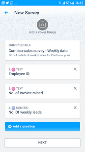
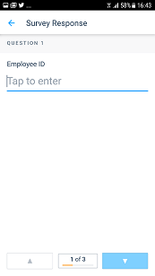

# Kaizala Aktionen

## Übersicht
Kaizala Aktionen sind grundlegende 'Arbeitseinheiten', mit denen Benutzer für eine Gesprächs Kontext innerhalb Kaizala ihre Arbeit vermitteln. Einige dieser Aktionen wie Auftrag, Umfrage, Umfrage usw. sind gelieferten Out-of-the-Box. Diese Aktionen innerhalb der app Kaizala ermittelt werden können und in einem Chat aus der Palette Aktion aufgerufen werden können. [Lesen Sie mehr](https://support.office.com/en-us/article/Kaizala-Actions-1EACC59A-DD14-43E9-B6B0-3C78773D5496).

Wir wissen, dass die Anforderungen der jede Organisation variieren und Funktionen, die geringfügig von den Anforderungen eines anderen Unternehmens wären erfordern würde. Daher kann Kaizala Entwicklung von benutzerdefinierten Kaizala Aktionen, die von 3. Anbietern durchgeführt werden kann. Diese benutzerdefinierten Aktionen können an eine Gruppe, die innerhalb einer Organisationskontext zugeordnet bereitgestellt werden. 

Alle Aktionen, die in einer Gruppe von Benutzern veröffentlicht werden können von ihnen für alle Gruppen aufgerufen werden, denen Aktion zu hinzugefügt wurde. 

> **Hinweis:** Benutzerdefinierte Aktionen können nur Organisationsgruppen hinzugefügt werden.

> **Hinweis:** [Kaizala-Verwaltungsportal](https://manage.kaiza.la) ist das Gateway für die Entwicklung, testen und Veröffentlichen der neuen Kaizala Aktionen.

## Grundlegendes zu Kaizala Aktion

Aktuell enthält eine Kaizala-Aktion vier verschiedene Ansichten, die wie folgt definiert werden können:

* Eine **Ansicht erstellen** , wenn eine Aktion aus der Palette aufgerufen wird
* Eine **Karte anzeigen** , die auf den Zeichenbereich Chat angezeigt wird, wenn eine Instanz der Aktion gesendet wird
* Eine **Ansicht Responder** für Benutzer auf die Kaizala-Aktion reagiert
* Eine **Zusammenfassungsansicht** aggregierte Antworten anzeigen

Beispielsweise in Out-of-Box(OOB) Kaizala Umfrage Aktion:

| Ansicht | Beispiel-Ansicht in OOB Umfrage Aktion |
|------|----------------------------------|
| Ansicht erstellen| |
| Kartenansicht | |
| Responder-Ansicht | |
| Ansicht "Zusammenfassung" | |

In benutzerdefinierten Aktionen können Sie benutzerdefinierte Ansichten erstellen, die über Ansichten entsprechen.

## Erstellen einer neuen Kaizala-Aktion
Neue Kaizala Aktionen, die Kaizalas Personen Netzwerk nutzen können erstellt und Mobilfunktionen überzeugende Erstellen guter auf folgende Weise:

* **Entwurf** einer neuen Aktion Kaizala über dem Kaizala-Verwaltungsportal - können Sie eine benutzerdefinierte Aktion Kaizala über die Schnittstelle Action Designer auf die vorhandenen Aktion Vorlagen erstellen entwerfen. [Erfahren Sie mehr](https://support.office.com/en-us/article/Kaizala-Actions-1eacc59a-dd14-43e9-b6b0-3c78773d5496?ui=en-US&rs=en-US&ad=US)
* **Entwickeln** einer neuen Kaizala Aktion - komplexe neue Kaizala Aktionen, die benutzerdefinierte Funktionen von webtechnologien wie HTML-, CSS- und JavaScript bereitstellen können erstellt werden. Führen Sie die unten aufgeführten Links, über die verschiedenen Phasen der Entwicklung einer Aktion Kaizala zu informieren.
    *   [Anatomie einer Aktion Kaizala-Paket](anatomy.md)
    *   [Erste Schritte](get_started.md)
    *   [Entwickeln](develop.md)
    *   [Publish](publish.md)

Alle Kaizala Aktionen müssen qualifiziert Kaizala Clients veröffentlicht werden soll, die [Richtlinien](validation.md) beachten.

## Erstellen Sie Ihre erste Kaizala-Aktion

Sie können die erste Kaizala Aktion erstellen, indem Sie unsere einfache [Lernprogramm](tutorial.md) ausprobieren

## Beispiel-Aktion Pakete herunterladen

*  [Beispiel-Actions](https://manage.kaiza.la/MiniApps/DownloadSDK)
