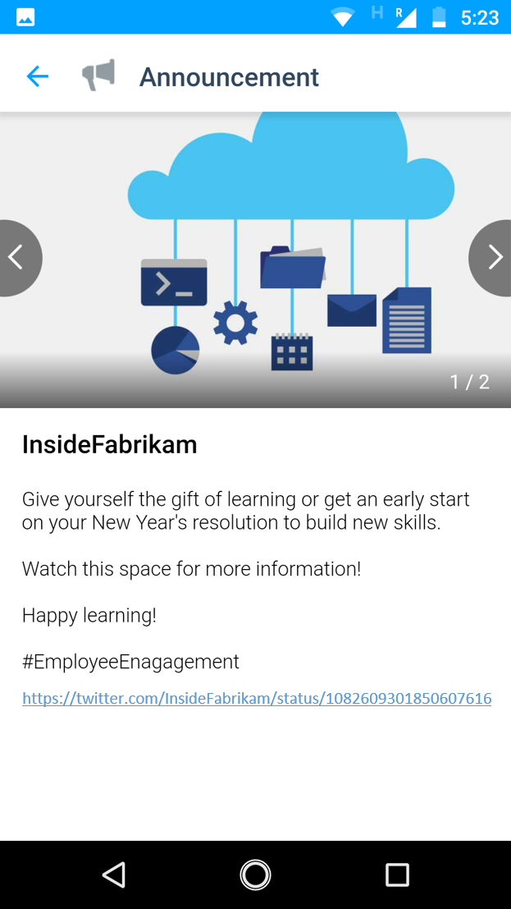
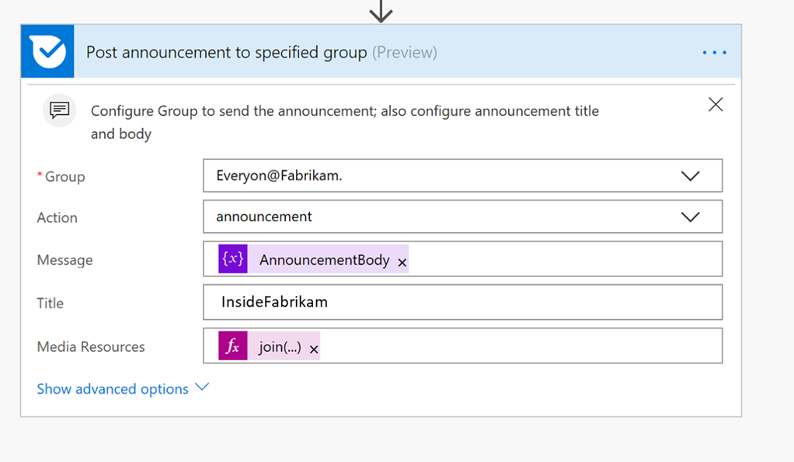

# Updates zu Kaizala Auto-Post Twitter (engl.)

Buchen, um Mitarbeiter Seiten Twitter ist Teil der Geschäftsalltag, jedoch müssen die gleiche Informationen mehrmals buchen ist ziemlich komplex. Förderung der Mitarbeiter soziale Medien-Updates gemeinsam nutzen, wenn keine weiteren ordnungsgemäß kann erheblich des Unternehmens Folgendes erweitern. 

In diesem beispiellösung speichert Ihrer Termine durch die automatische-Veröffentlichung Tweets von Ihrem offizielle Twitter-Konto auf Kaizala Gruppen. Eine Ankündigung Karte werden gesendet, um die Gruppe aus, wenn eine oder alle der unten Trigger auftreten

1. Ein neuer Tweet wird auf eine bestimmte Twitter gebucht behandeln E.g.,"@InsideFabrikam"

2. Ein Beitrag ist neu in diesem Twitter Handle tweeted 
    
3. Ein Beitrag ist eine bestimmte Hashtag E.g.,"#EmployeeEngagement"

Diese Karte verfügt über drei Felder-Karte Titel Anlagen (Bilder, Videos und GIF) und den Text (Beschreibung). Die Ankündigung Nachrichtentext enthält die URL Twitter (engl.), und auf diese URL tippen, würde Benutzer auf Statusseite auf Twitter umgeleitet werden.

> Hinweis: Im Fall eines WAN-Video oder GIF, wird in der Miniaturansicht in Kartenansicht Chat angezeigt.

Chat-Karte anzeigen:

Fesselnden anzeigen:

In diesem Szenario wird Ablauf die Karte auf eine ausgewählte Gruppe in Kaizala senden.

Kaizala" width="500" />

## Implementierungsschritte:

1. Laden Sie die [AutoPostTwitterUpdatesToKaizala SolutionPackage.zip](https://github.com/MicrosoftDocs/kaizala-docs/blob/master/Articles/BusinessSolutions/CorporateCommunications/AutoPostTwitterUpdatesToKaizala/AutoPostTwitterUpdatesToKaizala-SolutionPackage.zip) (*Dies enthält Flow-Paket*)

2. [Import](https://flow.microsoft.com/en-us/blog/import-export-bap-packages/) "AutoPostTwitterUpdatesToKaizala-SolutionPackage.zip" Flow Microsoft-Konto

     > Hinweis-Wenn Sie noch nie verwendet haben, Twitter oder Kaizala Verbindungen, die erste [Verbindungen hinzuzufügen](https://docs.microsoft.com/en-us/flow/add-manage-connections)

3. Bearbeiten Sie den Ablauf (*wie unten*)

    1.  In der erste Block des Datenflusses
    
        Geben Sie das Handle Twitter, oder geben Sie die Hashtag oder beides
        
        Kaizala" width="400" />
    
    2.  In den letzten Block mit den Ablauf
      
        1. Wählen Sie den Namen der Gruppe aus. 
    
        2. Geben Sie den Titel. Der Titel wird für Benutzer in Chat Kartenansicht sichtbar sein. Z. B. "InsideFabrikam"
     
        Kaizala" width="400" />
     
4. Speichern Sie den Ablauf

Ankündigung wird an der ausgewählten Gruppe Kaizala jedes Mal gesendet, den Fluss ausgelöst wird.

> Hinweis: im Fall eines WAN-Tweets durch Umfragen/Speicherort nur der Umfrage Frage/Tweet Text wird angezeigt, in die Karte, nicht die Umfrage Optionen oder den Speicherort Tweet

> Hinweis: Überprüfen Sie mit Ihren IT-Administrator bei einer [DLP-Richtlinie](https://docs.microsoft.com/en-us/flow/prevent-data-loss) in Ihrer Organisation für Twitter festgelegt
