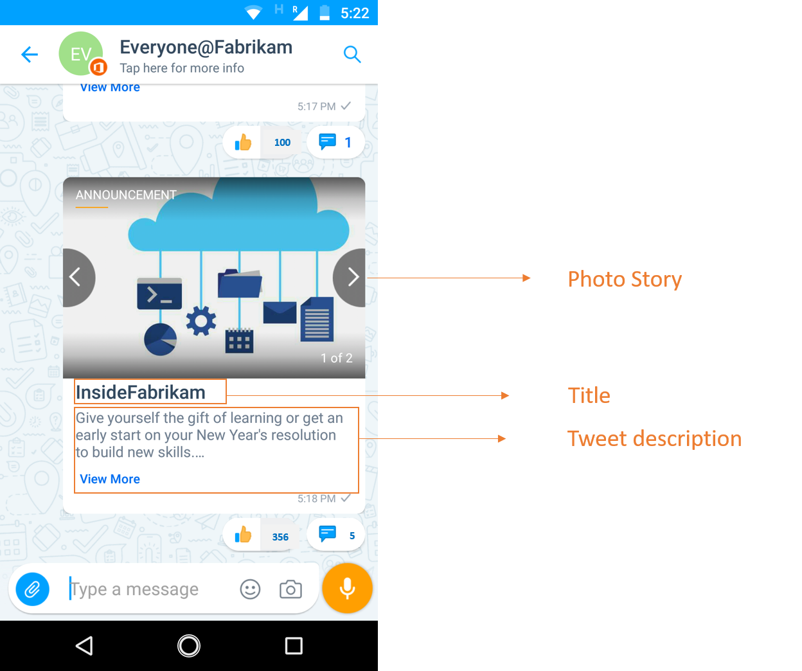

# Automatisches Veröffentlichen von Twitter-Updates für Kaizala

Posting to Twitter Employee Pages ist Teil des täglichen Geschäfts, aber es ist schwierig, dieselben Informationen mehrmals veröffentlichen zu müssen. Wenn Sie Mitarbeiter dazu ermuntern, Social Media-Updates zu teilen, können Sie die folgenden Funktionen drastisch erweitern. 

Diese Beispiellösung spart Ihnen Zeit, indem Sie tweets von Ihrem offiziellen Twitter-Konto zu Kaizala-Gruppen automatisch veröffentlicht. Eine Ansage Karte wird an die Gruppe gesendet, wenn ein oder alle der folgenden Auslöser auftreten.

1. Ein neuer Tweet wird in einem bestimmten Twitter-handle veröffentlicht, z. b. "@InsideFabrikam"

2. Ein Beitrag wird in diesem Twitter-handle erneut tweeted 
    
3. Ein Beitrag hat einen bestimmten hashtag, z. b. "#EmployeeEngagement"

Diese Karte hat drei Felder: Kartentitel, Anlagen (Bilder, Videos oder GIF) und Body (Beschreibung). Der Ankündigungstext hat die Twitter-URL und beim Tippen auf diese URL werden Benutzer auf die Statusseite auf Twitter umgeleitet.

> Hinweis: bei Video-oder GIF-Bildern wird die Miniaturansicht in der Chat Kartenansicht angezeigt.

Chat Kartenansicht:

Immersive Ansicht:

In diesem Szenario wird Flow verwendet, um die Karte an eine ausgewählte Gruppe in Kaizala zu senden.

Kaizala" width="500" />

## Implementierungsschritte:

1. Laden Sie die [AutoPostTwitterUpdatesToKaizala-SolutionPackage. zip](https://aka.ms/AutoPostTwitterUpdatesToKaizala-SolutionPackage.zip) (*Dieses enthält Flow-Paket*)

2. [Importieren](https://flow.microsoft.com/en-us/blog/import-export-bap-packages/) des "AutoPostTwitterUpdatesToKaizala-SolutionPackage. zip" in Ihr Microsoft Flow-Konto

     > Hinweis: Wenn Sie nie Twitter-oder Kaizala-Verbindungen verwendet haben, fügen Sie zunächst [Verbindungen hinzu](https://docs.microsoft.com/en-us/flow/add-manage-connections) .

3. Bearbeiten des Flusses (nach*folgend*)

    1.  Im ersten Block des Flusses
    
        Geben Sie den Twitter-Handle ein, oder geben Sie den hashtag ein.
        
        Kaizala" width="400" />
    
    2.  Im letzten Block des Flusses
      
        1. Wählen Sie den Gruppennamen aus. 
    
        2. Geben Sie den Titel ein. Der Titel ist für Benutzer in der Chat Kartenansicht sichtbar. Beispielsweise "InsideFabrikam"
     
        Kaizala" width="400" />
     
4. Speichern des Flusses

Die Ansage wird an die ausgewählte Kaizala-Gruppe gesendet, und jeder Zeitablauf wird ausgelöst.

> Hinweis: bei Tweets mit Umfragen/Standort wird nur die Umfrage-Frage/der Tweet-Text in der Karte angezeigt, nicht die Abstimmungsoptionen oder der Tweet-Speicherort.

> Hinweis: erkundigen Sie sich bei Ihrem IT-Administrator im Falle einer [DLP-Richtlinie](https://docs.microsoft.com/en-us/flow/prevent-data-loss) , die von Ihrer Organisation für Twitter festgelegt wurde.
