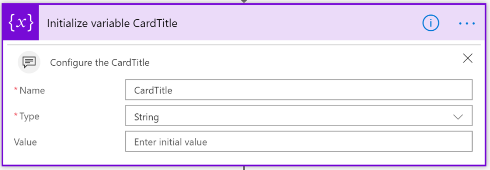

# <a name="display-rss-feeds-in-kaizala-groups"></a><span data-ttu-id="3bff5-101">Anzeigen von RSS-Feeds in Kaizala-Gruppen</span><span class="sxs-lookup"><span data-stu-id="3bff5-101">Display RSS feeds in Kaizala groups</span></span>

<span data-ttu-id="3bff5-102">Organisationen verwenden RSS-Feeds, um Ihre e-Mail-Systeme zu ergänzen und die Art der Bereitstellung von Informationen für Mitarbeiter zu verbessern.</span><span class="sxs-lookup"><span data-stu-id="3bff5-102">Organizations use RSS feeds to complement their e-mail systems and improve the way they provide information to employees.</span></span> <span data-ttu-id="3bff5-103">Organisationen können diese Feeds jetzt mit der ersten und mobilen Arbeitskraft nutzen, indem Sie Sie als Ankündigungen an Kaizala-Gruppen senden.</span><span class="sxs-lookup"><span data-stu-id="3bff5-103">Organizations can now leverage these feeds with the first line and mobile workers by sending them as announcements to Kaizala groups.</span></span>

<span data-ttu-id="3bff5-104">Einige Anwendungsfälle von RSS-Feeds:</span><span class="sxs-lookup"><span data-stu-id="3bff5-104">Few use cases of RSS feeds:</span></span>

1. <span data-ttu-id="3bff5-105">Branchennachrichten von externen Websites</span><span class="sxs-lookup"><span data-stu-id="3bff5-105">Industry News from external sites</span></span>
2. <span data-ttu-id="3bff5-106">Unternehmensnachrichten von internen Websites</span><span class="sxs-lookup"><span data-stu-id="3bff5-106">Company news from internal sites</span></span>
3. <span data-ttu-id="3bff5-107">Konkurrieren von Informationen von externen Websites</span><span class="sxs-lookup"><span data-stu-id="3bff5-107">Compete Information from external sites</span></span>
4. <span data-ttu-id="3bff5-108">Produkt Updates</span><span class="sxs-lookup"><span data-stu-id="3bff5-108">Product Updates</span></span>
5. <span data-ttu-id="3bff5-109">Gruppenspezifische Feeds, z. b. Finance, Design und Tech</span><span class="sxs-lookup"><span data-stu-id="3bff5-109">Group specific feeds, E.g., Finance, Design and Tech</span></span> 
6. <span data-ttu-id="3bff5-110">Tipps und Tricks, beispielsweise DIY, Sport und Fotografie</span><span class="sxs-lookup"><span data-stu-id="3bff5-110">Tips and Tricks, E.g, DIY, Sports and Photography</span></span>

<span data-ttu-id="3bff5-111">Dieses Beispiel hilft einem Administrator Benutzer, RSS-Feeds zu Kaizala-Gruppen hinzuzufügen.</span><span class="sxs-lookup"><span data-stu-id="3bff5-111">This sample will help, an admin user to add RSS feeds to Kaizala groups.</span></span> <span data-ttu-id="3bff5-112">Diese Karte hat 3 Felder in der Chat Kartenansicht-Kartentitel (z. b. Business News), Bild und Feed.</span><span class="sxs-lookup"><span data-stu-id="3bff5-112">This card has 3 fields in chat card view- Card title(E.g., Business News), Image and Feed title.</span></span> <span data-ttu-id="3bff5-113">Durch Tippen auf die Karte würde der Benutzer in der Webansicht in Kaizala.</span><span class="sxs-lookup"><span data-stu-id="3bff5-113">Tapping on the card would take the user to web view within Kaizala.</span></span> 
 
 ><span data-ttu-id="3bff5-114">Hinweis: nur whitelisted RSS Feed URL es in Kaizala geöffnet, wenn nicht, würde der Inhalt an einen Browser weitergeleitet werden.</span><span class="sxs-lookup"><span data-stu-id="3bff5-114">Note: Only whitelisted RSS feed URL's open within Kaizala, if not, the content would be directed to a browser.</span></span>


<span data-ttu-id="3bff5-115">Dies ist eine Ansage in Form einer Karte, und Flow wird verwendet, um diese benutzerdefinierte Aktionskarte an die Kaizala-Gruppe zu senden.</span><span class="sxs-lookup"><span data-stu-id="3bff5-115">This is an announcement in the form of a card and Flow is used to send this custom action card to Kaizala group.</span></span>


## <a name="implementation-steps"></a><span data-ttu-id="3bff5-116">Implementierungsschritte</span><span class="sxs-lookup"><span data-stu-id="3bff5-116">Implementation steps</span></span>

1. <span data-ttu-id="3bff5-117">Laden Sie die Datei ["GetRSSFeedsOnKaizala-SolutionPackage. zip](https://aka.ms/GetRssFeedsonKaizala-SolutionPackage.zip) " herunter (*Dieses Paket enthält "RSS-Feed-ActionPackage. zip" und "RSS-Feed-FlowPackage. zip"*).</span><span class="sxs-lookup"><span data-stu-id="3bff5-117">Download the ["GetRSSFeedsOnKaizala-SolutionPackage.zip"](https://aka.ms/GetRssFeedsonKaizala-SolutionPackage.zip) (*This package contain "RSS-feed-ActionPackage.zip" and "RSS-feed-FlowPackage.zip"*)</span></span>
2. <span data-ttu-id="3bff5-118">Laden Sie die neueste Version von Kaizala ["ActionSDK. zip"](https://manage.kaiza.la/MiniApps/DownloadSDK)(*Diese enthält die Datei KASClient. js*).</span><span class="sxs-lookup"><span data-stu-id="3bff5-118">Download the latest version of Kaizala ["ActionSDK.Zip"](https://manage.kaiza.la/MiniApps/DownloadSDK)(*This contains KASClient.js file*)</span></span>
3. <span data-ttu-id="3bff5-119">Bearbeiten Sie den "RSS-feed-ActionPackage. zip" (*wie unten*)</span><span class="sxs-lookup"><span data-stu-id="3bff5-119">Edit the "RSS-feed-ActionPackage.zip" (*as below*)</span></span>
   1. <span data-ttu-id="3bff5-120">Unzip-Aktionspaket "RSS-feed-ActionPackage. zip" in einen Ordner</span><span class="sxs-lookup"><span data-stu-id="3bff5-120">Unzip action package "RSS-feed-ActionPackage.zip" to a folder</span></span>
   2. <span data-ttu-id="3bff5-121">Ändern der Aktion "ID" und "Anbietername" in Package. JSON</span><span class="sxs-lookup"><span data-stu-id="3bff5-121">Change the action "id" and "provider name" in package.json</span></span>
   3. <span data-ttu-id="3bff5-122">KASClient. js-Datei zu diesem Ordner hinzufügen</span><span class="sxs-lookup"><span data-stu-id="3bff5-122">Add KASClient.js file to this folder</span></span> 
   4. <span data-ttu-id="3bff5-123">Fügen Sie die RSS-Feed-URL in Package. JSON (wie unten) zur Whitelist dieser URL hinzu.</span><span class="sxs-lookup"><span data-stu-id="3bff5-123">Add RSS feed URL in package.json(as below) to whitelist that URL.</span></span> <span data-ttu-id="3bff5-124">In diesem Beispiel wird die URL für digitale Trends in der Whitelist dargestellt.</span><span class="sxs-lookup"><span data-stu-id="3bff5-124">In this example, digital trends URL is whitelisted.</span></span>    
         ```
      "externalUrls": [
      { "url": "https://www.digitaltrends.com" }
      ]  
      ```
   5. <span data-ttu-id="3bff5-125">ZIP alle Inhalte in diesem Ordner (*dieser Ordner ist Ihr geändertEs Aktionspaket, das in das kaizala-Verwaltungsportal importiert werden sollte*)</span><span class="sxs-lookup"><span data-stu-id="3bff5-125">Zip all the contents in this folder (*This folder is your modified Action package which should be imported to kaizala management portal*)</span></span>
   
 > <span data-ttu-id="3bff5-126">Hinweis: Wählen Sie alle Dateien im Arbeitsverzeichnis aus, und erstellen Sie eine neue ZIP-Datei für Ihr Paket.</span><span class="sxs-lookup"><span data-stu-id="3bff5-126">Note: Select all the files in your working directory and create a new zip file for your package.</span></span> <span data-ttu-id="3bff5-127">Stellen Sie sicher, dass alle Dateien im Stammverzeichnis des Pakets vorhanden sind.</span><span class="sxs-lookup"><span data-stu-id="3bff5-127">Ensure that all files are present in the root directory of the package.</span></span> <span data-ttu-id="3bff5-128">Hierzu sollten KASClient. js, Package. JSON mit neuem "ID", "ProviderName" und whitelisted URL gehört.</span><span class="sxs-lookup"><span data-stu-id="3bff5-128">This should include KASClient.js, package.json with new "id", "provider name" and whitelisted URL</span></span>
 
4. <span data-ttu-id="3bff5-129">[Importieren](https://docs.microsoft.com/en-us/kaizala/actions/publish#import-kaizala-action) des bearbeiteten Aktionspakets in das kaizala-Verwaltungsportal (*diese Karte wird von der Anruf-API gesendet, sodass die Karte nicht einer Gruppe hinzugefügt werden muss*)</span><span class="sxs-lookup"><span data-stu-id="3bff5-129">[Import](https://docs.microsoft.com/en-us/kaizala/actions/publish#import-kaizala-action) the edited action package to kaizala management portal (*This card is sent by calling API, so there is no need to add the card to a group*)</span></span>
5. <span data-ttu-id="3bff5-130">[Importieren](https://flow.microsoft.com/en-us/blog/import-export-bap-packages/) des "RSS-Feed-Flowpackage. zip" in Ihr Microsoft Flow-Konto</span><span class="sxs-lookup"><span data-stu-id="3bff5-130">[Import](https://flow.microsoft.com/en-us/blog/import-export-bap-packages/) the "RSS-feed-Flowpackage.zip" to your Microsoft Flow account</span></span>

    > <span data-ttu-id="3bff5-131">Hinweis: Wenn Sie noch nie RSS-oder Kaizala-Verbindungen verwendet haben, fügen Sie zunächst [Verbindungen hinzu](https://docs.microsoft.com/en-us/flow/add-manage-connections) .</span><span class="sxs-lookup"><span data-stu-id="3bff5-131">Note: If you have never used RSS or Kaizala connections, first [add connections](https://docs.microsoft.com/en-us/flow/add-manage-connections)</span></span>    

6. <span data-ttu-id="3bff5-132">Bearbeiten von Details in importiertem Flow (*siehe Schritte unten*)</span><span class="sxs-lookup"><span data-stu-id="3bff5-132">Edit details in Imported Flow (*See steps below*)</span></span> 
   1. <span data-ttu-id="3bff5-133">Geben Sie im ersten Block die URL des RSS-Feeds ein. </span><span class="sxs-lookup"><span data-stu-id="3bff5-133">In the first block , enter the RSS feed URL  </span></span>
   2. <span data-ttu-id="3bff5-134">Geben Sie im zweiten Block den Kartentitel in das Feld Wert ein.</span><span class="sxs-lookup"><span data-stu-id="3bff5-134">In the second block, enter the card title in "value" field.</span></span> <span data-ttu-id="3bff5-135">Der Kartentitel ist für Benutzer in der Chat Kartenansicht sichtbar.</span><span class="sxs-lookup"><span data-stu-id="3bff5-135">The card title will be visible to users in chat card view.</span></span> <span data-ttu-id="3bff5-136">Z. b. "Business News"</span><span class="sxs-lookup"><span data-stu-id="3bff5-136">E.g., "Business News"</span></span>
   
      
   3. <span data-ttu-id="3bff5-137">Geben Sie im dritten Block die Aktion "ID" in das Feld "Wert" ein, die Sie in Package. JSON angegeben haben.</span><span class="sxs-lookup"><span data-stu-id="3bff5-137">In the third block, enter the Action "id" in "value" field, that you have given in package.json</span></span>
      
   4. <span data-ttu-id="3bff5-138">Im letzten Block des Flusses</span><span class="sxs-lookup"><span data-stu-id="3bff5-138">In the last block of the Flow</span></span>
        1. <span data-ttu-id="3bff5-139">Wählen Sie den Gruppennamen aus, oder geben Sie die Gruppen-ID ein, an die die Karte gesendet werden soll.</span><span class="sxs-lookup"><span data-stu-id="3bff5-139">Select the group name or enter the group id where you want to send the card</span></span>
        2. <span data-ttu-id="3bff5-140">Um die Gruppen-ID abzurufen, wechseln Sie zu Ihrer https://manage.kaiza.la Gruppe und wählen Sie den Bezeichner am Ende der URL aus.</span><span class="sxs-lookup"><span data-stu-id="3bff5-140">To get the group id, go to your group on https://manage.kaiza.la and select the identifier at the end of the URL.</span></span>
        
            
            
        3. <span data-ttu-id="3bff5-141">Klicken Sie auf Aktion, um die Aktionsart als "benutzerdefinierter Wert" aus der Dropdownliste auszuwählen.</span><span class="sxs-lookup"><span data-stu-id="3bff5-141">Click on action, to select action type as "custom value" from the dropdown</span></span>
        4. <span data-ttu-id="3bff5-142">Körper "ActionBodyJson" zuordnen</span><span class="sxs-lookup"><span data-stu-id="3bff5-142">Map body to "ActionBodyJson"</span></span>
       
       
7.  <span data-ttu-id="3bff5-143">Speichern des Flusses</span><span class="sxs-lookup"><span data-stu-id="3bff5-143">Save the Flow</span></span>

 <span data-ttu-id="3bff5-144">RSS-Feeds werden an die ausgewählte Kaizala-Gruppe gesendet, und jeder Zeitablauf wird ausgelöst.</span><span class="sxs-lookup"><span data-stu-id="3bff5-144">RSS feeds will be sent to the selected Kaizala group, each time flow is triggered.</span></span> 

> <span data-ttu-id="3bff5-145">Hinweis: Sie können nur eine RSS-Feed-URL im Flow festlegen.</span><span class="sxs-lookup"><span data-stu-id="3bff5-145">Note: You can only set one RSS feed URL in the Flow.</span></span> <span data-ttu-id="3bff5-146">Um mehrere Feeds zur gleichen Gruppe zu leiten, müssen für jeden Feed unterschiedliche Flows erstellt werden.</span><span class="sxs-lookup"><span data-stu-id="3bff5-146">To direct multiple feeds to same group, different Flows have to be created for each feed</span></span>

> <span data-ttu-id="3bff5-147">Bekanntes Problem: die anzeigen führen den Benutzer über die WebView aus, da Sie nicht in der Whitelist enthalten sind.</span><span class="sxs-lookup"><span data-stu-id="3bff5-147">Known issue: On iOS, the ads take the user out of the webview since they are not whitelisted</span></span>

### <a name="useful-links"></a><span data-ttu-id="3bff5-148">Nützliche Links</span><span class="sxs-lookup"><span data-stu-id="3bff5-148">Useful links</span></span>
1. [<span data-ttu-id="3bff5-149">Erstellen von Kaizala-Gruppen</span><span class="sxs-lookup"><span data-stu-id="3bff5-149">How to create Kaizala Groups</span></span>](https://docs.microsoft.com/en-us/office365/kaizala/groups)
2. [<span data-ttu-id="3bff5-150">Konfigurieren des RSS-Feeds auf SharePoint-Website</span><span class="sxs-lookup"><span data-stu-id="3bff5-150">Configure RSS Feed to SharePoint site</span></span>](https://support.office.com/en-us/article/create-or-subscribe-to-an-rss-feed-fb35047d-8dbd-412a-a5f3-f1712af14dcb)
