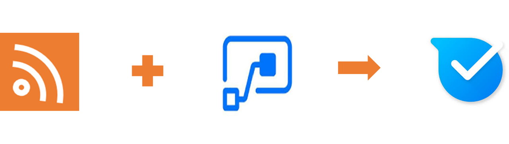
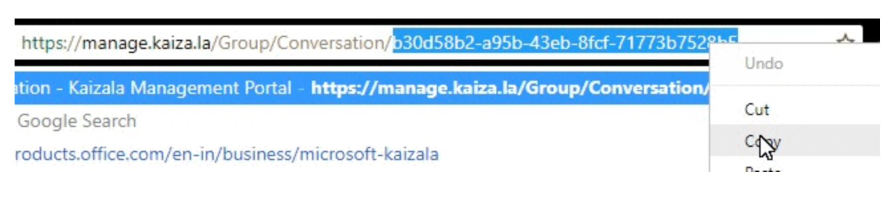

# <a name="display-rss-feeds-in-kaizala-groups"></a><span data-ttu-id="900e1-101">Anzeigen von RSS-Feeds in Kaizala Gruppen</span><span class="sxs-lookup"><span data-stu-id="900e1-101">Display RSS feeds in Kaizala groups</span></span>

<span data-ttu-id="900e1-102">Organisationen verwenden RSS-Feeds zu ergänzen ihre e-Mail-Systeme und verbessern die Art und Weise, in der sie Informationen für Mitarbeiter bereitstellen.</span><span class="sxs-lookup"><span data-stu-id="900e1-102">Organizations use RSS feeds to complement their e-mail systems and improve the way they provide information to employees.</span></span> <span data-ttu-id="900e1-103">Organisationen können diese Feeds mit der ersten Zeile und mobile Mitarbeiter jetzt durch Senden der Formularvorlagen als Ankündigungen Kaizala Gruppen nutzen.</span><span class="sxs-lookup"><span data-stu-id="900e1-103">Organizations can now leverage these feeds with the first line and mobile workers by sending them as announcements to Kaizala groups.</span></span>

<span data-ttu-id="900e1-104">Wenige Anwendungsfälle von RSS-Feeds:</span><span class="sxs-lookup"><span data-stu-id="900e1-104">Few use cases of RSS feeds:</span></span>

1. <span data-ttu-id="900e1-105">Neuigkeiten aus der Branche aus externen Websites</span><span class="sxs-lookup"><span data-stu-id="900e1-105">Industry News from external sites</span></span>
2. <span data-ttu-id="900e1-106">Nachrichten von internen Websites</span><span class="sxs-lookup"><span data-stu-id="900e1-106">Company news from internal sites</span></span>
3. <span data-ttu-id="900e1-107">Füllen Sie die Informationen aus externen Websites</span><span class="sxs-lookup"><span data-stu-id="900e1-107">Compete Information from external sites</span></span>
4. <span data-ttu-id="900e1-108">Produktupdates</span><span class="sxs-lookup"><span data-stu-id="900e1-108">Product Updates</span></span>
5. <span data-ttu-id="900e1-109">Gruppe bestimmte feeds, z. B. Finanzen, Entwurf und Tech</span><span class="sxs-lookup"><span data-stu-id="900e1-109">Group specific feeds, E.g., Finance, Design and Tech</span></span> 
6. <span data-ttu-id="900e1-110">Tipps und Tricks, z. B., DIY, Sportliga und Fotos</span><span class="sxs-lookup"><span data-stu-id="900e1-110">Tips and Tricks, E.g, DIY, Sports and Photography</span></span>

<span data-ttu-id="900e1-111">In diesem Beispiel hilft Ihnen, ein Administrator die Aktivierung RSS-Feeds zu Kaizala Gruppen hinzufügen.</span><span class="sxs-lookup"><span data-stu-id="900e1-111">This sample will help, an admin user to add RSS feeds to Kaizala groups.</span></span> <span data-ttu-id="900e1-112">Diese Karte enthält 3 Felder im Chat Karte anzeigen-Karte Titel (z. B., Unternehmensnachrichten), Bild und Feed Titel.</span><span class="sxs-lookup"><span data-stu-id="900e1-112">This card has 3 fields in chat card view- Card title(E.g., Business News), Image and Feed title.</span></span> <span data-ttu-id="900e1-113">Tippen Sie auf der Karte würde der Benutzer auf Webansicht in Kaizala ausführen.</span><span class="sxs-lookup"><span data-stu-id="900e1-113">Tapping on the card would take the user to web view within Kaizala.</span></span> 
 
 ><span data-ttu-id="900e1-114">Hinweis: Nur White RSS-feed URL öffnen in Kaizala, falls nicht, würde der Inhalt in einem Browser umgeleitet werden.</span><span class="sxs-lookup"><span data-stu-id="900e1-114">Note: Only whitelisted RSS feed URL's open within Kaizala, if not, the content would be directed to a browser.</span></span>


<span data-ttu-id="900e1-115">Hierbei handelt es sich um eine Ankündigung in Form einer Karte und Ablauf wird verwendet, um diese benutzerdefinierte Aktion Karte Kaizala Gruppe zu senden.</span><span class="sxs-lookup"><span data-stu-id="900e1-115">This is an announcement in the form of a card and Flow is used to send this custom action card to Kaizala group.</span></span>



## <a name="implementation-steps"></a><span data-ttu-id="900e1-116">Implementierungsschritte</span><span class="sxs-lookup"><span data-stu-id="900e1-116">Implementation steps</span></span>

1. <span data-ttu-id="900e1-117">Laden Sie die ["GetRSSFeedsOnKaizala SolutionPackage.zip"](https://github.com/MicrosoftDocs/kaizala-docs/blob/master/Articles/BusinessSolutions/CorporateCommunications/GetRSSFeedsonKaizala/GetRssFeedsonKaizala-SolutionPackage.zip) (*Dieses Paket enthalten, "RSS-Feed-ActionPackage.zip" und "RSS-Feed-FlowPackage.zip"*)</span><span class="sxs-lookup"><span data-stu-id="900e1-117">Download the ["GetRSSFeedsOnKaizala-SolutionPackage.zip"](https://github.com/MicrosoftDocs/kaizala-docs/blob/master/Articles/BusinessSolutions/CorporateCommunications/GetRSSFeedsonKaizala/GetRssFeedsonKaizala-SolutionPackage.zip) (*This package contain "RSS-feed-ActionPackage.zip" and "RSS-feed-FlowPackage.zip"*)</span></span>
2. <span data-ttu-id="900e1-118">Laden Sie die neueste Version von Kaizala ["ActionSDK.Zip"](https://manage.kaiza.la/MiniApps/DownloadSDK)(*Dies enthält die KASClient.js-Datei*)</span><span class="sxs-lookup"><span data-stu-id="900e1-118">Download the latest version of Kaizala ["ActionSDK.Zip"](https://manage.kaiza.la/MiniApps/DownloadSDK)(*This contains KASClient.js file*)</span></span>
3. <span data-ttu-id="900e1-119">Bearbeiten der "RSS-Feed-ActionPackage.zip" (*wie unten*)</span><span class="sxs-lookup"><span data-stu-id="900e1-119">Edit the "RSS-feed-ActionPackage.zip" (*as below*)</span></span>
   1. <span data-ttu-id="900e1-120">Entzippen Sie Aktion Paket "RSS-Feed-ActionPackage.zip" in einen Ordner</span><span class="sxs-lookup"><span data-stu-id="900e1-120">Unzip action package "RSS-feed-ActionPackage.zip" to a folder</span></span>
   2. <span data-ttu-id="900e1-121">Ändern Sie die Aktion "Id" und "Anbietername" in package.json</span><span class="sxs-lookup"><span data-stu-id="900e1-121">Change the action "id" and "provider name" in package.json</span></span>
   3. <span data-ttu-id="900e1-122">Fügen Sie diesen Ordner KASClient.js-Datei hinzu</span><span class="sxs-lookup"><span data-stu-id="900e1-122">Add KASClient.js file to this folder</span></span> 
   4. <span data-ttu-id="900e1-123">Fügen Sie RSS in Package.json(as below) White-Liste die URL-feed-URL.</span><span class="sxs-lookup"><span data-stu-id="900e1-123">Add RSS feed URL in package.json(as below) to whitelist that URL.</span></span> <span data-ttu-id="900e1-124">In diesem Beispiel ist die URL der digitalen Trends White.</span><span class="sxs-lookup"><span data-stu-id="900e1-124">In this example, digital trends URL is whitelisted.</span></span>    
         ```
      "externalUrls": [
      { "url": "https://www.digitaltrends.com" }
      ]  
      ```
   5. <span data-ttu-id="900e1-125">ZIP-alle Inhalte in diesen Ordner (*dieser Ordner ist Ihr geänderte Aktion-Paket die Kaizala Management Portal importiert werden soll*)</span><span class="sxs-lookup"><span data-stu-id="900e1-125">Zip all the contents in this folder (*This folder is your modified Action package which should be imported to kaizala management portal*)</span></span>
   
 > <span data-ttu-id="900e1-126">Hinweis: Wählen Sie alle Dateien in Ihrem Arbeitsverzeichnis und erstellen Sie eine neue Zip-Datei für Ihr Paket.</span><span class="sxs-lookup"><span data-stu-id="900e1-126">Note: Select all the files in your working directory and create a new zip file for your package.</span></span> <span data-ttu-id="900e1-127">Stellen Sie sicher, dass alle Dateien im Stammverzeichnis des Pakets vorhanden sind.</span><span class="sxs-lookup"><span data-stu-id="900e1-127">Ensure that all files are present in the root directory of the package.</span></span> <span data-ttu-id="900e1-128">Dazu zählen u. a. KASClient.js package.json mit neuen "Id", "ProviderName" und White URL</span><span class="sxs-lookup"><span data-stu-id="900e1-128">This should include KASClient.js, package.json with new "id", "provider name" and whitelisted URL</span></span>
 
4. <span data-ttu-id="900e1-129">[Importieren](https://docs.microsoft.com/en-us/kaizala/actions/publish#import-kaizala-action) des Pakets bearbeiteten Aktion Kaizala-Verwaltungsportal (*vom aufrufenden API diese Karte gesendet wird, also besteht keine Notwendigkeit, um die Visitenkarte zu einer Gruppe hinzufügen*)</span><span class="sxs-lookup"><span data-stu-id="900e1-129">[Import](https://docs.microsoft.com/en-us/kaizala/actions/publish#import-kaizala-action) the edited action package to kaizala management portal (*This card is sent by calling API, so there is no need to add the card to a group*)</span></span>
5. <span data-ttu-id="900e1-130">[Importieren](https://flow.microsoft.com/en-us/blog/import-export-bap-packages/) der "RSS-Feed-Flowpackage.zip" Flow Microsoft-Konto</span><span class="sxs-lookup"><span data-stu-id="900e1-130">[Import](https://flow.microsoft.com/en-us/blog/import-export-bap-packages/) the "RSS-feed-Flowpackage.zip" to your Microsoft Flow account</span></span>

> <span data-ttu-id="900e1-131">Hinweis: Wenn Sie RSS- oder Kaizala Verbindungen mit der ersten [Hinzufügen von Verbindungen](https://docs.microsoft.com/en-us/flow/add-manage-connections) noch nie verwendet haben</span><span class="sxs-lookup"><span data-stu-id="900e1-131">Note: If you have never used RSS or Kaizala connections, first [add connections](https://docs.microsoft.com/en-us/flow/add-manage-connections)</span></span>    

6. <span data-ttu-id="900e1-132">Bearbeiten der Details in importiert Flow (*wie im folgenden beschrieben*)</span><span class="sxs-lookup"><span data-stu-id="900e1-132">Edit details in Imported Flow (*See steps below*)</span></span> 
   1. <span data-ttu-id="900e1-133">Geben Sie in der erste Block den RSS-feed-URL </span><span class="sxs-lookup"><span data-stu-id="900e1-133">In the first block , enter the RSS feed URL  </span></span>
   2. <span data-ttu-id="900e1-134">Geben Sie in der zweite Block den Titel der Karte im Feld "Wert" aus.</span><span class="sxs-lookup"><span data-stu-id="900e1-134">In the second block, enter the card title in "value" field.</span></span> <span data-ttu-id="900e1-135">Der Titel der Visitenkarte werden für Benutzer in einer Kartenansicht Chat angezeigt.</span><span class="sxs-lookup"><span data-stu-id="900e1-135">The card title will be visible to users in chat card view.</span></span> <span data-ttu-id="900e1-136">Z. B. "Unternehmensnachrichten"</span><span class="sxs-lookup"><span data-stu-id="900e1-136">E.g., "Business News"</span></span>
   
      
   3. <span data-ttu-id="900e1-137">Geben Sie in der dritte Block die Aktion "Id" im Feld "Wert", die Sie in package.json zugewiesen haben</span><span class="sxs-lookup"><span data-stu-id="900e1-137">In the third block, enter the Action "id" in "value" field, that you have given in package.json</span></span>
      
   4. <span data-ttu-id="900e1-138">In den letzten Block mit den Ablauf</span><span class="sxs-lookup"><span data-stu-id="900e1-138">In the last block of the Flow</span></span>
        1. <span data-ttu-id="900e1-139">Wählen Sie den Namen der Gruppe aus, oder geben Sie die Gruppen-Id, wo die Karte gesendet werden soll</span><span class="sxs-lookup"><span data-stu-id="900e1-139">Select the group name or enter the group id where you want to send the card</span></span>
        2. <span data-ttu-id="900e1-140">Wenn Sie die Gruppen-Id erhalten möchten, wechseln Sie an Ihre Gruppe auf https://manage.kaiza.la und wählen Sie die Kennung am Ende der URL.</span><span class="sxs-lookup"><span data-stu-id="900e1-140">To get the group id, go to your group on https://manage.kaiza.la and select the identifier at the end of the URL.</span></span>
        
            
            
        3. <span data-ttu-id="900e1-141">Klicken Sie auf Aktion, Aktionstyp als "benutzerdefinierter Wert" aus der Dropdownliste auswählen</span><span class="sxs-lookup"><span data-stu-id="900e1-141">Click on action, to select action type as "custom value" from the dropdown</span></span>
        4. <span data-ttu-id="900e1-142">Zuordnen von Stelle "ActionBodyJson"</span><span class="sxs-lookup"><span data-stu-id="900e1-142">Map body to "ActionBodyJson"</span></span>
       
       
7.  <span data-ttu-id="900e1-143">Speichern der RSS-Fluss werden Feeds der ausgewählten Kaizala Gruppe jedes Mal versendet Auslösung Fluss.</span><span class="sxs-lookup"><span data-stu-id="900e1-143">Save the Flow RSS feeds will be sent to the selected Kaizala group, each time flow is triggered.</span></span> 

> <span data-ttu-id="900e1-144">Hinweis: Sie können nur eine RSS-feed-URL in den Ablauf festlegen.</span><span class="sxs-lookup"><span data-stu-id="900e1-144">Note: You can only set one RSS feed URL in the Flow.</span></span> <span data-ttu-id="900e1-145">Um mehrere Feeds, demselben zu leiten, müssen verschiedene Abläufe für jeden Feed erstellt werden soll</span><span class="sxs-lookup"><span data-stu-id="900e1-145">To direct multiple feeds to same group, different Flows have to be created for each feed</span></span>

> <span data-ttu-id="900e1-146">Bekanntes Problem: auf iOS, übernehmen die anzeigen den Benutzer aus der Webansicht, da sie nicht weißen Liste enthalten sind</span><span class="sxs-lookup"><span data-stu-id="900e1-146">Known issue: On iOS, the ads take the user out of the webview since they are not whitelisted</span></span>

### <a name="useful-links"></a><span data-ttu-id="900e1-147">Hilfreiche links</span><span class="sxs-lookup"><span data-stu-id="900e1-147">Useful links</span></span>
1. [<span data-ttu-id="900e1-148">Gewusst wie: Kaizala Gruppen erstellen</span><span class="sxs-lookup"><span data-stu-id="900e1-148">How to create Kaizala Groups</span></span>](https://docs.microsoft.com/en-us/office365/kaizala/groups)
2. [<span data-ttu-id="900e1-149">Konfigurieren der RSS-Feed für die SharePoint-Website</span><span class="sxs-lookup"><span data-stu-id="900e1-149">Configure RSS Feed to SharePoint site</span></span>](https://support.office.com/en-us/article/create-or-subscribe-to-an-rss-feed-fb35047d-8dbd-412a-a5f3-f1712af14dcb)
