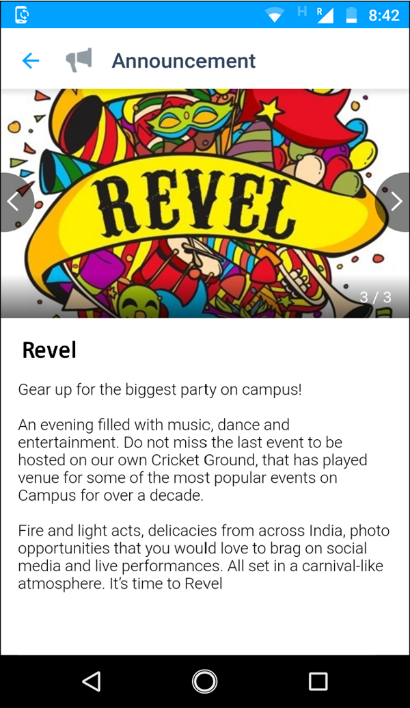
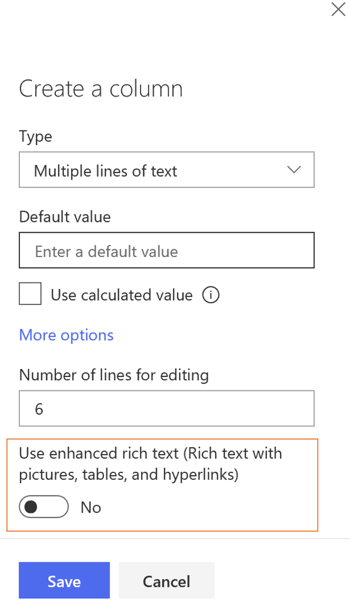
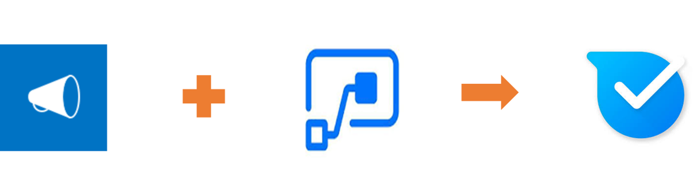
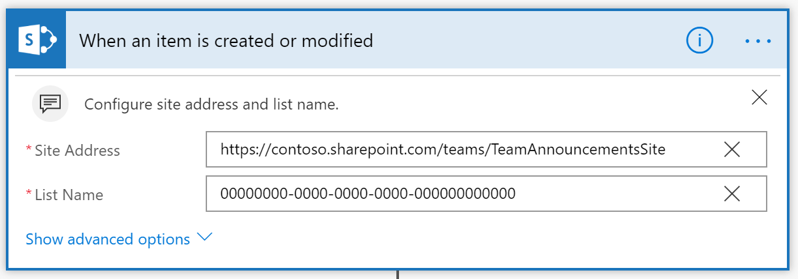
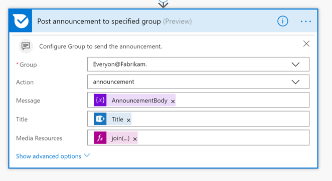

# Anzeigen von SharePoint-anSagen in Kaizala-GruppenDisplay SharePoint Announcements in Kaizala groups 
Organisationen verwenden SharePoint-Ansage-App zum Freigeben von Nachrichten, Status und anderen kurzen Informationen zu Mitarbeitern.Organizations use SharePoint Announcement app to share news, status and other short bits of information to employees . SharePoint-Ansage-APP, die mit einer Liste geliefert wird, ist ein spezieller Listentyp, mit dem Sie Ankündigungen erstellen können.Sharepoint Announcement app, that comes with a list, is a special type of list that lets you create announcements.

Mithilfe dieses Beispiels können Organisationen SharePoint-Ankündigungen mit der ersten und mobilen Arbeitskräften in Kaizala freigeben.Using this sample, organizations can share SharePoint announcements with the first line and mobile workers on Kaizala. Diese Karte hat 3 Felder in der Chat Kartenansicht-Anlagen (in diesem Beispiel Fotostory von Bildern), Titel und Ansagetext (Beschreibung).This card has 3 fields in chat card view- Attachments( In this example, Photo story of images), Title and Announcement body (description). Diese wird an eine Kaizala-Gruppe als out-of-Box-Ansage Karte gesendet.This is sent to a Kaizala group as an out-of-box announcement card.

Die Chat Kartenansicht ist wie folgt.The chat card view is as below

Beim Tippen auf die Karte ist die immersive Ansicht wie folgt.On tapping the card, immersive view is as below

Dieses Szenario kann grob in zwei Schritte unterteilt werden:This scenario can be broadly divided into 2 steps:
1. Erstellen einer Ankündigungsliste mit Spalten-Titel, Anlagen und Ansagetext (Beschreibung)Create an announcement list with columns- Title, attachments and announcement body(description) 

    > Hinweis: Rich-Text wird nicht von einer Vorankündigungs Karte unterstützt.Note: Rich text is not supported by out-of-box announcement card. Deaktivieren Sie Rich-Text für SharePoint-Kolumnen mit dem Ankündigungstext (Beschreibung) beim Erstellen dieser Spalte.Switch off rich text for sharepoint column that has Announcement body(description) while creating that column.

    

2. Konfigurieren Sie Flow so, dass bei der Erstellung eines neuen Elements oder eines vorhandenen Elements in der Ankündigungsliste eine Out-of-Box-Ansage Karte an eine Kaizala-Gruppe gesendet wird.Configure Flow such that, when a new item is created or existing item is modified in announcement list, an out-of-box announcement card is sent to a Kaizala group

    

## ImplementierungsschritteImplementation steps

1. [Hinzufügen](https://docs.microsoft.com/en-us/sharepoint/administration/add-apps-for-sharepoint-to-a-sharepoint-site) einer Ankündigungs-App zur SharePoint-Website (siehe*unten*)[Add Announcement app](https://docs.microsoft.com/en-us/sharepoint/administration/add-apps-for-sharepoint-to-a-sharepoint-site) to SharePoint site(*as below*)
     1. Klicken Sie auf das Symbol "Einstellungen"Click on the settings icon
     2.  Klicken Sie auf app hinzufügen.Click on Add an App 
     3.  Wählen Sie Ansage-App aus der Liste der verfügbaren Apps aus.Select Announcement App from the list of available Apps
2. Verwenden des [hervorgehobenen Inhalts](https://support.office.com/en-us/article/use-the-highlighted-content-web-part-e34199b0-ff1a-47fb-8f4d-dbcaed329efd) Webparts (*Falls erforderlich, zur Visualisierung*)Use the [highlighted content web part](https://support.office.com/en-us/article/use-the-highlighted-content-web-part-e34199b0-ff1a-47fb-8f4d-dbcaed329efd) (*if necessary , for visualization*)
3. Laden Sie die [SharepointAnnouncementOnKaizala-SolutionPackage. zip](https://aka.ms/SharepointAnnouncementOnKaizala-SolutionPackage.zip) (*Dies ist ein Flow-Paket*)Download the [SharepointAnnouncementOnKaizala-SolutionPackage.zip](https://aka.ms/SharepointAnnouncementOnKaizala-SolutionPackage.zip) (*This is a Flow package*)
4. [Importieren](https://flow.microsoft.com/en-us/blog/import-export-bap-packages/) SharepointAnnouncementOnKaizala-SolutionPackage. zip zu Ihrem Microsoft Flow-Konto[Import](https://flow.microsoft.com/en-us/blog/import-export-bap-packages/) SharepointAnnouncementOnKaizala-SolutionPackage.zip to your Microsoft Flow account
   
   > Hinweis: Wenn Sie die SharePoint-oder Kaizala-Verbindung noch nie verwendet haben, fügen Sie zunächst [Verbindungen hinzu](https://docs.microsoft.com/en-us/flow/add-manage-connections) .Note: If you have never used Sharepoint or Kaizala connection, first [add connections](https://docs.microsoft.com/en-us/flow/add-manage-connections)
   
5. Bearbeiten des Flusses (nach*folgend*)Edit the Flow (*as below*)
    1. Im ersten Block des FlussesIn the first block of the Flow
    
         1. Geben Sie die Websiteadresse ein.Enter the site address
         2. Geben Sie den Namen der Liste ein (*Schritte zum Abrufen des Listen namens ist wie folgt*)Enter the List name (*steps to get List name is as below*)
            - Klicken Sie in der linken Ecke des Bildschirms auf die Registerkarte Websiteinhalte.Click on site contents tab on the left hand corner of the screen
            - Wählen Sie die Ankündigungsliste aus, an die Sie Ankündigungen an Kaizala senden möchten.Select the announcement list from which you want to send announcements to Kaizala
            - Klicken Sie auf das Symbol "Einstellungen" in der oberen rechten Ecke des Bildschirms.Click on settings icon at the top right corner of the screen
            - Wechseln zu ListeneinstellungenGo to List settings
            - Kopieren Sie die URL der Liste aus dem Browser.Copy the URL of the list from the browser.
            - DeCodieren Sie die URL (Sie können die URL [hier](https://www.url-encode-decode.com/) decodieren)Decode the URL (you can decode the URL [here](https://www.url-encode-decode.com/) )
        
      
    2. Im zweiten Block des FlussesIn the second block of the Flow
   
        Ordnen Sie das Feld Wert mit dem Spaltentitel der Ankündigungsliste zu, der den Text der Ansage (Beschreibung) aus dem dynamischen Inhalt enthält.Map "value" field with column title of announcement list, that has announcement body(description) from Dynamic content. Im folgenden Beispiel lautet der Spaltentitel "Ansagetext". In the below example, the column title is "Announcement Body"  
       
    3. Im letzten Block des FlussesIn the last block of the Flow
    
       Wählen Sie den Gruppennamen aus Dropdown aus.Select the group name from dropdown. In diesem Beispiel lautet "jeder @ Fabrikam"In this Example it is "Everyone@Fabrikam"
       
6. Speichern des FlussesSave the flow

Die Ansage wird an die ausgewählte Kaizala-Gruppe gesendet, und jeder Zeitablauf wird ausgelöst.Announcement will be sent to the selected Kaizala group, each time flow is triggered.

> Hinweis: Textdatei wird als Anlage nicht unterstütztNote: Text file is not supported as attachment
