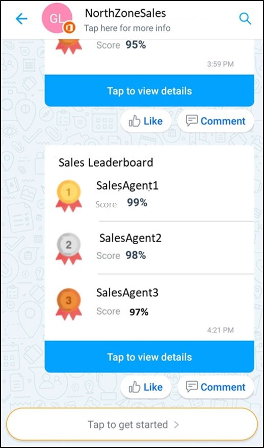
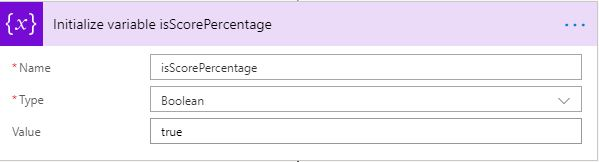

# <a name="drive-performance-using-leaderboard"></a><span data-ttu-id="10c56-101">Leistungssteigerung mit Leaderboard</span><span class="sxs-lookup"><span data-stu-id="10c56-101">Drive Performance using Leaderboard</span></span>
<span data-ttu-id="10c56-102">Eine Rangliste stellt eine umfassende visuelle Darstellung der Teilnehmer dar, um zu verstehen, wo Sie im Vergleich zu Gleichaltrigen rangen.</span><span class="sxs-lookup"><span data-stu-id="10c56-102">A leaderboard is a rich visual representation of participants to provide an understanding of where they rank in comparison to peers.</span></span> <span data-ttu-id="10c56-103">Wenn Sie die Leistungsfähigkeit von gamification nutzen, sind Leaderboards die beste Möglichkeit, um wettbewerbsfähigen Teamgeist in Teams zu vermitteln und die Leistung einzelner/Teammitglieder gegen geschäftliche Ziele nachzuverfolgen.</span><span class="sxs-lookup"><span data-stu-id="10c56-103">Leveraging the power of gamification, leaderboards are the best way to instill competitive spirit among teams and also track individual/team performance against business targets.</span></span> <span data-ttu-id="10c56-104">Sie bieten sofortiges Feedback zu Kurs-korrigieren und Identifizieren von Mustern in KPIs, die Mitarbeiter improvisieren können.</span><span class="sxs-lookup"><span data-stu-id="10c56-104">They provide instant feedback to course-correct and identify patterns in KPIs that could help employees improvise.</span></span>

<span data-ttu-id="10c56-105">Diese generische Lösung ist eine großartige Möglichkeit, Team Anreize und eine offene Kultur zu erstellen.</span><span class="sxs-lookup"><span data-stu-id="10c56-105">This generic solution is a great way to incentivize team and create an open culture.</span></span> <span data-ttu-id="10c56-106">Es kann von jeder Vertriebs-oder Dienstorganisation verwendet werden, um die Leistung zu verfolgen – individuell oder Team-und Leistungsvergleich über mehrere KPIs hinweg.</span><span class="sxs-lookup"><span data-stu-id="10c56-106">It can be used by any sales or service organization to track performance- Individual or Team and compare performance across multiple KPIs.</span></span> 

<span data-ttu-id="10c56-107">Excel aus Ihrem Onedrive for Business wird von Microsoft Flow verwendet, und Leaderboard Card wird in einem Serienmuster an die Kaizala-Gruppe gesendet.</span><span class="sxs-lookup"><span data-stu-id="10c56-107">Excel from your Onedrive for Business is consumed by Microsoft Flow and Leaderboard card is sent to Kaizala group in a recurrence pattern.</span></span> <span data-ttu-id="10c56-108">Diese Karte hat zwei Ansichten-Chat Kartenansicht & immersive Ansicht.</span><span class="sxs-lookup"><span data-stu-id="10c56-108">This card has two views- Chat card view & Immersive view.</span></span> 

<span data-ttu-id="10c56-109">**Chat Kartenansicht**</span><span class="sxs-lookup"><span data-stu-id="10c56-109">**Chat card view**</span></span>




<span data-ttu-id="10c56-110">**Immersive Ansicht**</span><span class="sxs-lookup"><span data-stu-id="10c56-110">**Immersive view**</span></span>

<span data-ttu-id="10c56-111">Diese Ansicht verfügt über zwei Registerkarten, wobei es sich zunächst um eine Wall of Fame für Top 10 Performer handelt, zweitens um "meine Leistung", was für jeden Benutzer unterschiedlich ist.</span><span class="sxs-lookup"><span data-stu-id="10c56-111">This view has two tabs, first being a wall of fame for Top 10 performers, second is "My performance" which is different for each user.</span></span>


<span data-ttu-id="10c56-112">Meine Leistung umfasst 2 Abschnitte, in denen meine Statistiken und die Reihen in der Nähe angezeigt werden.</span><span class="sxs-lookup"><span data-stu-id="10c56-112">My Performance has 2 sections that display my statistics and nearby ranks.</span></span> 


## <a name="implementation-steps"></a><span data-ttu-id="10c56-113">Implementierungsschritte</span><span class="sxs-lookup"><span data-stu-id="10c56-113">Implementation steps</span></span>
<span data-ttu-id="10c56-114">Dies kann grob in drei Schritte unterteilt werden:</span><span class="sxs-lookup"><span data-stu-id="10c56-114">This can be broadly divided into 3 steps:</span></span>
1. <span data-ttu-id="10c56-115">Paket zum Hochladen von Aktionen</span><span class="sxs-lookup"><span data-stu-id="10c56-115">Upload Action Package</span></span>
2. <span data-ttu-id="10c56-116">Excel-Blatt formatieren</span><span class="sxs-lookup"><span data-stu-id="10c56-116">Format Excel Sheet</span></span>
3. <span data-ttu-id="10c56-117">Konfigurieren von Microsoft Flow</span><span class="sxs-lookup"><span data-stu-id="10c56-117">Configure Microsoft Flow</span></span>

### <a name="upload-action-package"></a><span data-ttu-id="10c56-118">Paket zum Hochladen von Aktionen</span><span class="sxs-lookup"><span data-stu-id="10c56-118">Upload Action package</span></span>
1. <span data-ttu-id="10c56-119">Laden Sie die Datei ["Leaderboard-SolutionPackage. zip](https://github.com/MicrosoftDocs/kaizala-docs/blob/master/Articles/BusinessSolutions/Leaderboard/Leaderboard-SolutionPackage.zip)" herunter (*dieses* *enthält* *"Leaderboard_ActionPackage. zip* " *und* *"Leaderboard_FlowPackage. zip"* - *Paket*).</span><span class="sxs-lookup"><span data-stu-id="10c56-119">Download the [“Leaderboard-SolutionPackage.zip"](https://github.com/MicrosoftDocs/kaizala-docs/blob/master/Articles/BusinessSolutions/Leaderboard/Leaderboard-SolutionPackage.zip)(*This* *contains* *"Leaderboard_ActionPackage.zip"* *and* *"Leaderboard_FlowPackage.zip"* *Package*)</span></span>
2. <span data-ttu-id="10c56-120">Laden Sie die neueste Version von Kaizala ["ActionSDK. zip"](https://manage.kaiza.la/MiniApps/DownloadSDK) (*Diese enthält KASClient. js*)</span><span class="sxs-lookup"><span data-stu-id="10c56-120">Download the latest version of Kaizala ["ActionSDK.Zip"](https://manage.kaiza.la/MiniApps/DownloadSDK) (*This contains KASClient.js*)</span></span>
3. <span data-ttu-id="10c56-121">Bearbeiten Sie "Leaderboard_ActionPackage. zip"</span><span class="sxs-lookup"><span data-stu-id="10c56-121">Edit "Leaderboard_ActionPackage.zip"</span></span>
   1. <span data-ttu-id="10c56-122">Unzip "Leaderboard_ActionPackage. zip" in einen Ordner</span><span class="sxs-lookup"><span data-stu-id="10c56-122">Unzip "Leaderboard_ActionPackage.zip" to a folder</span></span>
   2. <span data-ttu-id="10c56-123">Ändern der Aktion "ID" und "Anbietername" in Package. JSON</span><span class="sxs-lookup"><span data-stu-id="10c56-123">Change the action "id" and "provider name" in package.json</span></span>
   3. <span data-ttu-id="10c56-124">Hinzufügen von KASClient. js zu diesem Ordner</span><span class="sxs-lookup"><span data-stu-id="10c56-124">Add KASClient.js to this folder</span></span> 
   4. <span data-ttu-id="10c56-125">ZIP alle Inhalte in diesem Ordner (*dieser Ordner ist Ihr geändertes Aktionspaket, das in das Kaizala-Verwaltungs Portal importiert werden sollte*)</span><span class="sxs-lookup"><span data-stu-id="10c56-125">Zip all the contents in this folder (*This folder is your modified action package which should be imported to Kaizala Management Portal*)</span></span>
   5. <span data-ttu-id="10c56-126">[Importieren](https://docs.microsoft.com/en-us/kaizala/actions/publish#import-kaizala-action) des bearbeiteten Aktionspakets in das [Kaizala-Verwaltungs Portal](https://manage.kaiza.la/)(*diese Karte wird durch Aufrufen einer API gesendet, sodass die Karte keiner Gruppe hinzugefügt werden muss*)</span><span class="sxs-lookup"><span data-stu-id="10c56-126">[Import](https://docs.microsoft.com/en-us/kaizala/actions/publish#import-kaizala-action) the edited action package to [Kaizala Management Portal](https://manage.kaiza.la/)(*This card is sent by calling an API, so no need to add the card to a group*)</span></span>

### <a name="format-excel-sheet"></a><span data-ttu-id="10c56-127">Excel-Blatt formatieren</span><span class="sxs-lookup"><span data-stu-id="10c56-127">Format Excel Sheet</span></span>

1. <span data-ttu-id="10c56-128">Herunterladen der [Excel-Vorlage](https://github.com/MicrosoftDocs/kaizala-docs/blob/master/Articles/BusinessSolutions/Leaderboard/Leaderboard.csv)</span><span class="sxs-lookup"><span data-stu-id="10c56-128">Download the [Excel template](https://github.com/MicrosoftDocs/kaizala-docs/blob/master/Articles/BusinessSolutions/Leaderboard/Leaderboard.csv)</span></span>

2. <span data-ttu-id="10c56-129">Füllen Sie alle Pflichtfelder-Name, PhoneNo und Score aus.</span><span class="sxs-lookup"><span data-stu-id="10c56-129">Fill all mandatory fields -Name, PhoneNo, and Score.</span></span> <span data-ttu-id="10c56-130">Neben diesen drei obligatorischen Feldern sind die restlichen KPIs (optional) und werden auf der Registerkarte meine Leistung angezeigt.</span><span class="sxs-lookup"><span data-stu-id="10c56-130">Apart from these three mandatory fields, the rest are KPIs (optional) and are displayed in "My Performance" tab.</span></span>

    

     > <span data-ttu-id="10c56-131">Hinweis: Score-&-KPIs können numerische oder%-Werte sein.</span><span class="sxs-lookup"><span data-stu-id="10c56-131">Note: Score & KPIs can be numeric or % values.</span></span> <span data-ttu-id="10c56-132">Wenn die Spalte Prozentsätze enthält, wenden Sie das [Prozentzahlen](https://support.office.com/en-ie/article/format-numbers-as-percentages-de49167b-d603-4450-bcaa-31fba6c7b6b4) Format auf diese Spalte an.</span><span class="sxs-lookup"><span data-stu-id="10c56-132">If the column has percentages, apply [percent number](https://support.office.com/en-ie/article/format-numbers-as-percentages-de49167b-d603-4450-bcaa-31fba6c7b6b4) format to that column</span></span>

     > <span data-ttu-id="10c56-133">Hinweis: meine Leistungs Registerkarte kann maximal 6 KPIs aufweisen.</span><span class="sxs-lookup"><span data-stu-id="10c56-133">Note: My Performance tab can have a maximum of 6 KPIs</span></span>


3. <span data-ttu-id="10c56-134">[Umbenennen](https://support.office.com/en-us/article/rename-an-excel-table-fbf49a4f-82a3-43eb-8ba2-44d21233b114) der Excel-Tabelle als "Leaderboardyyyymmdd" z. b. Leaderboard20190431 für den Tag 2019/04/31 (JJ/MM/DD)</span><span class="sxs-lookup"><span data-stu-id="10c56-134">[Rename](https://support.office.com/en-us/article/rename-an-excel-table-fbf49a4f-82a3-43eb-8ba2-44d21233b114) excel table as "Leaderboardyyyymmdd" E.g, Leaderboard20190431 for the day 2019/04/31(yy/mm/dd)</span></span>

4. <span data-ttu-id="10c56-135">Speichern Sie diese Datei auf einem Laufwerk für Unternehmen.</span><span class="sxs-lookup"><span data-stu-id="10c56-135">Save this file in One Drive for Business</span></span>

      > <span data-ttu-id="10c56-136">Hinweis: Flow wählt automatisch die Excel-Daten dieses Tags basierend auf dem Tabellennamen aus und sendet die Karte.</span><span class="sxs-lookup"><span data-stu-id="10c56-136">Note: Flow automatically picks up the excel data of that day based on the table name and sends the card.</span></span>

### <a name="configure-microsoft-flow"></a><span data-ttu-id="10c56-137">Konfigurieren von Microsoft Flow</span><span class="sxs-lookup"><span data-stu-id="10c56-137">Configure Microsoft Flow</span></span>

1. <span data-ttu-id="10c56-138">[Importieren](https://flow.microsoft.com/en-us/blog/import-export-bap-packages/) des "Leaderboard_FlowPackage. zip" in Ihr Microsoft Flow-Konto</span><span class="sxs-lookup"><span data-stu-id="10c56-138">[Import](https://flow.microsoft.com/en-us/blog/import-export-bap-packages/) the "Leaderboard_FlowPackage.zip" to your Microsoft Flow account</span></span>

      > <span data-ttu-id="10c56-139">Hinweis – Wenn Sie noch nie SharePoint-oder Kaizala-Verbindungen verwendet haben, fügen Sie zunächst [Verbindungen hinzu](https://docs.microsoft.com/en-us/flow/add-manage-connections) .</span><span class="sxs-lookup"><span data-stu-id="10c56-139">Note- If you have never used Sharepoint or Kaizala connections, first [add connections](https://docs.microsoft.com/en-us/flow/add-manage-connections)</span></span>    

2. <span data-ttu-id="10c56-140">Bearbeiten von Details in importiertem Flow (*siehe Schritte unten*)</span><span class="sxs-lookup"><span data-stu-id="10c56-140">Edit details in Imported Flow (*See steps below*)</span></span>

    1. <span data-ttu-id="10c56-141">Geben Sie im zweiten Block den Kartentitel in das Feld Wert ein, den Sie in der Rangliste anzeigen möchten.</span><span class="sxs-lookup"><span data-stu-id="10c56-141">In the second block, enter the card title in the value field, that you want to show in the leaderboard.</span></span> <span data-ttu-id="10c56-142">Zum Beispiel "Sales Leaderboard"</span><span class="sxs-lookup"><span data-stu-id="10c56-142">For E.g, "Sales Leaderboard"</span></span> 

         
    
    2. <span data-ttu-id="10c56-143">Legen Sie im dritten Block Value als true fest, wenn die "Partitur" ein Prozentsatz ist, wenn Sie nicht auf false festgelegt ist.</span><span class="sxs-lookup"><span data-stu-id="10c56-143">In the third block, set value as  true if the "score" is a percentage, if not set it to false</span></span>

         

    3. <span data-ttu-id="10c56-144">Im siebten Block</span><span class="sxs-lookup"><span data-stu-id="10c56-144">In the seventh block</span></span>

       1. <span data-ttu-id="10c56-145">Standort als "OneDrive for Business" aus der Dropdownliste auswählen</span><span class="sxs-lookup"><span data-stu-id="10c56-145">Select Location as "OneDrive for Business" from the dropdown</span></span>

       2. <span data-ttu-id="10c56-146">Wählen Sie in der Dropdownliste Dokumentbibliothek als "OneDrive" aus.</span><span class="sxs-lookup"><span data-stu-id="10c56-146">Select Document library as "OneDrive" from the dropdown</span></span>

       3. <span data-ttu-id="10c56-147">Wählen Sie Excel-Datei beim Klicken auf Ordnerauswahl aus.</span><span class="sxs-lookup"><span data-stu-id="10c56-147">Select Excel file on clicking folder picker</span></span>
     
             > <span data-ttu-id="10c56-148">Hinweis: der Tabellenname, den Sie in der Excel-Datei angegeben haben, wird automatisch vom Flow übernommen.</span><span class="sxs-lookup"><span data-stu-id="10c56-148">Note: Table name that you have given in excel file will be automatically picked up by the flow.</span></span> 
       
             


    4. <span data-ttu-id="10c56-149">Im neunten Block, "Apply to each",</span><span class="sxs-lookup"><span data-stu-id="10c56-149">In the ninth block, "Apply to each",</span></span> 

        1. <span data-ttu-id="10c56-150">Bearbeiten Sie KPI-Bezeichnungen in Parse JSON-Block für z. b. KPI 1 als abgeschlossene &-KPI 2-Aufrufe als konvertierte Anrufe.</span><span class="sxs-lookup"><span data-stu-id="10c56-150">Edit KPI labels in Parse JSON block for E.g, KPI 1 as Deals closed & KPI 2 as Calls converted.</span></span>

             


             ><span data-ttu-id="10c56-151">Hinweis: die Karte kann maximal 6 KPI es</span><span class="sxs-lookup"><span data-stu-id="10c56-151">Note: Card can display a maximum of 6 KPI's</span></span> 

        2. <span data-ttu-id="10c56-152">Bearbeiten von KPI-Bezeichnungen in Compose (*siehe unten*)</span><span class="sxs-lookup"><span data-stu-id="10c56-152">Edit KPI labels in Compose (*as shown below*)</span></span>
        
             

        
    5. <span data-ttu-id="10c56-153">Im letzten Block</span><span class="sxs-lookup"><span data-stu-id="10c56-153">In the last block</span></span>

        1. <span data-ttu-id="10c56-154">Geben Sie die Gruppen-ID ein, oder wählen Sie den Gruppennamen aus, an den Sie die Karte senden möchten.</span><span class="sxs-lookup"><span data-stu-id="10c56-154">Enter the group ID or select group name where you want to send the card</span></span>

        2. <span data-ttu-id="10c56-155">Klicken Sie auf Aktion, um "Aktionspaket" aus der Dropdownliste auszuwählen.</span><span class="sxs-lookup"><span data-stu-id="10c56-155">Click on Action to select "Action package" from drop down</span></span>
        
        3. <span data-ttu-id="10c56-156">Klicken Sie auf Aktionspaket, um "benutzerdefinierten Wert eingeben" auszuwählen, und geben Sie Ihre "Aktionspaket-ID" ein, die Sie Package. JSON angegeben haben.</span><span class="sxs-lookup"><span data-stu-id="10c56-156">Click on Action package to select "enter a custom value" and enter your "action package id" that you have given package.json</span></span>

        4. <span data-ttu-id="10c56-157">Speichern des Flusses</span><span class="sxs-lookup"><span data-stu-id="10c56-157">Save the Flow</span></span>

           

<span data-ttu-id="10c56-158">Die Leaderboard-Karte wird gemäß den Intervallen und Frequenzen, die im Flow festgelegt sind, an die angegebene Gruppe gesendet.</span><span class="sxs-lookup"><span data-stu-id="10c56-158">Leaderboard card will be sent to the specified group as per the interval and frequency set in the Flow.</span></span> 

><span data-ttu-id="10c56-159">Hinweis: Wenn Sie die Bezeichnungen "Name", "PhoneNo" und "Score" in Excel Sheet ändern möchten, ändern Sie diese in die gewünschten Bezeichnungen in ImmersiveView. js.</span><span class="sxs-lookup"><span data-stu-id="10c56-159">Note: If you wish to change the labels- "Name", "PhoneNo" and "Score" in excel sheet, change it to desired labels in ImmersiveView.js</span></span>

```
      
 "/*Fields from excel */

const NAME = "Name";
const PHONENO = "PhoneNo";
const SCORE = "Score";"      

