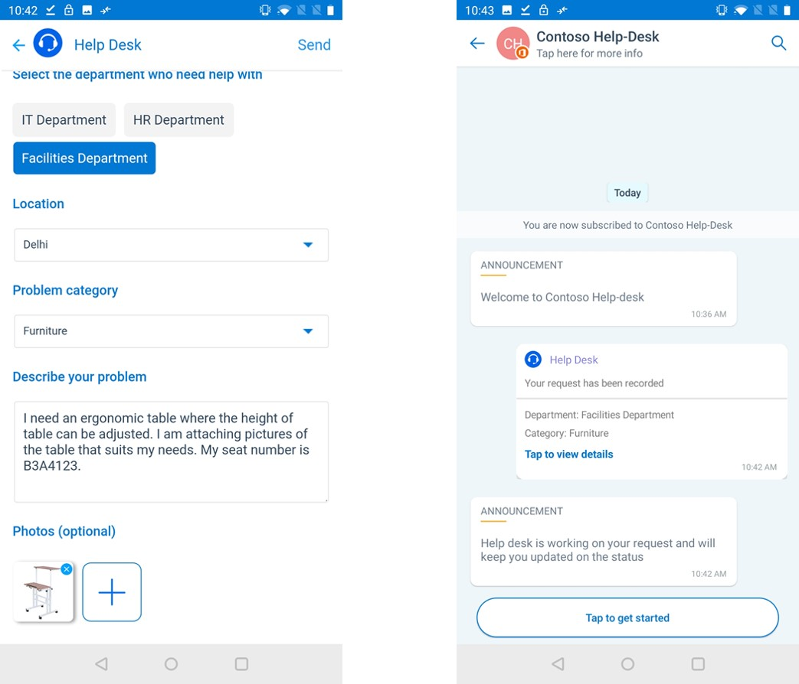
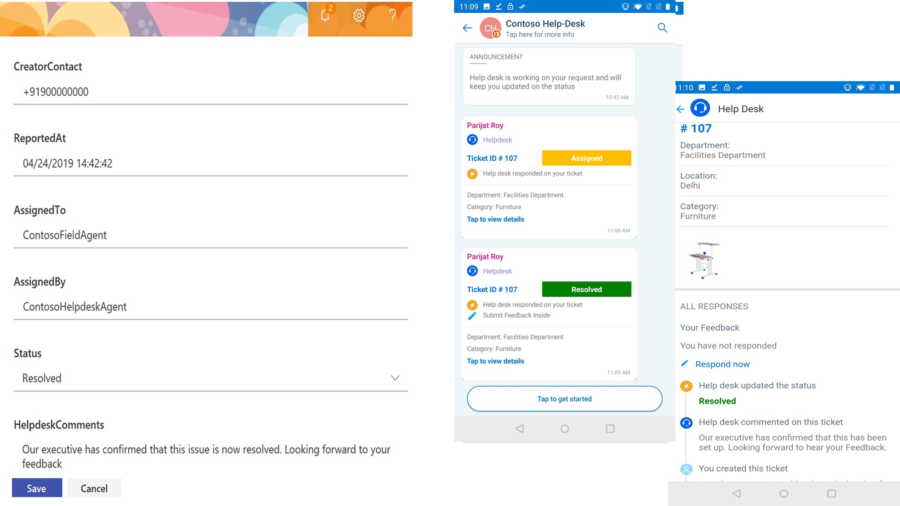
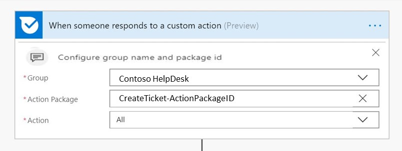
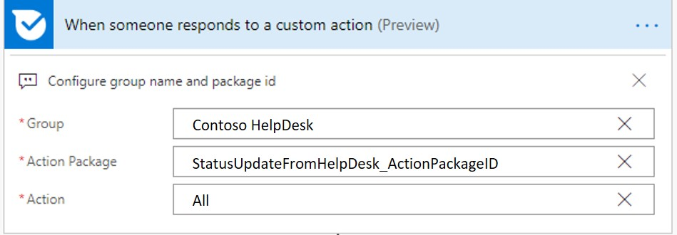
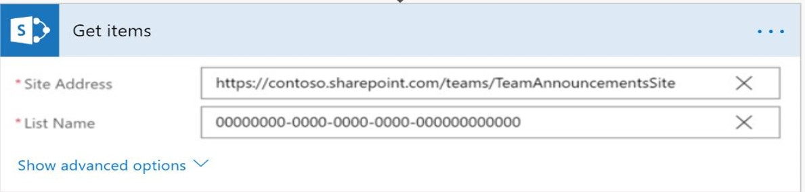
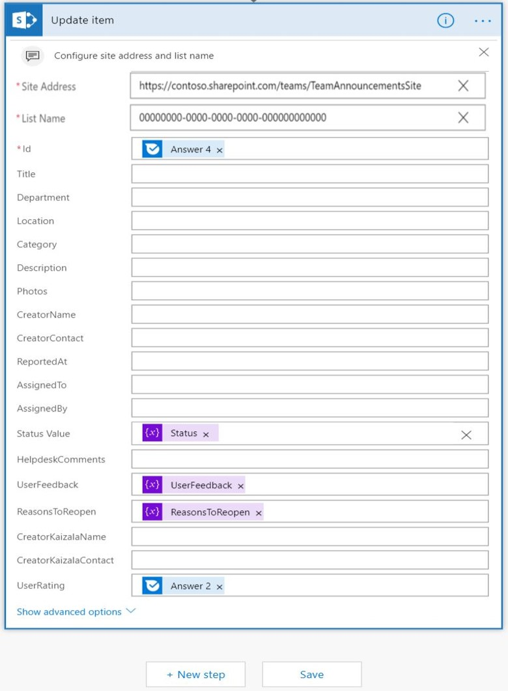

# Mitarbeiter-HelpdeskEmployee Help Desk

 In einer Organisation prüft das Helpdesk-Team die von Mitarbeitern ausgelösten Abfragen, weist es einem Field Agent zu und aktualisiert den Auflösungsstatus auf den Mitarbeiter.In an Organization, helpdesk team looks into the queries raised by employees, assigns it to a field agent and updates back the resolution status to the employee. Alle Abfragen werden als Tickets für eine einfache Verfolgung und Lösung angemeldet.All the queries are logged in as tickets for easy tracking and resolution. Ein Ticket System ermöglicht es Helpdesk-Agenten, Feedback systematisch zu erfassen, zu kategorisieren, zu lösen und zu sammeln.A ticketing system enables helpdesk agents to systematically capture, categorize, resolve and collect feedback. Dadurch kann eine Organisation in der Abfrage Auflösung effektiv sein und hat einen Multiplikatoreffekt für die Mitarbeiter Zufriedenheitsbewertung.This enables an organization to be effective in query resolution and has a multiplier effect on employee satisfaction scores.

Diese Lösung verwendet Kaizala als Front-End, SharePoint als Backend und Flow als Mittel zur Interaktion mit Kaizala und SharePoint.This solution uses Kaizala as the front-end, SharePoint as the backend and Flow as a means to interact with Kaizala and SharePoint. Ein Benutzer erstellt das Ticket durch Senden eines Formulars in Kaizala, die mit dieser Karte übermittelten Ticket Details werden erfasst und mithilfe von Flow in SharePoint gespeichert. bei Übermittlung erhält der Benutzer eine aktualisierte Karte, entweder wenn-A user creates the ticket by submitting a form in Kaizala, ticket details submitted using this card is captured and stored in the SharePoint using Flow.On submission, User gets an updated card,either when-

   1. Der Helpdesk-Agent aktualisiert den Status des Tickets in SharePoint (neu, zugewiesen oder aufgelöst) oderHelp desk agent updates the status of the ticket in SharePoint (New, Assigned or Resolved) or

   2. Helpdesk-Agents fügt Kommentare zu dem Ticket in SharePoint oderHelp desk agents adds comments on the ticket in SharePoint or

   3. Sowohl der Helpdesk-Agent aktualisiert den Status als auch Kommentare in SharePointBoth, help desk agent updates status and adds comments in SharePoint

Wenn der Benutzer mit der vorgeschlagenen Lösung zufrieden ist, hat der Benutzer die Möglichkeit, das Ticket zu beenden und Feedback zu senden.If the user is satisfied with the proposed resolution, user has the ability to close the ticket and submit feedback. Wenn der Benutzer mit der Lösung nicht zufrieden ist, kann der Benutzer das Ticket erneut öffnen.If the user is not satisfied with the resolution, user can re-open the ticket. Benutzer Feedback – Bewertung und Kommentare, Status erneut geöffnet oder geschlossen wird in SharePoint wieder aktualisiert.User Feedback - Rating and comments, status- Reopened or closed is updated back in SharePoint.

> Hinweis: diese Karte funktioniert nur in Hub-und Spoke-GruppenNote: This card works only in Hub and spoke groups

  Benutzeransicht der Ticketerstellung und-Übermittlung:User view of ticket creation and submission:

  

   Ansicht des Status, der auf "zugewiesen" in SharePoint aktualisiert wird, und die entsprechende Karte, die an den Benutzer gesendet wirdView of status being updated to "Assigned" in sharepoint and the corresponding card that is sent to user

   

   Ansicht des Status, der auf "aufgelöst" in SharePoint aktualisiert wird, und die entsprechende Karte, die an den Benutzer gesendet wirdView of status being updated to "Resolved" in sharepoint and the corresponding card that is sent to user
   
   

   Benutzer Feedback AnsichtUser Feedback view

   

## ImplementierungsSchritte:Implementation Steps:
Dies ist im Wesentlichen in drei Schritte unterteilt:This is broadly divided into 3 steps:

1. Aktionspakete hochladen, mit denen ein Benutzer (*2 Aktionspakete*) aktivieren kannUpload action packages that enable a user to (*2 Action Packages*)

   1. Erstellen und übermitteln eines Tickets für das Helpdesk (*CreateTicket-ActionPackage. zip*)Create and submit a ticket to help desk (*CreateTicket-ActionPackage.Zip*)

   2. Receive Status Updates & comments from Help Desk (*StatusUpdateFromHelpdesk-ActionPackage. zip*)Receive status updates & comments from help desk (*StatusUpdateFromHelpdesk-ActionPackage.Zip*)

2. Einrichten einer SharePoint-Liste, mit der Helpdesk-AgentsSet up a SharePoint list that enables helpdesk agents to

    1. Speichern der Ticket DetailsStore the ticket details

    2. Zuweisen, kommentieren und Ändern des Ticket StatusAssign, comment and change the ticket status

3. Konfigurieren von Microsoft Flow für die Interaktion mit SharePoint und Kaizala (*3 Flows*)Configure Microsoft Flow to interact with SharePoint and Kaizala (*3 Flows*)

    1. So erfassen Sie Ticket Details von der Karte und speichern Sie in SharePoint (*TicketCreationFlow. zip*)To collect ticket details from the card and store it in SharePoint(*TicketCreationFlow.Zip*)
    
    2. So senden Sie dem Benutzer eine aktualisierte Karte, wenn der Helpdesk-Agent den Status, Kommentare oder beides in SharePoint aktualisiert (*TicketStatusUpdatesFlow. zip*)To send the user an updated card when help desk agent updates the status, comments or both in the SharePoint(*TicketStatusUpdatesFlow.Zip*)

    3. So aktualisieren Sie die SharePoint-Liste, wenn der Benutzer das Schließen, erneutes Öffnen oder Hinzufügen von Feedback Kommentaren von der Karte auswählt (*TicketReopenFlow. zip*)To update the SharePoint list when the user chooses to close, reopen or adds feedback comments from the card(*TicketReopenFlow.Zip*)

### Aktionspakete hochladenUpload Action Packages
1. Laden Sie die Datei ["EmployeeHelpDesk-SolutionPackage. zip"](https://aka.ms/EmployeeHelpdesk-SolutionPackage.zip)(*Diese enthält 2 Aktionspakete und 3 Flows*).Download the ["EmployeeHelpDesk-SolutionPackage.zip"](https://aka.ms/EmployeeHelpdesk-SolutionPackage.zip)(*This contains 2 Action Packages and 3 Flows*)

2. Laden Sie die neueste Version von Kaizala ["ActionSDK. zip"](https://manage.kaiza.la/MiniApps/DownloadSDK) (*Diese enthält KASClient. js*)Download the latest version of Kaizala ["ActionSDK.Zip"](https://manage.kaiza.la/MiniApps/DownloadSDK) (*This contains KASClient.js*)

3. Einrichten des "CreateTicket-ActionPackage. zip"Set up the "CreateTicket-ActionPackage.Zip"

   1. Unzip "CreateTicket-ActionPackage. zip" in einen OrdnerUnzip "CreateTicket-ActionPackage.Zip" to a folder

   2. Ändern der Aktion "ID" und "Anbietername" in Package. JSONChange the action "id" and "provider name" in package.json

   3. Hinzufügen von KASClient. js zu diesem OrdnerAdd KASClient.js to this folder 

   4. ZIP alle Inhalte in diesem Ordner (*dieser Ordner ist Ihr geändertes Aktionspaket, das in das Kaizala-Verwaltungs Portal importiert werden sollte*)Zip all the contents in this folder (*This folder is your modified action package which should be imported to Kaizala Management Portal*)

   5. [Importieren](https://docs.microsoft.com/en-us/kaizala/actions/publish#import-kaizala-action) des bearbeiteten Aktionspakets in das [Kaizala-Verwaltungs Portal](https://manage.kaiza.la/)[Import](https://docs.microsoft.com/en-us/kaizala/actions/publish#import-kaizala-action) the edited action package to [Kaizala Management Portal](https://manage.kaiza.la/)

   6. [Veröffentlichen](https://docs.microsoft.com/en-us/kaizala/actions/publish) Sie die Aktion, und fügen Sie die Aktion zu einer Gruppe hinzu, der Sie die Karte hinzufügen möchten.[Publish](https://docs.microsoft.com/en-us/kaizala/actions/publish) the action and add the action to a group where you want to add the card

   7. Wählen Sie Benutzerrollen als Administrator und Mitglied aus.Select user roles as admin and member

4. Einrichten von "StatusUpdateFromHelpDesk-ActionPackage. zip"Set up "StatusUpdateFromHelpDesk-ActionPackage.Zip"

   1.  Unzip "StatusUpdateFromHelpDesk-ActionPackage. zip" in einen OrdnerUnzip "StatusUpdateFromHelpDesk-ActionPackage.Zip" to a folder

   2. Ändern der Aktion "ID" und "Anbietername" in Package. JSONChange the action "id" and "provider name" in package.json

   3. Hinzufügen von KASClient. js zu diesem OrdnerAdd KASClient.js to this folder 

   4. ZIP alle Inhalte in diesem Ordner (*dieser Ordner ist Ihr geändertes Aktionspaket, das in das Kaizala-Verwaltungs Portal importiert werden sollte*)Zip all the contents in this folder (*This folder is your modified action package which should be imported to Kaizala Management Portal*)

   5. [Importieren](https://docs.microsoft.com/en-us/kaizala/actions/publish#import-kaizala-action) des bearbeiteten Aktionspakets in das [Kaizala-Verwaltungs Portal](https://manage.kaiza.la/)[Import](https://docs.microsoft.com/en-us/kaizala/actions/publish#import-kaizala-action) the edited action package to [Kaizala Management Portal](https://manage.kaiza.la/)

   6. [Veröffentlichen](https://docs.microsoft.com/en-us/kaizala/actions/publish) Sie die Aktion, und fügen Sie die Aktion zu einer Gruppe hinzu, der Sie die Karte hinzufügen möchten.[Publish](https://docs.microsoft.com/en-us/kaizala/actions/publish) the action and add the action to a group where you want to add the card

   7. Benutzerrolle als Administrator auswählenSelect user role as admin

       > Hinweis: "CreateTicket-ActionPackage. zip" ist die Karte, die zum Auslösen eines Tickets verwendet wird und dem Administrator und den Abonnenten zur Verfügung gestellt werden soll. " StatusUpdateFromHelpDesk-ActionPackage. zip "zeigt Helpdesk-Kommentare und Status Updates an.Note: "CreateTicket-ActionPackage.Zip" is the card that is used to raise a ticket and should be made available to admin and Subscribers."StatusUpdateFromHelpDesk-ActionPackage.Zip" show helpdesk comments and status updates. Abonnenten müssen diese Karte nicht in der Aktions Palette sehen, daher wird Sie nur dem Administrator angezeigt.Subscribers do not have to see this card in action palette, hence this is only made visible to admin.

### Einrichten einer SharePoint-ListeSet up a SharePoint List

1. [Erstellen](https://support.office.com/en-us/article/create-a-list-in-sharepoint-0d397414-d95f-41eb-addd-5e6eff41b083) einer neuen Liste in SharePoint[Create](https://support.office.com/en-us/article/create-a-list-in-sharepoint-0d397414-d95f-41eb-addd-5e6eff41b083) a new list in SharePoint

2. [Hinzufügen](https://support.office.com/en-us/article/create-a-column-in-a-sharepoint-list-or-library-2b0361ae-1bd3-41a3-8329-269e5f81cfa2) von Spalten und [Bearbeiten](https://support.office.com/en-us/article/Edit-list-settings-in-SharePoint-Online-4d35793b-246e-42a3-990c-563a83795b7f) (*wie unten in der gleichen Reihenfolge und im Format*) Spalteneinstellungen für diese Liste[Add](https://support.office.com/en-us/article/create-a-column-in-a-sharepoint-list-or-library-2b0361ae-1bd3-41a3-8329-269e5f81cfa2) columns and [Edit](https://support.office.com/en-us/article/Edit-list-settings-in-SharePoint-Online-4d35793b-246e-42a3-990c-563a83795b7f) (*as below in the same order and format*) column settings for this list

    |SpalteColumn|Empfohlene EinstellungenRecommended settings|
    |-------- |---|
    |AbteilungDepartment|Eine TextzeileSingle line of text|
    |OrtLocation|Eine TextzeileSingle line of text|
    |KategorieCategory|Eine TextzeileSingle line of text|
    |BeschreibungDescription |Mehrere TextzeilenMultiple lines of text|
    |FotosPhotos|Mehrere TextzeilenMultiple lines of text|
    |CreatornameCreatorName|Eine TextzeileSingle line of text|
    |CreatorContactCreatorContact|Eine TextzeileSingle line of text|
    |ReportedAtReportedAt|Eine TextzeileSingle line of text|
    |AssignedToAssignedTo|Eine TextzeileSingle line of text|
    |AssignedByAssignedBy|Eine TextzeileSingle line of text|
    |StatusStatus|Auswahl mit Optionen als neu, zugewiesen, aufgelöst, geschlossen und erneut geöffnet (*diese Ticket Phasen sind obligatorisch*)Choice with options as New, Assigned, Resolved, Closed and Reopened (*These ticket stages are mandatory*)|
    |HelpdeskCommentsHelpdeskComments|Mehrere TextzeilenMultiple lines of text|
    |UserFeedbackUserFeedback|Mehrere TextzeilenMultiple lines of text|
    |ReasonsToReopenReasonsToReopen|Mehrere TextzeilenMultiple lines of text|
    |CreatorKaizalaNameCreatorKaizalaName|Eine TextzeileSingle line of text|
    |CreatorKaizalaContactCreatorKaizalaContact|Eine TextzeileSingle line of text|
    |User RatingUserRating|Eine TextzeileSingle line of text|
 

4. [Bearbeiten Sie die Listenansicht](https://support.office.com/en-gb/article/edit-a-list-view-in-sharepoint-online-15916903-e79a-423f-b4e2-02d37e1ff372) , um die ID an erster Stelle zu positionieren. Dies ist die eindeutige Ticket-ID, die auf der Karte angezeigt wird, nachdem das Ticket zugewiesen wurde.[Edit list view](https://support.office.com/en-gb/article/edit-a-list-view-in-sharepoint-online-15916903-e79a-423f-b4e2-02d37e1ff372) to position ID in first place.This is the unique ticket ID that will be displayed in the card, once the ticket is assigned.

     >Hinweis: Excel-Vorlage für Spaltenkopfzeilen [herunterladen](https://github.com/MicrosoftDocs/kaizala-docs/blob/master/Articles/BusinessSolutions/Life%40Work/EmployeeHelpDesk/HelpdeskTemplate.xlsx)Note: [Download](https://github.com/MicrosoftDocs/kaizala-docs/blob/master/Articles/BusinessSolutions/Life%40Work/EmployeeHelpDesk/HelpdeskTemplate.xlsx) excel template for column headers

### Importieren und Einrichten von FlowsImport and Set up Flows

Diese Lösung hat drei Flüsse,This solution has 3 Flows,

1. So erfassen Sie Ticket Details von der Karte und speichern Sie in SharePointTo collect ticket details from the card and store it in SharePoint

    1. [Importieren](https://flow.microsoft.com/en-us/blog/import-export-bap-packages/) des "TicketCreationFlow. zip" in Ihr Microsoft Flow-Konto[Import](https://flow.microsoft.com/en-us/blog/import-export-bap-packages/) the "TicketCreationFlow.Zip" to your Microsoft Flow account

          > Hinweis – Wenn Sie noch nie SharePoint-oder Kaizala-Verbindungen verwendet haben, fügen Sie zunächst [Verbindungen hinzu](https://docs.microsoft.com/en-us/flow/add-manage-connections) .Note- If you have never used Sharepoint or Kaizala connections, first [add connections](https://docs.microsoft.com/en-us/flow/add-manage-connections)    

    2. Bearbeiten von Details in importiertem Flow (*siehe Schritte unten*)Edit details in Imported Flow (*See steps below*) 

          1. Im ersten BlockIn the First block 

               1. Geben Sie die Gruppen-ID ein, oder wählen Sie den Gruppennamen aus, dem Sie die Karte hinzufügen möchten.Enter the Group ID or Select the Group name where you want to add the card

               2. Klicken Sie auf Aktionspaket Feld, um die Aktions-ID einzugeben, die Sie für "CreateTicket-ActionPackage. zip" angegeben haben.Click on Action Package field to enter action id that you have given for "CreateTicket-ActionPackage.zip"

               3. Aktion "alle" zuordnenMap action to "All"

                  

          2. Im letzten BlockIn the Last block

               1. Eingeben der SharePoint-WebsiteadresseEnter the SharePoint Site address

               2. Listen Name eingebenEnter List Name
                  
                  

                   > Hinweis: alle Spalten in der SharePoint-Liste werden beim Eingeben des &-Listen namens der SharePoint-Website in Flow angezeigt.Note: All the columns in the SharePoint list will be displayed in Flow on entering Sharepoint Site address & List Name. Überprüfen Sie die Zuordnung von SharePoint-Listenfeldern in Flow.Verify the mapping of SharePoint list fields in Flow. 

          3.  Speichern des FlussesSave the Flow
           

2. So senden Sie dem Benutzer eine aktualisierte Karte, wenn der Helpdesk-Agent den Status, Kommentare oder beides in SharePoint aktualisiertTo send the user an updated card when help desk agent updates the status, comments or both in the SharePoint

    1. [Importieren](https://flow.microsoft.com/en-us/blog/import-export-bap-packages/) des "TicketStatusUpdatesFlow. zip" in Ihr Microsoft Flow-Konto[Import](https://flow.microsoft.com/en-us/blog/import-export-bap-packages/) the "TicketStatusUpdatesFlow.Zip" to your Microsoft Flow account

    2. Bearbeiten von Details in importiertem Flow (*siehe Schritte unten*)Edit details in Imported Flow (*See steps below*) 

          1. Im ersten BlockIn the first block

               1.  Eingeben der SharePoint-WebsiteadresseEnter the SharePoint Site address

               2. Listen Name eingebenEnter List Name

                  

          2. Im letzten BlockIn the last block

               1. Geben Sie die Gruppen-ID ein, oder wählen Sie Gruppenname aus, an die Sie die Statusaktualisierungen senden möchten.Enter the group ID or select group name to where you want to send the status updates

               2. Klicken Sie auf Aktion, um "Aktionspaket" auszuwählen.Click on Action to select "Action Package" 

               3. Klicken Sie auf Aktionspaket, um die Aktions-ID einzugeben, die Sie für "StatusUpdateFromHelpDesk-ActionPackage. zip" angegeben haben.Click on Action package to enter action id that you have given for "StatusUpdateFromHelpDesk-ActionPackage.Zip"

               4. Körper "ActionBody" zuordnenMap body to "ActionBody"

                  

        3.  Speichern des FlussesSave the Flow
    
3. So aktualisieren Sie die SharePoint-Liste, wenn der Benutzer das Schließen, erneutes Öffnen oder Hinzufügen von Feedback Kommentaren von der Karte auswähltTo update the SharePoint list when the user chooses to close, reopen or adds feedback comments from the card
 
    1. [Importieren](https://flow.microsoft.com/en-us/blog/import-export-bap-packages/) des "TicketReopenFlow. zip" in Ihr Microsoft Flow-Konto[Import](https://flow.microsoft.com/en-us/blog/import-export-bap-packages/) the "TicketReopenFlow.Zip" to your Microsoft Flow account

    2. Bearbeiten von Details in importiertem Flow (*siehe Schritte unten*)Edit details in Imported Flow (*See steps below*) 

        1. Im ersten BlockIn the First block 

             1. Wählen Sie Gruppenname aus, oder geben Sie die Gruppen-ID ein.Select group name or enter the group ID

             2. Klicken Sie auf Aktionspaket, um die Aktions-ID einzugeben, die Sie für "StatusUpdateFromHelpDesk-ActionPackage. zip" angegeben haben.Click on action package to enter action id that you have given for "StatusUpdateFromHelpDesk-ActionPackage.Zip"

             3. Aktion "alle" zuordnenMap action to "All"

                

        2. Im zweiten BlockIn the second block

             1. Geben Sie die Websiteadresse ein.Enter the site address

             2. Geben Sie den Listennamen ein.Enter the list name 

                

        3. Im letzten BlockIn the Last block

             1. Geben Sie die Websiteadresse ein.Enter the site address

             2. Geben Sie den Listennamen ein.Enter the list name

                

        4.  Speichern des FlussesSave the Flow
