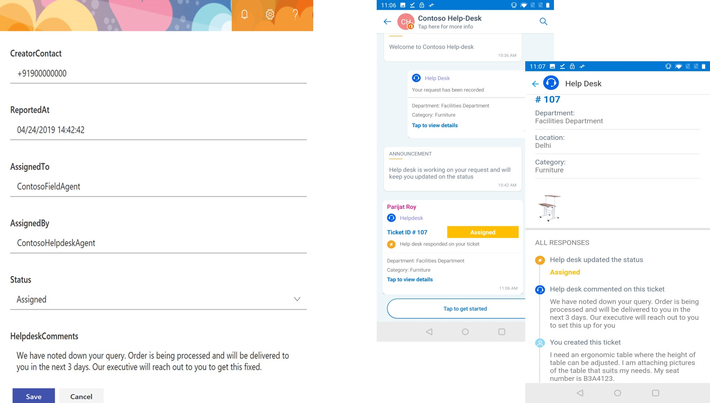
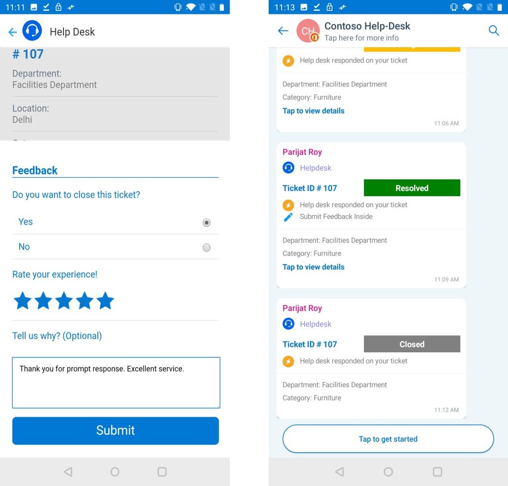

# Mitarbeiter-Helpdesk

 In einer Organisation prüft das Helpdesk-Team die von Mitarbeitern ausgelösten Abfragen, weist es einem Field Agent zu und aktualisiert den Auflösungsstatus auf den Mitarbeiter. Alle Abfragen werden als Tickets für eine einfache Verfolgung und Lösung angemeldet. Ein Ticket System ermöglicht es Helpdesk-Agenten, Feedback systematisch zu erfassen, zu kategorisieren, zu lösen und zu sammeln. Dadurch kann eine Organisation in der Abfrage Auflösung effektiv sein und hat einen Multiplikatoreffekt für die Mitarbeiter Zufriedenheitsbewertung.

Diese Lösung verwendet Kaizala als Front-End, SharePoint als Backend und Flow als Mittel zur Interaktion mit Kaizala und SharePoint. Ein Benutzer erstellt das Ticket durch Senden eines Formulars in Kaizala, die mit dieser Karte übermittelten Ticket Details werden erfasst und mithilfe von Flow in SharePoint gespeichert. bei Übermittlung erhält der Benutzer eine aktualisierte Karte, entweder wenn-

   1. Der Helpdesk-Agent aktualisiert den Status des Tickets in SharePoint (neu, zugewiesen oder aufgelöst) oder

   2. Helpdesk-Agents fügt Kommentare zu dem Ticket in SharePoint oder

   3. Sowohl der Helpdesk-Agent aktualisiert den Status als auch Kommentare in SharePoint

Wenn der Benutzer mit der vorgeschlagenen Lösung zufrieden ist, hat der Benutzer die Möglichkeit, das Ticket zu beenden und Feedback zu senden. Wenn der Benutzer mit der Lösung nicht zufrieden ist, kann der Benutzer das Ticket erneut öffnen. Benutzer Feedback – Bewertung und Kommentare, Status erneut geöffnet oder geschlossen wird in SharePoint wieder aktualisiert.

> Hinweis: diese Karte funktioniert nur in Hub-und Spoke-Gruppen

  Benutzeransicht der Ticketerstellung und-Übermittlung:

  

   Anzeigen der Aktualisierung des Status auf "zugewiesen" in SharePoint und der entsprechenden Karte, die an den Benutzer gesendet wird

   

   Ansicht des Status, der auf "aufgelöst" in SharePoint aktualisiert wird, und die entsprechende Karte, die an den Benutzer gesendet wird
   
   

   Benutzer Feedback Ansicht

   

## ImplementierungsSchritte:
Dies ist im Wesentlichen in drei Schritte unterteilt:

1. Aktionspakete hochladen, mit denen ein Benutzer (*2 Aktionspakete*) aktivieren kann

   1. Erstellen und übermitteln eines Tickets für das Helpdesk (*CreateTicket-ActionPackage. zip*)

   2. Receive Status Updates & comments from Help Desk (*StatusUpdateFromHelpdesk-ActionPackage. zip*)

2. Einrichten einer SharePoint-Liste, mit der Helpdesk-Agents

    1. Speichern der Ticket Details

    2. Zuweisen, kommentieren und Ändern des Ticket Status

3. Konfigurieren von Microsoft Flow für die Interaktion mit SharePoint und Kaizala (*3 Flows*)

    1. So erfassen Sie Ticket Details von der Karte und speichern Sie in SharePoint (*TicketCreationFlow. zip*)
    
    2. So senden Sie dem Benutzer eine aktualisierte Karte, wenn der Helpdesk-Agent den Status, Kommentare oder beides in SharePoint aktualisiert (*TicketStatusUpdatesFlow. zip*)

    3. So aktualisieren Sie die SharePoint-Liste, wenn der Benutzer das Schließen, erneutes Öffnen oder Hinzufügen von Feedback Kommentaren von der Karte auswählt (*TicketReopenFlow. zip*)

### Aktionspakete hochladen
1. Laden Sie die Datei ["EmployeeHelpDesk-SolutionPackage. zip"](https://github.com/MicrosoftDocs/kaizala-docs/blob/master/Articles/BusinessSolutions/Life%40Work/EmployeeHelpDesk/EmployeeHelpdesk-SolutionPackage.zip) (*Diese enthält 2 Aktionspakete und 3 Flows*).

2. Laden Sie die neueste Version von Kaizala ["ActionSDK. zip"](https://manage.kaiza.la/MiniApps/DownloadSDK) (*Diese enthält KASClient. js*)

3. Einrichten des "CreateTicket-ActionPackage. zip"

   1. Unzip "CreateTicket-ActionPackage. zip" in einen Ordner

   2. Ändern der Aktion "ID" und "Anbietername" in Package. JSON

   3. Hinzufügen von KASClient. js zu diesem Ordner 

   4. ZIP alle Inhalte in diesem Ordner (*dieser Ordner ist Ihr geändertes Aktionspaket, das in das Kaizala-Verwaltungs Portal importiert werden sollte*)

   5. [Importieren](https://docs.microsoft.com/en-us/kaizala/actions/publish#import-kaizala-action) des bearbeiteten Aktionspakets in das [Kaizala-Verwaltungs Portal](https://manage.kaiza.la/)

   6. [Veröffentlichen](https://docs.microsoft.com/en-us/kaizala/actions/publish) Sie die Aktion, und fügen Sie die Aktion zu einer Gruppe hinzu, der Sie die Karte hinzufügen möchten.

   7. Wählen Sie Benutzerrollen als Administrator und Mitglied aus.

4. Einrichten von "StatusUpdateFromHelpDesk-ActionPackage. zip"

   1.  Unzip "StatusUpdateFromHelpDesk-ActionPackage. zip" in einen Ordner

   2. Ändern der Aktion "ID" und "Anbietername" in Package. JSON

   3. Hinzufügen von KASClient. js zu diesem Ordner 

   4. ZIP alle Inhalte in diesem Ordner (*dieser Ordner ist Ihr geändertes Aktionspaket, das in das Kaizala-Verwaltungs Portal importiert werden sollte*)

   5. [Importieren](https://docs.microsoft.com/en-us/kaizala/actions/publish#import-kaizala-action) des bearbeiteten Aktionspakets in das [Kaizala-Verwaltungs Portal](https://manage.kaiza.la/)

   6. [Veröffentlichen](https://docs.microsoft.com/en-us/kaizala/actions/publish) Sie die Aktion, und fügen Sie die Aktion zu einer Gruppe hinzu, der Sie die Karte hinzufügen möchten.

   7. Benutzerrolle als Administrator auswählen

       > Hinweis: "CreateTicket-ActionPackage. zip" ist die Karte, die zum Auslösen eines Tickets verwendet wird und dem Administrator und den Abonnenten zur Verfügung gestellt werden soll. " StatusUpdateFromHelpDesk-ActionPackage. zip "zeigt Helpdesk-Kommentare und Status Updates an. Abonnenten müssen diese Karte nicht in der Aktions Palette sehen, daher wird Sie nur dem Administrator angezeigt.

### Einrichten einer SharePoint-Liste

1. [Erstellen](https://support.office.com/en-us/article/create-a-list-in-sharepoint-0d397414-d95f-41eb-addd-5e6eff41b083) einer neuen Liste in SharePoint

2. [Hinzufügen](https://support.office.com/en-us/article/create-a-column-in-a-sharepoint-list-or-library-2b0361ae-1bd3-41a3-8329-269e5f81cfa2) von Spalten und [Bearbeiten](https://support.office.com/en-us/article/Edit-list-settings-in-SharePoint-Online-4d35793b-246e-42a3-990c-563a83795b7f) (*wie unten in der gleichen Reihenfolge und im Format*) Spalteneinstellungen für diese Liste

    Spalten Empfohlene Einstellungen--------|---Department | Einzelne Textzeile | Einzelne Textzeile Kategorie | Einzelne Textzeile Beschreibung | Mehrere Textzeilen Fotos | Mehrere Textzeilen Creatorname | Einzelne Textzeile CreatorContact | Einzelne Textzeile ReportedAt | Einzelne Textzeile ZugewiesenAn | Einzelne Textzeile AssignedBy | Einzelne Zeile des Text Status | Auswahl mit Optionen als neu, zugewiesen, aufgelöst, geschlossen und erneut geöffnet (*diese Ticket Phasen sind obligatorisch*) HelpdeskComments | Mehrere Textzeilen UserFeedback | Mehrere Textzeilen ReasonsToReopen | Mehrere Textzeilen CreatorKaizalaName | Einzelne Textzeile CreatorKaizalaContact | Einzelne Textzeile User Rating | Einzelne Textzeile
 

4. [Bearbeiten Sie die Listenansicht](https://support.office.com/en-gb/article/edit-a-list-view-in-sharepoint-online-15916903-e79a-423f-b4e2-02d37e1ff372) , um die ID an erster Stelle zu positionieren. Dies ist die eindeutige Ticket-ID, die auf der Karte angezeigt wird, nachdem das Ticket zugewiesen wurde.

     >Hinweis: Excel-Vorlage für Spaltenkopfzeilen [herunterladen](https://github.com/MicrosoftDocs/kaizala-docs/blob/master/Articles/BusinessSolutions/Life%40Work/EmployeeHelpDesk/HelpdeskTemplate.xlsx)

### Importieren und Einrichten von Flows

Diese Lösung hat drei Flüsse,

1. So erfassen Sie Ticket Details von der Karte und speichern Sie in SharePoint

    1. [Importieren](https://flow.microsoft.com/en-us/blog/import-export-bap-packages/) des "TicketCreationFlow. zip" in Ihr Microsoft Flow-Konto

          > Hinweis – Wenn Sie noch nie SharePoint-oder Kaizala-Verbindungen verwendet haben, fügen Sie zunächst [Verbindungen hinzu](https://docs.microsoft.com/en-us/flow/add-manage-connections) .    

    2. Bearbeiten von Details in importiertem Flow (*siehe Schritte unten*) 

          1. Im ersten Block 

               1. Geben Sie die Gruppen-ID ein, oder wählen Sie den Gruppennamen aus, dem Sie die Karte hinzufügen möchten.

               2. Klicken Sie auf Aktionspaket Feld, um die Aktions-ID einzugeben, die Sie für "CreateTicket-ActionPackage. zip" angegeben haben.

               3. Aktion "alle" zuordnen

                  

          2. Im letzten Block

               1. Eingeben der SharePoint-Websiteadresse

               2. Listen Name eingeben
                  
                  

                   > Hinweis: alle Spalten in der SharePoint-Liste werden beim Eingeben des &-Listen namens der SharePoint-Website in Flow angezeigt. Überprüfen Sie die Zuordnung von SharePoint-Listenfeldern in Flow. 

          3.  Speichern des Flusses
           

2. So senden Sie dem Benutzer eine aktualisierte Karte, wenn der Helpdesk-Agent den Status, Kommentare oder beides in SharePoint aktualisiert

    1. [Importieren](https://flow.microsoft.com/en-us/blog/import-export-bap-packages/) des "TicketStatusUpdatesFlow. zip" in Ihr Microsoft Flow-Konto

    2. Bearbeiten von Details in importiertem Flow (*siehe Schritte unten*) 

          1. Im ersten Block

               1.  Eingeben der SharePoint-Websiteadresse

               2. Listen Name eingeben

                  

          2. Im letzten Block

               1. Geben Sie die Gruppen-ID ein, oder wählen Sie Gruppenname aus, an die Sie die Statusaktualisierungen senden möchten.

               2. Klicken Sie auf Aktion, um "Aktionspaket" auszuwählen. 

               3. Klicken Sie auf Aktionspaket, um die Aktions-ID einzugeben, die Sie für "StatusUpdateFromHelpDesk-ActionPackage. zip" angegeben haben.

               4. Körper "ActionBody" zuordnen

                  

        3.  Speichern des Flusses
    
3. So aktualisieren Sie die SharePoint-Liste, wenn der Benutzer das Schließen, erneutes Öffnen oder Hinzufügen von Feedback Kommentaren von der Karte auswählt
 
    1. [Importieren](https://flow.microsoft.com/en-us/blog/import-export-bap-packages/) des "TicketReopenFlow. zip" in Ihr Microsoft Flow-Konto

    2. Bearbeiten von Details in importiertem Flow (*siehe Schritte unten*) 

        1. Im ersten Block 

             1. Wählen Sie Gruppenname aus, oder geben Sie die Gruppen-ID ein.

             2. Klicken Sie auf Aktionspaket, um die Aktions-ID einzugeben, die Sie für "StatusUpdateFromHelpDesk-ActionPackage. zip" angegeben haben.

             3. Aktion "alle" zuordnen

                

        2. Im zweiten Block

             1. Geben Sie die Websiteadresse ein.

             2. Geben Sie den Listennamen ein. 

                

        3. Im letzten Block

             1. Geben Sie die Websiteadresse ein.

             2. Geben Sie den Listennamen ein.

                

        4.  Speichern des Flusses
