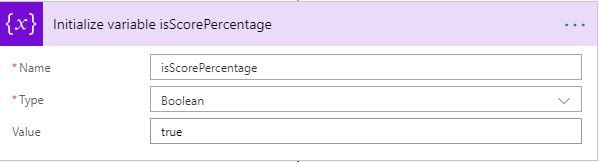

# <a name="drive-performance-using-leaderboard"></a>Leistungssteigerung mit Leaderboard
Eine Rangliste stellt eine umfassende visuelle Darstellung der Teilnehmer dar, um zu verstehen, wo Sie im Vergleich zu Gleichaltrigen rangen. Wenn Sie die Leistungsfähigkeit von gamification nutzen, sind Leaderboards die beste Möglichkeit, um wettbewerbsfähigen Teamgeist in Teams zu vermitteln und die Leistung einzelner/Teammitglieder gegen geschäftliche Ziele nachzuverfolgen. Sie bieten sofortiges Feedback zu Kurs-korrigieren und Identifizieren von Mustern in KPIs, die Mitarbeiter improvisieren können.

Diese generische Lösung ist eine großartige Möglichkeit, Team Anreize und eine offene Kultur zu erstellen. Es kann von jeder Vertriebs-oder Dienstorganisation verwendet werden, um die Leistung zu verfolgen – individuell oder Team-und Leistungsvergleich über mehrere KPIs hinweg. 

Excel aus Ihrem Onedrive for Business wird von Microsoft Flow verwendet, und Leaderboard Card wird in einem Serienmuster an die Kaizala-Gruppe gesendet. Diese Karte hat zwei Ansichten-Chat Kartenansicht & immersive Ansicht. 

**Chat Kartenansicht**


**Immersive Ansicht**

Diese Ansicht verfügt über zwei Registerkarten, wobei es sich zunächst um eine Wall of Fame für Top 10 Performer handelt, zweitens um "meine Leistung", was für jeden Benutzer unterschiedlich ist.


Meine Leistung umfasst 2 Abschnitte, in denen meine Statistiken und die Reihen in der Nähe angezeigt werden. 


## <a name="implementation-steps"></a>Implementierungsschritte
Dies kann grob in drei Schritte unterteilt werden:
1. Paket zum Hochladen von Aktionen
2. Excel-Blatt formatieren
3. Konfigurieren von Microsoft Flow

### <a name="upload-action-package"></a>Paket zum Hochladen von Aktionen
1. Laden Sie die Datei ["Leaderboard-SolutionPackage. zip](https://aka.ms/Leaderboard-SolutionPackage.zip)" herunter (*dieses* *enthält* *"Leaderboard_ActionPackage. zip* " *und* *"Leaderboard_FlowPackage. zip"* - *Paket*).
2. Laden Sie die neueste Version von Kaizala ["ActionSDK. zip"](https://manage.kaiza.la/MiniApps/DownloadSDK) (*Diese enthält KASClient. js*)
3. Bearbeiten Sie "Leaderboard_ActionPackage. zip"
   1. Unzip "Leaderboard_ActionPackage. zip" in einen Ordner
   2. Ändern der Aktion "ID" und "Anbietername" in Package. JSON
   3. Hinzufügen von KASClient. js zu diesem Ordner 
   4. ZIP alle Inhalte in diesem Ordner (*dieser Ordner ist Ihr geändertes Aktionspaket, das in das Kaizala-Verwaltungs Portal importiert werden sollte*)
   5. [Importieren](https://docs.microsoft.com/en-us/kaizala/actions/publish#import-kaizala-action) des bearbeiteten Aktionspakets in das [Kaizala-Verwaltungs Portal](https://manage.kaiza.la/)(*diese Karte wird durch Aufrufen einer API gesendet, sodass die Karte keiner Gruppe hinzugefügt werden muss*)

### <a name="format-excel-sheet"></a>Excel-Blatt formatieren

1. Herunterladen der [Excel-Vorlage](https://github.com/MicrosoftDocs/kaizala-docs/blob/master/Articles/BusinessSolutions/Life%40Work/Leaderboard/Leaderboard.csv)

2. Füllen Sie alle Pflichtfelder-Name, PhoneNo und Score aus. Neben diesen drei obligatorischen Feldern sind die restlichen KPIs (optional) und werden auf der Registerkarte meine Leistung angezeigt.

    

     > Hinweis: Score-&-KPIs können numerische oder%-Werte sein. Wenn die Spalte Prozentsätze enthält, wenden Sie das [Prozentzahlen](https://support.office.com/en-ie/article/format-numbers-as-percentages-de49167b-d603-4450-bcaa-31fba6c7b6b4) Format auf diese Spalte an.

     > Hinweis: meine Leistungs Registerkarte kann maximal 6 KPIs aufweisen.


3. [Umbenennen](https://support.office.com/en-us/article/rename-an-excel-table-fbf49a4f-82a3-43eb-8ba2-44d21233b114) der Excel-Tabelle als "Leaderboardyyyymmdd" z. b. Leaderboard20190431 für den Tag 2019/04/31 (JJ/MM/DD)

4. Speichern Sie diese Datei auf einem Laufwerk für Unternehmen.

      > Hinweis: Flow wählt automatisch die Excel-Daten dieses Tags basierend auf dem Tabellennamen aus und sendet die Karte.

### <a name="configure-microsoft-flow"></a>Konfigurieren von Microsoft Flow

1. [Importieren](https://flow.microsoft.com/en-us/blog/import-export-bap-packages/) des "Leaderboard_FlowPackage. zip" in Ihr Microsoft Flow-Konto

      > Hinweis – Wenn Sie noch nie SharePoint-oder Kaizala-Verbindungen verwendet haben, fügen Sie zunächst [Verbindungen hinzu](https://docs.microsoft.com/en-us/flow/add-manage-connections) .    

2. Bearbeiten von Details in importiertem Flow (*siehe Schritte unten*)

    1. Geben Sie im zweiten Block den Kartentitel in das Feld Wert ein, den Sie in der Rangliste anzeigen möchten. Zum Beispiel "Sales Leaderboard" 

         
    
    2. Legen Sie im dritten Block Value als true fest, wenn die "Partitur" ein Prozentsatz ist, wenn Sie nicht auf false festgelegt ist.

         

    3. Im siebten Block

       1. Standort als "OneDrive for Business" aus der Dropdownliste auswählen

       2. Wählen Sie in der Dropdownliste Dokumentbibliothek als "OneDrive" aus.

       3. Wählen Sie Excel-Datei beim Klicken auf Ordnerauswahl aus.
     
             > Hinweis: der Tabellenname, den Sie in der Excel-Datei angegeben haben, wird automatisch vom Flow übernommen. 
       
             


    4. Im neunten Block, "Apply to each", 

        1. Bearbeiten Sie KPI-Bezeichnungen in Parse JSON-Block für z. b. KPI 1 als abgeschlossene &-KPI 2-Aufrufe als konvertierte Anrufe.

             


             >Hinweis: die Karte kann maximal 6 KPI es 

        2. Bearbeiten von KPI-Bezeichnungen in Compose (*siehe unten*)
        
             

        
    5. Im letzten Block

        1. Geben Sie die Gruppen-ID ein, oder wählen Sie den Gruppennamen aus, an den Sie die Karte senden möchten.

        2. Klicken Sie auf Aktion, um "Aktionspaket" aus der Dropdownliste auszuwählen.
        
        3. Klicken Sie auf Aktionspaket, um "benutzerdefinierten Wert eingeben" auszuwählen, und geben Sie Ihre "Aktionspaket-ID" ein, die Sie Package. JSON angegeben haben.

        4. Speichern des Flusses

           

Die Leaderboard-Karte wird gemäß den Intervallen und Frequenzen, die im Flow festgelegt sind, an die angegebene Gruppe gesendet. 

>Hinweis: Wenn Sie die Bezeichnungen "Name", "PhoneNo" und "Score" in Excel Sheet ändern möchten, ändern Sie diese in die gewünschten Bezeichnungen in ImmersiveView. js.

```
      
 "/*Fields from excel */

const NAME = "Name";
const PHONENO = "PhoneNo";
const SCORE = "Score";"      

