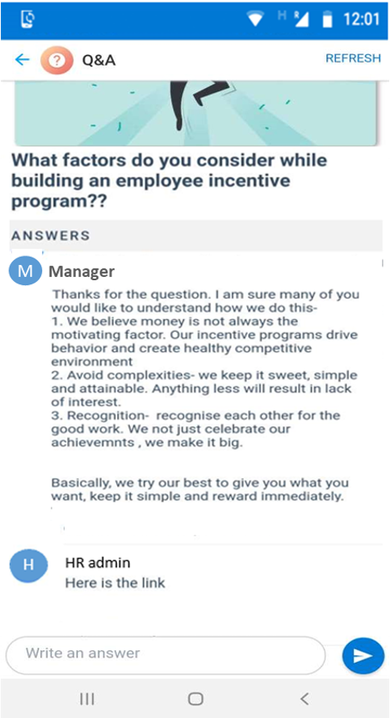

# Strukturierte Antworten auf Ihre Fragen von Kollegen erhalten

Das Erhöhen der Mitarbeiterbindung ist für den Erfolg jeder Organisation entscheidend – sei es ein kleiner Startup oder ein großes Unternehmen, das über mehrere Standorte hinweg betrieben wird. Es kann für Führungskräfte und Führungskräfte eine Herausforderung sein, zu erfahren, wie die Mitarbeiter über Unternehmensrichtlinien, Projekte, Aufträge und zugewiesene Aufgaben informiert sind.

Mit dem Zuwachs an mobilen Mitarbeitern, die solche QnA-Sitzungen mit Managern durchführen, können Sie unterwegs noch schwieriger sein. Wenn Sie auf QnA-Sitzung im mobilen Chat zurückgreifen, können die Antworten auf Fragen den Fluss unterbrechen, und Endbenutzer können Informationen nicht verpassen.

Mit der QnA-Karte können Benutzer Fragen an Vorgesetzte und Rest der Community stellen. alle Antworten werden in einem strukturierten Format angezeigt.

Dies ist eine einfache Karte mit einer Erstellungsansicht, die es dem Benutzer ermöglicht, eine Frage, eine Kartenansicht für Benutzer zu übermitteln, um den neuesten Kommentar anzuzeigen, sowie eine Zusammenfassungsansicht, mit der Benutzer die Diskussion anzeigen und daran teilnehmen können.

Erstellungsansicht:

Chat Kartenansicht:

Zusammenfassungsansicht:

## Implementierungsschritte:
1. Laden Sie die Datei ["QnA-SolutionPackage. zip"](https://aka.ms/QnA-SolutionPackage) herunter (*Dieses enthält Aktionspaket*)
2. Laden Sie die neueste Version von Kaizala ["ActionSDK. zip"](https://manage.kaiza.la/MiniApps/DownloadSDK) herunter (*Dies enthält KASClient. js*)
3. Bearbeiten des "QnA-SolutionPackage. zip" (siehe*unten*)
   1. Unzip "QnA-SolutionPackage. zip" in einen Ordner
   2. Ändern der Aktion "ID" und "ProviderName" in "Package. JSON"
   3. Fügen Sie KASClient. js zu diesem Ordner hinzu (*benennen Sie den KASClient (1). js bei Bedarf in KASClient. js um*)
   4. Alle Inhalte in diesem Ordner komprimieren (*dieser Ordner ist Ihr geändertes Aktionspaket, das in das kaizala-Verwaltungsportal importiert werden sollte*)    
       
      > Hinweis: Wählen Sie alle Dateien in Ihrem Arbeitsverzeichnis aus, und erstellen Sie eine neue ZIP-Datei für Ihr Paket. Stellen Sie sicher, dass alle Dateien im Stammverzeichnis des Pakets vorhanden sind. Dies sollte KASClient. js, Package. JSON mit der neuen Aktion "ID" und "ProviderName" umfassen.
       
4. [Importieren](https://docs.microsoft.com/en-us/kaizala/actions/publish#import-kaizala-action) des bearbeiteten Aktionspakets in das [kaizala-Verwaltungsportal](https://manage.kaiza.la/)
5. [Veröffentlichen](https://docs.microsoft.com/en-us/kaizala/actions/publish) Sie die Aktion, und fügen Sie die Aktion zu einer Gruppe hinzu, der Sie die Karte hinzufügen möchten.
6. Wählen Sie Benutzerrollen als Administrator und Mitglied zum Veröffentlichen der Karte in der Flat Group aus.

> Hinweis: diese Karte funktioniert nur in Flat Group. Alle Gruppenmitglieder und Administratoren können diese Karte in einer flachen Gruppe erstellen und senden.
