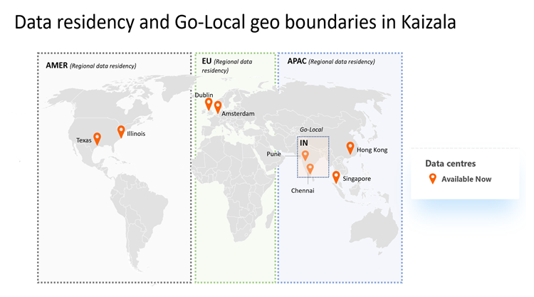

# Daten Wohnsitz und lokale Unterstützung in Microsoft Kaizala

Derzeit bietet Microsoft Kaizala den regionalen Daten Wohnsitz Unterstützung über die Rechenzentren in Europa (EU), den asiatisch-pazifischen Raum (APAC), USA (USA) und Indien (in). Dies bedeutet, dass Kaizala-Kunden über Daten im Zusammenhang mit [Organisations Chats und Gruppen](https://support.office.com/article/organization-chats-and-groups-in-kaizala-c8a7855c-d232-4914-811c-f6708734dcc3) wie Nachrichten, Anlagen und Kaizala-Aktionen verfügen, die im Rechenzentrum ihrer Abrechnungs Region gespeichert sind.

Zusätzlich zur Unterstützung der Ziele des Daten Aufenthalts innerhalb der Region erleichtern Kaizala-Dienst-Rechenzentren auch das Failover und die Notfallwiederherstellung über die Rechenzentren.

## Globales Rechenzentrums-Footprint mit Unterstützung für Daten Residency

Derzeit verfügt Kaizala über acht Rechenzentren (Primär und Sicherung) in drei Regionen und einem Land:

- APAC (dient dem asiatisch-pazifischen Raum außer Indien)-Rechenzentren in Singapur und Hong Kong
- EMEA (EU, MEA) – Rechenzentren in Dublin und Amsterdam
- Amer (North and South Americas) – Rechenzentren in Texas und Illinois
- Indien (go-local) – Rechenzentren in Chennai und Pune

Neben der Bereitstellung von COMPUTE und Speicher bietet Kaizala auch Daten Wohnsitz Unterstützung, robustes Failover und Unterstützung für die Notfallwiederherstellung für Unternehmenskunden. Diese Skalierungseinheiten ermöglichen außerdem eine verbesserte Konnektivität und Messagingleistung für Unternehmens-und allgemeine Kunden. 

## Wie werden Daten in Kaizala gespeichert?

Kaizala speichert Daten basierend auf den Datentypen der Nachrichten anders.

- **Chats, likes und Kommentare** – alle Nachrichten, Vorlieben und Kommentardaten, die zu Organisationsgruppen-oder org 1:1-Chats gehören, werden in einem sicheren Office 365-und Azure powered-Chatdienst gespeichert, der basierend auf dem jeweiligen Abrechnungs Land für Mandanten begrenzt ist.
- **Attachments** -alle Anlagen befinden sich zusammen mit Chatnachrichten in derselben Daten Grenze.
- **Kaizala-Aktionskarten** -alle Kaizala-Aktionskarten Daten, die Metadaten, Aktionspakete und Antwort Berichtsdaten enthalten, werden mit dem Chatdienst in derselben Daten Grenze zusammengefunden.
- **** Kaizala-Anrufdaten werden vorübergehend nicht in Rechenzentren gespeichert. Anrufprotokolle verfolgen jedoch dieselben Daten wie Chats.

### Beispiel

Contoso verfügt über ein Office 365-Abrechnungs Land in der EU. Contoso hat sich im April 2019 bei Kaizala angemeldet, und alle seine Kern Daten einschließlich Chats, Anlagen und Aktionskarten werden in Rest ausschließlich in EU-Skaleneinheiten (Dublin und Amsterdam) gespeichert.

## Was wird in Zukunft gespeichert?

- **Onboarding auf der Seite "Datenspeicherort"** – für Unternehmen ist der Datenspeicherort für unterschiedliche Arbeitsauslastungen von Office 365 unter Office 365 Verwaltungsportal unter Home\Organizational-Profil sichtbar. Die Möglichkeit zum Onboarding von Kaizala auf der Seite "Datenspeicherort" im Verwaltungsportal wird demnächst angezeigt. Sehen Sie sich diesen Abschnitt für Updates an.
- **Neue Rechenzentren** : das Kaizala-Team untersucht kontinuierlich die Erweiterung, basierend auf der Bereitstellung der besten Benutzeroberfläche für Benutzer. Wenn Sie einen Geschäftsfall haben, veröffentlichen Sie Ihre Fragen in unserer [TechNet-Community](https://techcommunity.microsoft.com/t5/Microsoft-Kaizala/ct-p/MicrosoftKaizala).

## FAQs

### Was bedeutet es für vorhandene Unternehmenskunden?

Bestehende Kunden in Indien haben bereits Ihren Daten Wohnsitz in Indien. Daten für alle nicht in Indien vorhandenen Mandanten bleiben jedoch weiterhin am Gruppen Standort (basierend auf dem Landescode des Erstellers). Nach dem 2019. April beginnen jedoch alle neueren Organisationsgruppen und Nachrichten vorhandener Organisationsgruppen oder Chats mit dem folgenden Daten Wohnsitz basierend auf der Abrechnungs Region des Mandanten.

### Was bedeutet es für neue Unternehmenskunden?

Der Daten Wohnsitz wird automatisch für alle Kunden, die sich bei Kaizala nach April 2019 registrieren, angewendet. Außerdem sollte der Daten Wohnsitz auf Aktionskarten auf den neuesten Android-oder IOS-App-Versionen anwendbar sein.
 
### Ich habe noch weitere Fragen. Wen kann ich erreichen?

Wenn Sie weitere Fragen haben, wenden Sie sich an Ihr Konto Team oder unsere [TechNet-Community](https://techcommunity.microsoft.com/t5/Microsoft-Kaizala/ct-p/MicrosoftKaizala). Darüber hinaus können Sie in [Kaizalafeedback@Microsoft.com](mailto:kaizalafeedback@microsoft.com)schreiben.

