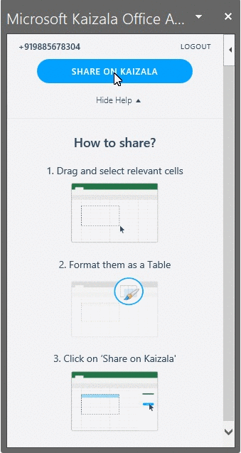
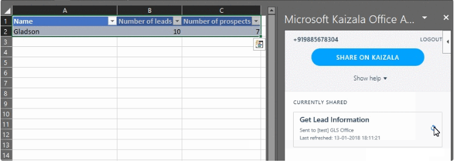

## Kaizala Office-Add-in: Abrufen von Daten in ExcelKaizala Office add-in: Fetch data into Excel
 Mit dem Kaizala-Excel-Add-in können Sie schnell Daten von Kaizala-Endpunkten abrufen, ohne Excel in nur einem Klick zu verlassen.The Kaizala Excel add-in allows you to quickly get data from Kaizala endpoints without leaving Excel in just a click. Sie benötigen lediglich eine Excel-Tabelle in einem Tabellenblatt und ein Kaizala-Konto.All you need is an Excel table within a spreadsheet and a Kaizala account. Sie können nun die Excel-Tabelle auf Kaizala freigeben – was eine Umfrage mit jeder Spalte als Frage senden würde.You could now share the Excel table on Kaizala – which would send out a survey with each column as a question. Personen in der Gruppe können auf die Umfrage Antworten, die Sie auf Ihrem Telefon erhalten haben.People on the group could respond to the survey that they received on their phone. Wenn Sie die Tabelle in Excel aktualisieren, erhalten Sie die Antworten als Zeilen in der Tabelle.When you refresh the table from within Excel, you would get the responses as rows within your table.
### Installieren des Add-InsInstalling the add-in
[1]:https://store.office.com/addinstemplateinstallpage.aspx?rs=en-IN&assetid=WA104381121
Detaillierte Anweisungen zur Installation des Plugins finden Sie unter [http://aka.ms/KaizalaExcelAddin] [ 1].Detailed instructions on installing the plugin is present at [http://aka.ms/KaizalaExcelAddin][1]. Falls dies nicht funktioniert, können Sie diesen direkten Link vorübergehend verwenden.In case that doesn’t work, you could temporarily use this direct link.
 Nachdem Sie das Add-in installiert haben, sollte das Menüband auf der Registerkarte Add-Ins angezeigt werden.Once you have installed the add-in, you should see the ribbon under the Add-ins tab.
 
### Exemplarische VorgehensweiseScenario walkthrough
Beginnen wir mit einem neuen Excel-Tabellenblatt, und erstellen Sie eine Tabelle.Lets start with a fresh Excel spread sheet and create a table. Fügen Sie Text in 3 Zellen mit dem Namen der Felder, der Anzahl von Leads und der Anzahl der Interessenten hinzu, und erstellen Sie anschließend eine Tabelle mit diesen als Kopfzeilen.Add text in 3 cells having the fields name, number of leads and number of prospects – and subsequently create a table with them as headers.

 

 Wählen Sie jetzt auf der Registerkarte ADD-INS Microsoft Kaizala aus.Now from the ADD-INS tab, select Microsoft Kaizala. Dadurch würde eine Seitenleiste mit der Kaizala-Seite geöffnet.This would open up a side bar with the Kaizala page. Geben Sie Ihre Mobiltelefonnummer und OTP auf der Seite an, um sich selbst zu authentifizieren.Provide your mobile number and OTP in the page to authenticate yourself. Sie müssen dies nur einmal tun.You need to do this only once.
  Wenn Sie die Tabelle ausgewählt halten, klicken Sie auf der Seite Kaizala auf freigeben.Keeping the table selected, click on SHARE button on the Kaizala page. Geben Sie einen Titel für Ihre Umfrage aus wählen Sie die Gruppe aus, aus der Sie die Daten erfassen möchten.Give a title for your survey select the group you want to capture the data from. 

 

  Dies würde dazu führen, dass eine Umfrage in der Gruppe gesendet wird, die wie folgt aussieht:This would cause a survey to be sent on the group that looks like this:

 

 Zum Beispiel eine Antwort auf die Umfrage im Telefon mit dem Namen als Gladson, die Anzahl der Leads 10 und die Anzahl der Aussichten als 7.For example a response to the survey in the phone with name as Gladson, the number of leads as 10 and number of prospects as 7.

 

 Klicken Sie nun auf der Kaizala-Seite in Excel auf das Symbol aktualisieren, um die Daten in der Tabelle zu aktualisieren.Now, click on the refresh icon in the Kaizala page in Excel to refresh data in the table. Voila, Sie haben die Daten!Voila, you have the data!

 

 Wenn Sie noch weitere Informationen benötigen, gehen Sie über diesen [Link](https://www.youtube.com/watch?v=cyvfEw5zGv8&t=0s&index=6&list=PLJquJ26ry3X6wZ5FCXOjMD-uhUGxB_tMd )If you still need some more information go through this [link](https://www.youtube.com/watch?v=cyvfEw5zGv8&t=0s&index=6&list=PLJquJ26ry3X6wZ5FCXOjMD-uhUGxB_tMd )
