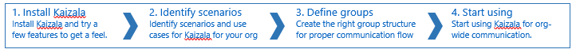
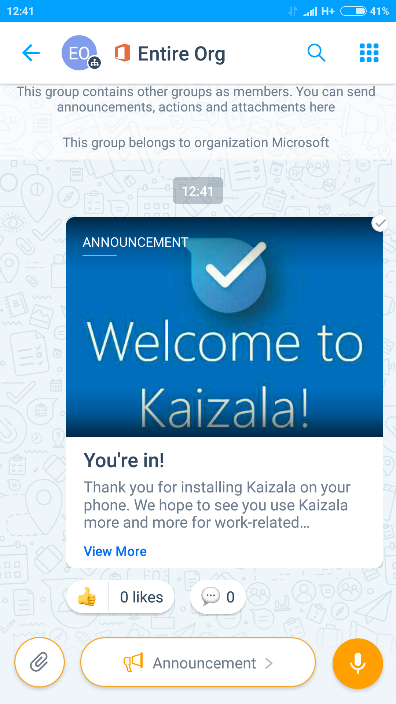

# Erste Schritte mit Microsoft KaizalaGetting Started with Microsoft Kaizala
## KurzübersichtA Quick Reference Guide 
  Willkommen, wir sind froh, dass Sie hier sind!Welcome, we’re glad you’re here! Diese Kurzübersicht hilft Ihnen, Ihre Organisation auf Kaizala zu starten.This quick reference guide will help you to get your organization started on Kaizala.    
  
  Das Kaizala-Benutzerhandbuch steht [hier](https://support.office.com/en-us/article/About-the-Kaizala-mobile-app-122fdf32-9f15-465d-a905-6fae72d38b42) und der Leitfaden für das Kaizala-Verwaltungs Portal zur Verfügung, mit dem Sie Kaizala-Gruppen verwalten, eine Massen proaktivierung ausführen und Berichte über alle Kaizala-Aktivitäten abrufen können, die [hier](https://support.office.com/en-us/article/About-Kaizala-Management-Portal-2046ddba-06fb-49c9-b6d6-a4777e8a556f?ui=en-US&rs=en-US&ad=US)verfügbar sind.The Kaizala user guide is available [here](https://support.office.com/en-us/article/About-the-Kaizala-mobile-app-122fdf32-9f15-465d-a905-6fae72d38b42) and the guide for the Kaizala Management Portal that enables you to manage Kaizala groups, do bulk provisioning, and get reports of all Kaizala activity is available [here](https://support.office.com/en-us/article/About-Kaizala-Management-Portal-2046ddba-06fb-49c9-b6d6-a4777e8a556f?ui=en-US&rs=en-US&ad=US).  
  
[1]: https://support.office.com/en-us/article/About-the-Kaizala-mobile-app-122fdf32-9f15-465d-a905-6fae72d38b42
[2]: https://support.office.com/en-us/article/About-Kaizala-Management-Portal-2046ddba-06fb-49c9-b6d6-a4777e8a556f?ui=en-US&rs=en-US&ad=US
[3]: https://play.google.com/store/apps/details?id=com.microsoft.mobile.polymer&hl=en
[4]: https://itunes.apple.com/in/app/microsoft-kaizala/id1112208399?mt=8
[5]: http://manage.kaiza.la/
[6]: https://support.office.com/en-us/article/Kaizala-Groups-858bead0-f99b-4215-83c6-b8812bbe3edd
[7]: https://github.com/MicrosoftDocs/kaizala-docs

## 1. Installation und Schnellstart1. Installation and quick start 
  * Herunterladen von Kaizala aus dem [Google Play Store](https://play.google.com/store/apps/details?id=com.microsoft.mobile.polymer&hl=en) für Android oder [App Store](https://itunes.apple.com/in/app/microsoft-kaizala/id1112208399?mt=8) für IOS nowDownload Kaizala from [Google Play Store](https://play.google.com/store/apps/details?id=com.microsoft.mobile.polymer&hl=en) for Android or [App Store](https://itunes.apple.com/in/app/microsoft-kaizala/id1112208399?mt=8) for iOS now
  * Aktivieren Sie Ihre Telefonnummer und beginnen Sie sofortActivate with your phone number and get started right away
  * Klicken Sie auf das "+"-Zeichen, um eine Gruppe zu erstellen und Mitglieder aus Ihrer Kontaktliste hinzuzufügen oder die Telefonnummern direkt hinzuzufügen.Click on the ‘+’ sign to create a group and add members from your contacts list or directly add the phone numbers
  * Geben Sie der Gruppe einen Namen, und Sie sind alle festgelegt.Give the group a name and you are all set
  * Versuchen Sie, eine Kaizala-Aktion zu senden, indem Sie auf die obere rechte Ecke klicken, um die Kaizala-Aktions Palette aufzurufen.Try sending a Kaizala Action by clicking on the top right corner to bring up the Kaizala Actions palette
  * Senden Sie eine Schnellabfrage oder eine Ansage, um Kaizala in Aktion zu sehen.Try sending a Quick Poll or an Announcement to see Kaizala in Action. 
  Wenn Sie niemanden in Ihrem Netzwerk auf Kaizala haben, können Sie diese weiterhin der Gruppe hinzufügen und dann auf Gruppen Name klicken, um eine Einladung an alle Mitglieder zu senden, die sich nicht in Kaizala befinden.If you don’t have anyone in your network on Kaizala, you can still add them to the group and then click on Group Name to send an invite to all the members who are not on Kaizala.
  
## 2. Identifizieren von Szenarien2.   Identify scenarios

  Bevor Sie mit der Bereitstellung beginnen, sollten Sie einige Anwendungsfälle für Kaizala berücksichtigen.It is advisable to have a few use cases for Kaizala in mind for your organization before you begin the deployment. Hier sind einige Videos mit Kaizala-Anwendungsfällen, die mit Inspiration von echten Kunden mithilfe von Kaizala erstellt wurden.Here are some videos depicting Kaizala use cases, created with inspiration from real customers using Kaizala.  

  

 **Im folgenden finden Sie weitere Beispiele für Anwendungsfälle, die als Referenz aufgeführt sind, damit Sie mit ihrer Planung beginnen können.****Here are some more sample use cases listed for your reference to get you started with your planning.**
 
| SzenarioScenario   |      Einige AnwendungsfälleSome Use Cases      |  Beispiel IllustrationSample Illustration|
|----------|:-------------:|------:|
|**Informieren und engagieren ihrer Mitarbeiter****Keep your employees informed and engaged**| Verwenden Sie die Ansage Karte in Kaizala, um Folgendes zu tun:Use the Announcement card in Kaizala to: <ul><li>Senden einer Begrüßungsansage an alle MitarbeiterSend a Welcome announcement to all employees</li><li>Informieren Sie alle Mitarbeiter über eine neue Richtlinie.Inform all employees about a new policy.; </li><ul><li>Mitarbeiter können Ihre Eingaben bereitstellen oder Fragen mithilfe des Kommentar Abschnitts der Ankündigung stellen.Employees can provide their inputs or ask questions using Comments section of the Announcement.</li><li> Sie können nur "wie" die AnsageThey can just “Like” the announcement</li></ul><li>Aktualisieren des gesamten Vertriebsteams über die neueste Produkteinführung und neue ZieleUpdate the entire Sales team about the latest product launch and new targets</li><ul><li>Mitarbeiter können Klärungs Fragen im Abschnitt Kommentare Fragen.Employees can ask clarifying questions in Comments section.</li></ul><li>Melden Sie einen plötzlichen Feiertag oder eine Neuorganisation im Team an.Announce a sudden holiday or a re-organization in the team. Mitarbeiter verwenden sicher "likes".Employees will use “Likes” for sure.</li></ul> |  |
| **Datensammlung vom Feld und effektive Arbeitsverwaltung für Ihr Team****Data collection from field and effective work management for your team** | <ul><li>Verwenden Sie Kaizala-Umfragen und-Umfragen, um schnell Daten von Field-Mitarbeitern zu sammeln und andere Aktionen zum Verwalten der Arbeit zu verwenden.Use Kaizala Surveys and Polls to quickly collect data from field employees and use other Actions to manage work. </li><li> Kunden Leads-Daten abrufen, während sich das Team im Feld befindetGet customer leads data while team is in the field<ul><li>Das Vertriebsteam kann Kundeninformationen eingeben, wenn es unterwegs ist.Sales team can enter customer information while on the go</li><li>Kunden Leads können automatisch in Back-End-CRM mit Kaizala-APIsCustomer leads can automatically get into backend CRM using Kaizala APIs</li><li>Dieser Bericht ist auf dem Kaizala-Verwaltungs Portal in Echtzeit verfügbar.Report of this is available on the Kaizala Management Portal, in real time.</li></ul><li>Abrufen des täglichen Statusberichts von Remotestandorten aus sowie Foto und Speicherort der RemotewebsiteGet daily status report from remote locations, along with photo and location of the remote site</li><li>Zuweisen von Aufgaben zu Team in Kaizala und über Prüfstatus und-Trend im Kaizala-Verwaltungs PortalAssign tasks to team in Kaizala and review status and trend in the Kaizala Management Portal</li><li>Einladen von Personen zu Besprechungen mithilfe von Kaizala.Invite people for meetings using Kaizala.</li></ul>||
|**Verbinden Sie sich mit ihren Kunden und der Wertschöpfungskette; Sofort Feedback abrufen****Connect with your customers and value chain;Get feedback instantly**|<ul><li>Verwenden Sie Kaizala Public Groups, um einen privaten Kommunikationskanal mit Ihrem lakhs zu erstellen:Use Kaizala public groups to create a private channel of communication with your lakhs of customer or citizens: <ol><li>Senden Sie Ihnen Marketinginhalte zu neuem StartSend them marketing content about new launch</li><li>Senden Sie Umfragen an diese, um Feedback zum neuen Start zu erhalten.Send surveys to them to get feedback on new launch</li><li>Erstellen benutzerdefinierter Kaizala-Karten, damit diese eine Supportanfrage öffnen könnenCreate custom Kaizala cards for them to open a support request</li></ol><li>Bericht über all dies im Kaizala-Verwaltungs Portal anzeigenView  report of all of this on the Kaizala Management Portal</li><li>Verwenden Sie verwaltete öffentliche Gruppe, um einer öffentlichen Gruppe nur vordefinierte Mitglieder hinzuzufügen, wie alle Elterngruppen für Schulen oder alle Händler oder Lieferanten, mit denen Sie arbeiten.Use managed public group to only add pre-defined members to a public group like all parents groups for schools or all dealers or vendors you work with</li></ul>||
|**Entwickeln Sie Ihre Branchen-apps auf Kaizala als Kaizala benutzerdefinierte Aktionen, die innerhalb der app verfügbar sind.****Develop your LoB apps on Kaizala as Kaizala Custom Actions, available within the app**|Sie können benutzerdefinierte Anwendungen für Ihre Organisation erstellen, wie die Anwendung oder Anwesenheits Verfolgung mithilfe des Kaizala-Erweiterbarkeits Frameworks.You can create customized applications for your organization like leave application or attendance tracking using the Kaizala Extensibility Framework. Diese apps werden in der Kaizala-Aktions Palette angezeigt.These apps will show up in the Kaizala Action palette.||  

## 3. Definieren von Gruppen in Kaizala für Ihre Organisation3.Define groups in Kaizala for your org  

Nachdem Sie die Anwendungsfälle für Kaizala in Ihrer Organisation ermittelt haben, müssen Sie die richtigen Gruppen in Kaizala erstellen, damit diese Anwendungsfälle effektiv erreicht werden können.Once you have identified the use cases for Kaizala in your org, you need to create the right groups in Kaizala so that those use cases can be achieved effectively.   
Kaizala bietet drei Arten von Gruppen, die isoliert oder in Verbindung verwendet werden können, um die verschiedenen Kommunikations-und Zusammenarbeitsanforderungen Ihrer Organisation zu unterstützen – sowohl innerhalb seiner Mitarbeiter als auch mit der Wertschöpfungskette oder den Mitarbeitern.Kaizala provides 3 types of groups that can be used in isolation or in conjunction to support the various communication and collaboration needs of your organization – within its employees as well as with its value chain or employees.    
###### Hier sind die Typen von Gruppen, deren Eigenschaften und häufig verwendeten Szenarios, in denen jeder Gruppentyp von unseren vorhandenen Kunden verwendet wird:Here are the types of groups, their properties, and commonly used scenarios where each of the group type is used by our existing customers: 
| GruppentypGroup Type   |      EigenschaftenProperties     |  Häufig verwendete SzenarienCommonly Used Scenarios|
|----------|:-------------:|------:|
|**Flache****Flat**|<ul><li>Standard-Messaging Gruppen, in denen Sie Tausende von Benutzern hinzufügen könnenStandard messaging groups where you can add thousands of users </li><li>  Sie können Benutzer mithilfe von Telefonnummern hinzufügen. Speichern als Kontakt ist nicht erforderlichYou can add users using phone numbers; saving as contact is not needed </li><li>    Sie können jedem Teilnehmer der Gruppe Kaizala-Aktionen (wie Job, Umfrage, Umfrage usw.) erstellen und zuweisen.You can create and assign Kaizala Actions (like Job, Survey, Poll, etc.) to any participant of the group.</li><li>  Telefonnummern von Gruppenmitgliedern sind nur für Administratoren sichtbar. es sei denn, der Member befindet sich bereits in Ihren Kontakten.Phone numbers of group members are only visible to admin; unless member is already in your contacts. </li></ul>| <ol><li>Kleine Team GruppenSmall team groups</li><li>Projektteam GruppeProject team group</li><li>Gruppe "Leadership Team"Leadership team group</li><li> Ihre Arbeit Freunde/FamiliengruppeYour work friends/family group| 
  |**Hierarchische****Hierarchical**|<ul><li>    Gruppen können direkte Mitglieder und Untergruppen als Mitglieder haben.Groups can have direct members as well as subgroups as members </li><li>    NachRichten, die auf einer beliebigen Ebene gesendet werden, gehen an alle Mitglieder in dieser Gruppe und bis hin zu allen untergeordneten Gruppen.Message sent at any level goes to all members in that group and down to all its child groups. Daher können Mitglieder in der übergeordneten Gruppe keine Textnachrichten senden; Sie können nur eine Ansage Karte senden, da diese Nachrichten an alle untergeordneten Gruppen gesendet werden.Hence, members in parent group cannot send text messages; they can only send an Announcement card since those messages are sent to all its child groups. </li><li>    Jedes Gruppenmitglied kann Kaizala-Aktionen (wie Job, Umfrage, Umfrage usw.) für alle Benutzer in der gleichen Gruppe oder darunter erstellen und zuweisen.Any group member can create and assign Kaizala Actions (like Job, Survey, Poll, etc.) to anyone in the same group or below it. </li><li>    Untergeordnete Gruppen können keine Nachricht an übergeordnete Gruppen-oder Peergruppen senden.Child groups cannot send message to parent group or peer groups. </li><li>  Untere Gruppen (Blattknoten) der hierarchischen Gruppen sind reguläre flache Gruppen.Bottom groups (leaf nodes) of the hierarchical groups are regular flat groups. </li></ul>  |<ol><li>    Sie können geographische Gruppen für Bezirke und Organisationseinheiten auf Status Ebene erstellen.You can create geographical groups mapping to districts and state level org units.</li><li> Sie können Geschäftsgruppen erstellen, die von der übergeordneten Gruppe für CEO/all org geleitet werden.You can create business groups headed by the parent group for CEO/all org. E.g. HR, Finanzen, OPS usw.HR, Finance, Ops, etc. unter Organisationsgruppe.under ORG group. Jedes dieser Länder kann regionale Gruppen wie Umsatz Nord, Umsatz Süd usw. aufweisen.Each of these can have regional groups like North Sales, South Sales, etc. </li><li>    Hochschulgruppen mit jedem Thema/Abteilungsgruppen Zuordnung zu einer übergeordneten Gruppe auf College-Ebene.College groups with each subject/dept. group mapping to a college level parent group. </li><li> Apartment-communitygruppe mit jedem Gebäude/Turm, der eine untergeordnete Gruppe darstellt.Apartment community group with each building/tower representing a child group.</li></ol>| 
|**Public****Public**|<ul><li>    Der Administrator kann eine Verbindung mit einer beliebigen Anzahl von Mitgliedern herstellen und Informationen senden und suchen.Admin can connect with any number of members and send and seek information. </li><li>   Diese Mitglieder können sich nicht gegenseitig sehen oder miteinander interagieren.These members cannot see each other or interact with each other</li><li>    Diese Mitglieder können mit admin nur über vom Administrator definierte benutzerdefinierte Karten kommunizieren, wie Feedback geben, Ihre Anforderung teilen usw.These members can communicate with admin only through admin-defined custom cards like Give Feedback, Share your requirement, etc </li><li>  Mitglieder können eine öffentliche Gruppe über einen Link abonnieren.Members can subscribe to a public group using a link.|<ol><li>  Behörden können eine öffentliche Gruppe erstellen, um eine Verbindung mit den Bürgern herzustellen.Government agencies can create a public group to connect with citizens. </li><li>   Unternehmen können eine öffentliche Gruppe erstellen, um eine Verbindung mit Kunden herzustellen.Enterprises can create a public group to connect with customers. Unternehmen können auch eine verwaltete öffentliche Gruppe erstellen, die eine Verbindung mit ihren Anbietern, Lieferanten, Einzelhändlern usw. herstellen kann. in diesem Fall können nur vordefinierte Mitglieder der Gruppe beitreten.Enterprises can also create a managed public group to connect with their vendors, suppliers, retailers, etc.; in this case, only pre-defined members can join the group.</li>|
  
### 3,1 Gruppen erstellen und Benutzer hinzufügen3.1 Create groups and add users 

  Nachdem Sie die Gruppentypen und die Struktur für Ihre Organisation identifiziert haben, können Sie entweder Gruppen direkt über die APP erstellen, oder Sie können mithilfe des Kaizala-Verwaltungsportals Gruppen erstellen und Benutzer mithilfe von Excel massenweise hinzufügen.Once you have identified the group types and structure for your organization, you can either create groups directly using the app or you can use the Kaizala Management Portal to create groups and add users in Bulk using Excel.   
  Sie können eine Gruppe mit dem Zeichen "+" erstellen und dieser Gruppe Mitglieder hinzufügen.You can create a group using the ‘+’ sign and add members to that group. Wenn Sie untergeordnete Gruppen hinzufügen möchten, können Sie dies auf demselben Bildschirm tun, auf dem Sie Mitglieder hinzufügen – wählen Sie einfach Gruppen anstelle von Kontakten aus, und alle vorhandenen Gruppen auf Ihrem Telefon werden angezeigt.If you want to add child groups, you can do that on the same screen where you are adding members – just select Groups instead of Contacts and all existing groups on your phone will show up. Sie müssen zuerst die einzelnen untergeordneten Gruppen erstellen und diese dann der übergeordneten Gruppe hinzufügen.You will have to create the individual child groups first and then add them to the parent group.   
  
  \* \* Hier finden Sie eine kurze Anleitung zum Erstellen dieser Gruppen mithilfe des Portals: \* \*\*\*Here are quick instructions on how to create these groups using the portal: \*\* 
 <ol>
<li>Anmelden [Kaizala Management Portal] [5] mit Ihren Office 365-Anmeldeinformationen oder Kaizala pro-AnmeldeinformationenLogin on [Kaizala Management Portal][5] with your Office 365 credentials or Kaizala Pro credentials</li>
<li>    Klicken Sie unter Add users in Bulk auf Upload CSV file.Click on Upload CSV file under Add users in Bulk</li>
<li>    Herunterladen von Excel-Vorlagen und hinzufügen mobiler Nummern und Hierarchieinformationen, falls vorhandenDownload Excel templates and add mobile numbers and hierarchy information, if any</li>  
<li>    Durchsuchen und Hinzufügen der Dateien und klicken auf SendenBrowse and add both the files and click on Submit</li>
<li>    Sobald die Informationen auf dem Bildschirm angezeigt werden, klicken Sie auf hochladen.Once you see the information on the screen, click on Upload</li>
<li>    Wenn Sie öffentliche Gruppen erstellen möchten, klicken Sie im linken Menü auf öffentliche Gruppe und dann auf erstellen.If you want to create public groups, click on Public Group from the left menu and go through Create flow</li>
  </ol>
    Ausführliche Anweisungen zum Erstellen von Gruppen und zum Hinzufügen von Mitgliedern finden Sie unter [here.] 6For detailed instructions on creating groups and adding members to it, please refer [here.][6]
  
## 4. beginnen Sie mit der Verwendung von Kaizala4.Start using Kaizala
> Kaizala kann im [Google Play Store](https://play.google.com/store/apps/details?id=com.microsoft.mobile.polymer&hl=en) für Android oder [App Store](https://itunes.apple.com/in/app/microsoft-kaizala/id1112208399?mt=8) für iPhones installiert werden.Kaizala can be installed from [Google Play Store](https://play.google.com/store/apps/details?id=com.microsoft.mobile.polymer&hl=en) for Android or [App Store](https://itunes.apple.com/in/app/microsoft-kaizala/id1112208399?mt=8) for iPhones.

### 4,1 Get Kaizala von Ihren organisatorischen Benutzern installiert4.1 Get Kaizala installed by your organizational users

Das Steuern der App-Installation in ihrer org wäre für den Erfolg dieses Projekts sehr wichtig.Driving app installation in your org would be very critical to the success of this project. Hier finden Sie einige Methoden, die von anderen Kunden verwendet werden:Here are some methods used by other customers:
* Klicken Sie in der Kaizala-App auf Gruppenname, und klicken Sie auf alle einladen, um eine Textnachricht zu senden, um alle Mitglieder einzuladen.Click on Group name in Kaizala app and click on Invite All to send a text message to invite all members.
* Senden Sie eine e-Mail an People Sharing Value Prop und einen Link zum herunterladen.Send out an email to people sharing value prop and a link to download.
* Senden von Nachrichten an die Organisations-WhatsApp-Gruppen mit dem Download-Link.Send out messages to the organizational WhatsApp groups with the download link.   
* Senden Sie Bulk-SMS an Personen mit dem Download-Link.Send out bulk SMSs to people with the download link. 
* Entwerfen Sie Kaizala Poster, und platzieren Sie Sie an Stellen, an denen Sie von jedem angezeigt werden können.Design Kaizala posters and place them at places where everyone can see it.
* Anreize Personen zur Installation von Kaizala mit Early Bird Winner oder mit Quiz oder Best Picture Submission Survey usw.Incentivize people to install Kaizala with early bird winner or with quizzes or best picture submission survey, etc

### 4,2 Benutzer mit Kaizala/Benutzer Aktivierungsdaten suchen4.2 Find users who have installed Kaizala / User activation data

    From the Kaizala Management Portal, you can download a CSV file that shows the status of Kaizala for each user.
<ol>
<li>Anmelden [Kaizala Management Portal] [5] mit Ihren Office 365-Anmeldeinformationen oder Kaizala pro-AnmeldeinformationenLogin on [Kaizala Management Portal][5] with your Office 365 credentials or Kaizala Pro credentials</li>  
<li>Klicken Sie Links auf die Registerkarte Gruppen, und klicken Sie auf den Namen Ihrer Gruppe.Click on Groups tab on the left and click on your group name</li>
<li>Sie können sehen, dass die Mitglieder registriert oder nicht registriert sind (Kaizala nicht installiert).You can see the members Registered or Unregistered (have not installed Kaizala). Sie können auch die Option "Benutzer > Initiieren einer neuen Anforderung >" verwenden, um diese Details in einer CSV-Datei abzurufen.You can also use the Export users > Initiate new request > Download option to get these details in a CSV file</li> </ol>

### 4,3 ermitteln, ob Benutzer Kaizala/Kaizala-Verwendungsdaten verwenden4.3 Find whether users are using Kaizala / Kaizala usage data

    You can monitor whether users are using Kaizala using the Kaizala Management Portal.
<ol>
<li>Anmeldung im [Kaizala-Verwaltungs Portal](http://manage.kaiza.la/) mit ihren Office 365-Anmeldeinformationen oder Kaizala pro-AnmeldeinformationenLogin on [Kaizala Management Portal](http://manage.kaiza.la/) with your Office 365 credentials or Kaizala Pro credentials</li>  
<li>Klicken Sie Links auf die Registerkarte Gruppen, und klicken Sie auf den Namen Ihrer Gruppe.Click on Groups tab on the left and click on your group name</li>
<li>Klicken Sie im linken Bereich auf Berichte, und klicken Sie auf Usage teleMetrie, um die Verwendung von Kaizala in ihren Gruppen zu überwachen.You can click on Reports on the left pane and click on Usage Telemetry to monitor usage of Kaizala in your groups</li> </ol>

### 4,4 senden Sie Ihre erste Nachricht4.4 Send your first message

|*Veröffentlichen einer Willkommens Ansage*   Sie können eine Willkommensnachricht an alle Benutzer in Ihrer Organisation senden, um Sie auf Kaizala zu übertragen.*Publish a Welcome Announcement*   You can send out a Welcome message to all the users in your organization to get them started on Kaizala. Senden Sie diese Nachricht aus der oberen Gruppe als Ansage.Send this message from the top group as an Announcement. Bild oder Audiodaten hinzufügen, um Sie ansprechender zu machen.Add picture or audio to make it more engaging. Incept People, um einige Kommentare oder wie die Ankündigung zu schreiben, um das Engagement gestartet.Incept people to write some Comments or Like the announcement to get the engagement started.| ||
|-----------|:-------------:|------:|
|*Veröffentlichen einer Umfrage*   Senden Sie eine kurze Umfrage, um mit ihren Benutzern zu beginnen.*Publish a Poll*   Send a Quick Poll to start engaging with your users.  Öffnen Sie die Gruppe, von der Sie das senden möchten. Wenn Sie an alle Mitarbeiter senden möchten, senden Sie von der obersten Gruppe.Open the group from which you want to send this out. If you want to send to all employees, send from Top group. Klicken Sie einfach oben rechts auf das Aktionssymbol, und klicken Sie auf Schnellabfrage.Just click on the Action icon on the top right and click on Quick Poll. Nehmen Sie eine Meinungsumfrage zu etwas, was vielen lieb ist.Take an opinion poll on something which is dear to many. Wenn Sie eine Entscheidung treffen oder auf der Grundlage dieser Maßnahme handeln können – noch besser!If you can make a decision or take action based on that – even better! Mundpropaganda wird sich ausbreiten, und die Benutzer werden mehr bereit zu laden.Word of mouth will spread and people will download more willingly. |||
###### Nachdem Sie eine kritische Masse Ihrer Organisation mithilfe von Kaizala haben, können Sie die Erstellung/Migration von benutzerdefinierten/Branchen-apps auf Kaizala oder das Integrieren von Kaizala-Daten in Ihre vorhandenen DB oder Workflows mithilfe der [Kaizala-Entwicklerplattform](https://github.com/MicrosoftDocs/kaizala-docs) auswerten.Once you have a critical mass of your organization using Kaizala, you can evaluate creating/migrating your custom/LoB apps on Kaizala or integrating Kaizala data to your existing DB or workflows using the [Kaizala Developer Platform.](https://github.com/MicrosoftDocs/kaizala-docs)

## KontaktContact Us

<ol>
<li>Senden Sie eine e-Mail an KaizalaFeedback@microsoft.com, wenn Sie Fragen oder Vorschläge haben.Send email to KaizalaFeedback@microsoft.com for any questions or suggestions</li>  
<li>Sie können auch die öffentliche Team Kaizala-Gruppe auf Kaizala besuchen, um die neuesten Updates zu Kaizala zu erhalten und Ihr Feedback/Ihre Vorschläge zu geben.Or, join Team Kaizala public group on Kaizala to get latest updates about Kaizala and provide your feedback/suggestions</li> 
</ol>
        [Kaizala > Discover > Subscribe to "Team Kaizala" > Share Feedback].[Kaizala > Discover > Subscribe to “Team Kaizala” > Share Feedback]. 

