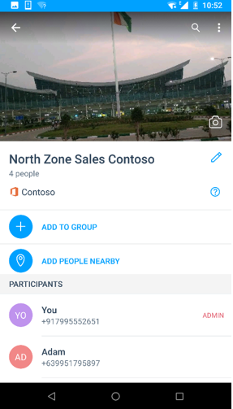
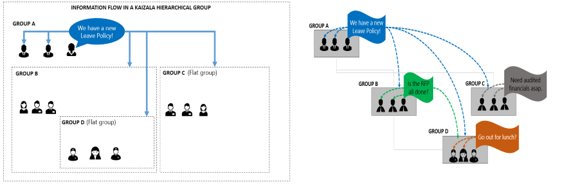
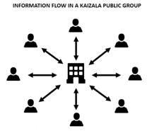

# Gruppen in KaizalaGroups in Kaizala
Sie können in Kaizala hinzufügen oder Einladen von Personen zu der Gruppe beitreten, auch wenn sie noch nicht auf Kaizala sind.In Kaizala, you can add or invite people to join the group even if they are not yet on Kaizala. Sobald sie Kaizala installiert haben, sehen sie sich, dass sie bereits an die Gruppe hinzugefügt werden.As soon as they install Kaizala, they will see that they are already added to the group. 

Kaizala besteht aus drei Arten von Gruppen, um verschiedene Arten von organisationsanforderungen abzudecken:Kaizala has three types of groups to cater to different types of organizational requirements:
- Flache GruppenFlat Groups
- Hierarchische GruppenHierarchical Groups
- Öffentliche GruppenPublic Groups

## **Flache Gruppen****Flat Groups**

Flache Gruppen in der Regel kleine Teams, Projektteams, führende Team und Arbeit-Produktfamilie Teamgruppen geeignet ist.Flat groups usually suits to small team, project team, leadership team, and Work/family team groups. 

Einige Haupteigenschaften flache Gruppe enthält:Some main properties of Flat group includes:

- Standard messaging Gruppen, in dem Sie Tausende von Benutzern hinzufügen können.Standard messaging groups where you can add thousands of users.
- Sie können die Benutzer verwenden, Rufnummer zunächst Speichern eines Kontakts nicht zwingend erforderlich ist, hinzufügen.You can add users using phone numbers, saving a contact first is not mandatory.
- Sie können erstellt und alle Teilnehmer der Gruppe Kaizala Aktionen wie (Auftrag, Umfrage, Umfrage usw.) zugewiesen.You can create and assign Kaizala Actions like (Job, Survey, Poll, etc.) to any participant of the group. 
- Telefonnummern von Gruppenmitgliedern sind nur für Admin sichtbar. es sei denn, bereits in den Kontakten gehörtPhone numbers of group members are only visible to admin; unless member is already in the contacts  
 &nbsp;&nbsp;&nbsp;&nbsp;&nbsp;&nbsp;&nbsp; 

## **Hierarchische Gruppen****Hierarchical Groups**

Die meisten Organisationen in der Praxis sind nicht flachen jedoch hierarchische, und daher Kaizala bietet die Möglichkeit zum Chat Plattform Ihrer Organisationshierarchie zuordnen.Most organizations in real world are not flat but hierarchical, and hence Kaizala provides a way to map your organizational hierarchy to chat platform.

Im Gegensatz zu einer flachen Gruppe, in dem alle freigegebene Informationen in hierarchische Gruppe für alle Benutzer in der Gruppe angezeigt wird, fließt von Informationen von oben nach unten.Unlike a flat group where all the information shared is visible to everyone in the group, in hierarchical group, information flows from the top to the bottom. Es ist eine hierarchische Beziehung zwischen Gruppen vorhanden.There exists a parent-child relationship between the groups. 

Wenn Sie die Gruppe "Sales" Head Office-Gruppe (Gruppe A in Bildern) hinzufügen, wird Gruppe "Sales" (Gruppe B in Bildern) beispielsweise die Untergruppe der Head Office-Gruppe.For example, when you add Sales group to Head Office group (group A in images), Sales Group (group B in images) becomes the sub-group of Head Office group. Mitglieder der Gruppe "Sales" startet eine Head Office in ihrer Liste der Kaizala Client Chat anzeigen.Members of Sales group will start seeing a Head Office in their Kaizala Client chat list. In der Gruppe Head Office sie können nur anzeigen/Aktionen im Head Office gesendet reagieren.In group Head office, they can only view/respond to Actions sent in Head Office. Sie würden nicht zum Senden von Nachrichten in dieser Gruppe sein.They would not be able to send messages in this group.

Bei der Gruppe "Sales" North Sales (Gruppe D in Bildern) hinzugefügt wird, finden Sie auf ähnliche Weise zu verstehen, die Beziehung in der folgenden Tabelle.Similarly, when North Sales (group D in images) is added to Sales Group, refer the table below to understand the relationship.

|Gruppe von Nachricht sendenMessage Sending Group|Nachricht mit Strom GruppeMessage Recieving Group|
|--------|--------|
|Gesendete Nachrichten im Head OfficeMessages sent in Head Office|Mitglieder der Gruppe "Sales" und Gruppe "Sales" North empfängt die Nachricht in der Gruppe mit dem Namen Head Office in der Liste chatMembers of Sales Group and North Sales Group receives the message in group named Head Office in the chat list|
|In der Gruppe "Sales" Gesendete NachrichtenMessages sent in Sales Group|Mitglieder der North Sales Gruppe empfängt die Nachricht in der Gruppe "Sales" in der Liste chatMembers of North Sales Group receives the message in Sales group in the chat list|
|In der Gruppe "Sales" North gesendete NachrichtenMessages sent in North Sales Group |Nur North Sales Gruppe empfängt die NachrichtOnly North Sales group receives the message|

  

Hierarchische Gruppen dienen hauptsächlich zum Freigeben von Informationen für die gesamte Organisation oder zu sammeln Daten von Ihrer Organisation.Hierarchical groups are mainly used to share information with your entire organization or collect data from your organization. 

Berücksichtigen Sie die folgenden Beispiele.Consider the following examples.

- In einer öffentlichen Sektor Organisation verteilt tief in einem Zustand können Sie geografische zuordnen zu Bezirken, Mandals/Abschnitte und Zustand Ebene Organisation Einheiten Gruppen erstellen.In a public-sector organization spread deep in a state, you can create geographical groups mapping to districts, mandals/constituencies, and state level organization units.
-   In einer Organisation Business können Sie durch die übergeordnete Gruppe für CEO oder HR, Finanzen, Vorgänge fasst Spitze Geschäftsbereichen erstellen.In a business organization, you can create business groups headed by the parent group for CEO or HR, Finance, Operations Heads. Jede dieser Gruppen kann regionale untergeordneten Gruppen, wie z. B. wie North Sales Department, South Sales Department usw. haben.Each of these groups can have regional child groups such as, like North Sales Department, South Sales department, and so on.
-   In Bildungseinrichtungen können Sie Gruppen mit Gruppen auf Abteilungsebene als untergeordnetes Element Gruppen müssen jedes Jahr Student Batch als untergeordnete Gruppen erstellen.In education institutions, you can create groups with departmental groups as child groups, having each year’s student batch as child groups.
-   In einer Community des Apartmentthreading können Sie mit jeder zum Erstellen von/Tower Darstellung einer Gruppe von untergeordneten Gruppen erstellen.In a Apartment community, you can create groups with each building/tower representing a child group.

Einige Haupteigenschaften dieses Typs der Gruppe gehören:Some main properties of this type of group include: 
- Gruppen können direkte Mitglieder sowie Untergruppen als Mitglieder enthalten.Groups can have direct members as well as subgroups as members.
- Auf jeder Ebene gesendete Nachricht wird an alle Mitglieder der Gruppe und nach unten zu allen untergeordneten Gruppen.Message sent at any level goes to all members of that group and down to all its child groups. Folglich Chat ist in der übergeordneten Gruppen deaktiviert, aber alle Kaizala Aktionen sind aktiviert.Hence, chat is disabled in parents groups but all Kaizala Actions are enabled. Mitglieder der übergeordneten Gruppen können also senden Ankündigungen oder Umfragen die gesamte Organisation gesendet werden.So, members of parent groups can send Announcements or Surveys which will be sent to entire organization.
- Ein beliebiges Gruppenmitglied kann erstellt und alle Benutzer in der gleichen Gruppe oder darunter Kaizala Aktionen wie (Auftrag, Umfrage, Umfrage usw.) zugewiesen.Any group member can create and assign Kaizala Actions like (Job, Survey, Poll, etc.) to anyone in the same group or below it.
- Untergeordneten Gruppen können nicht senden die Nachricht an eine übergeordnete Gruppe oder Peer-Gruppen, jedoch können sie ihre Ansichten präsentieren bis "gefällt mir" und Kommentare auf jeder Aktion Kaizala an Sie gesendet.Child groups cannot send the message to a parent group or peer groups but they can present their views through Likes and Comments on each Kaizala Action sent to them.
- Unten Gruppen (Endknoten) der hierarchischen Gruppen sind regulären flache Gruppen.Bottom groups (leaf nodes) of the hierarchical groups are regular flat groups.
  

## **Öffentliche Gruppen****Public Groups** 

Öffentliche Gruppe in Kaizala ist eine eindeutige Gruppe Mitglieder der Gruppe mit dem Admin der Gruppe zu eins interagieren können, wobei ein die Interaktionen können von Mitgliedern der Gruppe angezeigt werden.A Public Group in Kaizala is a unique group where members of the group can interact with the admin of the group on a one-to-one basis, but the interactions cannot be seen by other group members. 

Öffentliche Gruppen werden in der Regel in den folgenden Szenarien bevorzugt:Public groups are usually preferred in the following scenarios:

- Behörden, die mit der Bürger eine Verbindung herstellen möchten.Government agencies who want to connect with citizens.
- Unternehmen können mit Kunden eine Verbindung herstellen.Enterprises can connect with customers.
- Unternehmen können auch verwaltete öffentliche Gruppe für die Verbindung mit ihren Lieferanten, Lieferanten, Einzelhandelsunternehmen usw. erstellen.Enterprises can also create managed public group to connect with their vendors, suppliers, retailers, and so on.

In öffentlichen Gruppen können nur vordefinierte Mitglieder die Gruppe teilnehmen.In Public Groups, only pre-defined members can join the group.

Einige Haupteigenschaften dieser Art von Gruppe gehören:Some main properties of this kind of group include: 

- Admin kann Verbinden mit einer beliebigen Anzahl von Elementen und senden und Informationen zu suchen.Admin can connect with any number of members and send and seek information.
- Die Member nicht finden Sie unter miteinander oder miteinander interagieren.The members cannot see each other or interact with each other.
- Die Mitglieder können miteinander Admin nur über Admin definiert benutzerdefinierte Karten wie Erteilen von Feedback, Ihre Anforderung usw. freigeben.The members can communicate with admin only through admin defined custom cards like giving Feedback, Share your requirement, etc.
- Mitglieder können an eine öffentliche Gruppe über einen Link abonnieren.Members can subscribe to a public group using a link.
    

