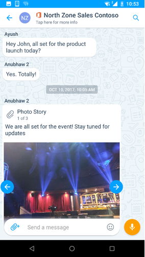
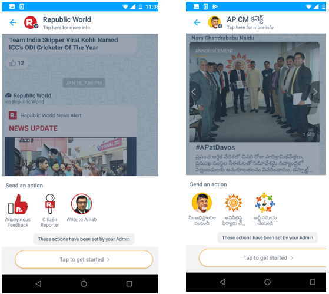

# Gruppen in KaizalaGroups in Kaizala
In Kaizala können Sie Personen hinzufügen oder einladen, der Gruppe beizutreten, auch wenn Sie noch nicht auf Kaizala sind.In Kaizala, you can add or invite people to join the group even if they are not yet on Kaizala. Sobald Sie Kaizala installieren, werden Sie feststellen, dass Sie bereits der Gruppe hinzugefügt wurden.As soon as they install Kaizala, they will see that they are already added to the group. 

Kaizala verfügt über drei Arten von Gruppen, die verschiedenen Arten organisatorischer Anforderungen gerecht werden:Kaizala has three types of groups to cater to different types of organizational requirements:
- Flache GruppenFlat Groups
- Hierarchische GruppenHierarchical Groups
- Öffentliche GruppenPublic Groups

## **Flache Gruppen****Flat Groups**

Flache Gruppen sind in der Regel für kleine Teams, Projektteams, Führungsteams und Arbeits-/Familien Teams geeignet.Flat groups usually suits to small team, project team, leadership team, and Work/family team groups. 

Zu den wichtigsten Eigenschaften einer flachen Gruppe gehören:Some main properties of Flat group includes:

- Standard-Messaging Gruppen, in denen Sie Tausende von Benutzern hinzufügen können.Standard messaging groups where you can add thousands of users.
- Sie können Benutzer mithilfe von Telefonnummern hinzufügen, wobei der erste Kontakt nicht zwingend erforderlich ist.You can add users using phone numbers, saving a contact first is not mandatory.
- Sie können jedem Teilnehmer der Gruppe Kaizala-Aktionen wie (Job, Umfrage, Umfrage usw.) erstellen und zuweisen.You can create and assign Kaizala Actions like (Job, Survey, Poll, etc.) to any participant of the group. 
- Telefonnummern von Gruppenmitgliedern sind nur für Administratoren sichtbar. es sei denn, der Member ist bereits in den KontaktenPhone numbers of group members are only visible to admin; unless member is already in the contacts  
 &nbsp;&nbsp;&nbsp;&nbsp;&nbsp;&nbsp;&nbsp; 

## **Hierarchische Gruppen****Hierarchical Groups**

Die meisten Organisationen in der realen Welt sind nicht flach, sondern hierarchisch, und daher bietet Kaizala eine Möglichkeit, ihre Organisationshierarchie der Chat Plattform zuzuordnen.Most organizations in real world are not flat but hierarchical, and hence Kaizala provides a way to map your organizational hierarchy to chat platform.

Im Gegensatz zu einer flachen Gruppe, in der alle freigegebenen Informationen für alle in der Gruppe sichtbar sind, fließt in der hierarchischen Gruppe Informationen von oben nach unten.Unlike a flat group where all the information shared is visible to everyone in the group, in hierarchical group, information flows from the top to the bottom. Es besteht eine Beziehung zwischen über-und untergeordneten Elementen zwischen den Gruppen.There exists a parent-child relationship between the groups. 

Wenn Sie beispielsweise die Gruppe "Sales Group to Head Office" (Gruppe A in Images) hinzufügen, wird die Gruppe "Sales" (Gruppe B in Images) zur Untergruppe der Gruppe "Head Office".For example, when you add Sales group to Head Office group (group A in images), Sales Group (group B in images) becomes the sub-group of Head Office group. Mitglieder der Vertriebsgruppe beginnen mit der Anzeige einer Hauptniederlassung in ihrer Kaizala-Client Chat Liste.Members of Sales group will start seeing a Head Office in their Kaizala Client chat list. In der Gruppe Head Office können Sie nur Aktionen anzeigen/beantworten, die in der Zentrale gesendet werden.In group Head office, they can only view/respond to Actions sent in Head Office. Sie können keine Nachrichten in dieser Gruppe senden.They would not be able to send messages in this group.

Entsprechend wird die Beziehung in der folgenden Tabelle beschrieben, wenn North Sales (Gruppe D in Images) zur Vertriebsgruppe hinzugefügt wird.Similarly, when North Sales (group D in images) is added to Sales Group, refer the table below to understand the relationship.

|Nachrichten Sende GruppeMessage Sending Group|Nachrichtenempfänger GruppeMessage Receiving Group|
|--------|--------|
|Nachrichten, die in der Zentrale gesendet werdenMessages sent in Head Office|Mitglieder der Gruppe "Sales Group" und "North Sales Group" erhalten die Nachricht in der Gruppe "Head Office" in der Chat Liste.Members of Sales Group and North Sales Group receives the message in group named Head Office in the chat list|
|Nachrichten, die in der Vertriebsgruppe gesendet werdenMessages sent in Sales Group|Mitglieder der Nord-Vertriebsgruppe erhalten die Nachricht in der Gruppe "Sales" in der Chat ListeMembers of North Sales Group receives the message in Sales group in the chat list|
|Nachrichten, die in der Nord Vertriebsgruppe gesendet werdenMessages sent in North Sales Group |Nur Nord-Vertriebsgruppe erhält die NachrichtOnly North Sales group receives the message|

  

Hierarchische Gruppen werden hauptsächlich zum Freigeben von Informationen für Ihre gesamte Organisation oder zum Sammeln von Daten aus Ihrer Organisation verwendet.Hierarchical groups are mainly used to share information with your entire organization or collect data from your organization. 

Betrachten Sie die folgenden Beispiele.Consider the following examples.

- In einer öffentlichen Organisation, die sich tief in einem Staat befindet, können Sie geographische Gruppen für Distrikte, Mandals/Wahlkreise und Organisationseinheiten auf Status Ebene erstellen.In a public-sector organization spread deep in a state, you can create geographical groups mapping to districts, mandals/constituencies, and state level organization units.
-   In einer Unternehmensorganisation können Sie Geschäftsgruppen erstellen, die von der übergeordneten Gruppe für CEO oder HR, Finance, Operations Heads geleitet werden.In a business organization, you can create business groups headed by the parent group for CEO or HR, Finance, Operations Heads. Jede dieser Gruppen kann regionale untergeordnete Gruppen haben, wie beispielsweise Nord-Vertriebsabteilung, Süd-Vertriebsabteilung usw.Each of these groups can have regional child groups such as, like North Sales Department, South Sales department, and so on.
-   In Bildungseinrichtungen können Sie Gruppen mit Abteilungsgruppen als untergeordnete Gruppen erstellen, die die Studien Batches jedes Jahr als untergeordnete Gruppen aufweisen.In education institutions, you can create groups with departmental groups as child groups, having each year’s student batch as child groups.
-   In einer Apartment-Community können Sie Gruppen erstellen, wobei jedes Gebäude/jeder Turm eine untergeordnete Gruppe darstellt.In a Apartment community, you can create groups with each building/tower representing a child group.

Zu den Haupteigenschaften dieses Gruppentyps gehört Folgendes:Some main properties of this type of group include: 
- Gruppen können sowohl direkte Mitglieder als auch Untergruppen als Mitglieder haben.Groups can have direct members as well as subgroups as members.
- NachRichten, die auf einer beliebigen Ebene gesendet werden, werden an alle Mitglieder dieser Gruppe und nach unten auf alle untergeordneten Gruppen geleitet.Message sent at any level goes to all members of that group and down to all its child groups. Daher ist der Chat in den Elterngruppen deaktiviert, aber alle Kaizala-Aktionen sind aktiviert.Hence, chat is disabled in parents groups but all Kaizala Actions are enabled. Daher können Mitglieder von übergeordneten Gruppen Ankündigungen oder Umfragen senden, die an die gesamte Organisation gesendet werden.So, members of parent groups can send Announcements or Surveys which will be sent to entire organization.
- Jedes Gruppenmitglied kann Kaizala-Aktionen wie (Job, Umfrage, Umfrage usw.) für alle Benutzer in der gleichen Gruppe oder darunter erstellen und zuweisen.Any group member can create and assign Kaizala Actions like (Job, Survey, Poll, etc.) to anyone in the same group or below it.
- Untergeordnete Gruppen können die Nachricht nicht an eine übergeordnete Gruppe oder Peergruppen senden, aber Sie können Ihre Ansichten über likes und Kommentare zu jeder an Sie gesendeten Kaizala-Aktion darstellen.Child groups cannot send the message to a parent group or peer groups but they can present their views through Likes and Comments on each Kaizala Action sent to them.
- Untere Gruppen (Blattknoten) der hierarchischen Gruppen sind reguläre flache Gruppen.Bottom groups (leaf nodes) of the hierarchical groups are regular flat groups.
  

## **Öffentliche Gruppen****Public Groups** 

Eine öffentliche Gruppe in Kaizala ist eine eindeutige Gruppe, in der Mitglieder der Gruppe mit dem Administrator der Gruppe 1:1 interagieren können, die Interaktionen können jedoch nicht von anderen Gruppenmitgliedern angezeigt werden.A Public Group in Kaizala is a unique group where members of the group can interact with the admin of the group on a one-to-one basis, but the interactions cannot be seen by other group members. 

Öffentliche Gruppen werden in der Regel in den folgenden Szenarien bevorzugt:Public groups are usually preferred in the following scenarios:

- Behörden, die sich mit Bürgern verbinden möchten.Government agencies who want to connect with citizens.
- Unternehmen können sich mit Kunden verbinden.Enterprises can connect with customers.
- Unternehmen können auch eine verwaltete öffentliche Gruppe erstellen, um eine Verbindung mit ihren Lieferanten, Anbietern, Händlern usw. herzustellen.Enterprises can also create managed public group to connect with their vendors, suppliers, retailers, and so on.

In öffentlichen Gruppen können nur vordefinierte Mitglieder der Gruppe beitreten.In Public Groups, only pre-defined members can join the group.

Einige Haupteigenschaften dieser Art von Gruppe sind:Some main properties of this kind of group include: 

- Der Administrator kann eine Verbindung mit einer beliebigen Anzahl von Mitgliedern herstellen und Informationen senden und suchen.Admin can connect with any number of members and send and seek information.
- Die Mitglieder können sich nicht gegenseitig sehen oder miteinander interagieren.The members cannot see each other or interact with each other.
- Die Mitglieder können mit admin nur über Administratoren definierte benutzerdefinierte Karten wie Feedback geben, teilen Sie Ihre Anforderungen usw.The members can communicate with admin only through admin defined custom cards like giving Feedback, Share your requirement, etc.
- Mitglieder können eine öffentliche Gruppe über einen Link abonnieren.Members can subscribe to a public group using a link.
    

