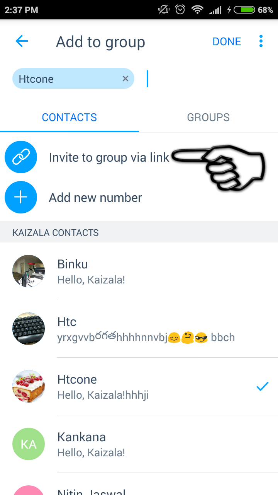

[3]: https://play.google.com/store/apps/details?id=com.microsoft.mobile.polymer&hl=en
[4]: https://itunes.apple.com/in/app/microsoft-kaizala/id1112208399?mt=8

# Installation und Schnellstart 
###### Laden Sie Kaizala aus dem [Google Play Store] [ 3] für Android oder den [App Store] [ 4] für IOS jetzt herunter.

### Aktivieren Sie Ihre Telefonnummer und beginnen Sie sofort 

1. Klicken Sie auf das "+"-Zeichen, um eine Gruppe zu erstellen und Mitglieder aus Ihrer Kontaktliste hinzuzufügen oder die Telefonnummern direkt hinzuzufügen. Geben Sie der Gruppe einen Namen, und Sie sind alle festgelegt. 

 
2.  Wenn Sie die Personen, die nicht in Kaizala sind, zu dieser Gruppe einladen möchten, teilen Sie einfach den Link zur Gruppe.

3.  Sagen Sie "Hello" in der Gruppe.

4. Senden Sie eine Kaizala-Aktion, indem Sie auf die obere rechte Ecke klicken, um die Kaizala-Aktions Palette aufzurufen. Senden Sie eine Schnellabfrage oder eine Ansage, um Kaizala in Aktion zu sehen.

 

