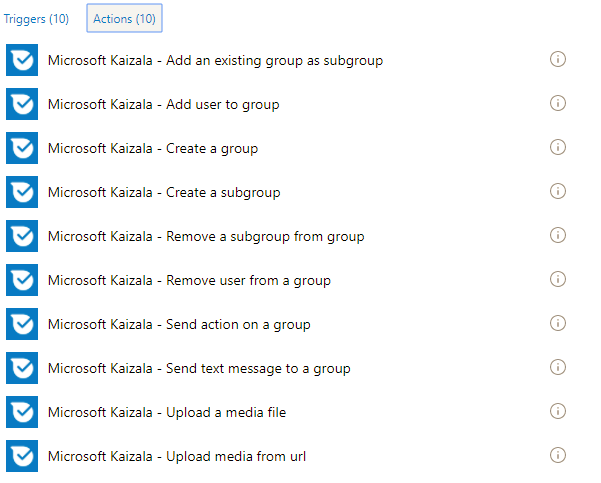
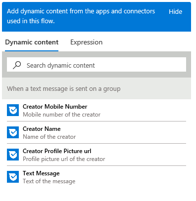
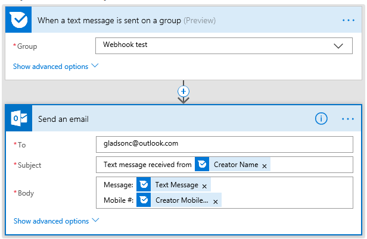

# Automatisieren der Geschäftsprozess mit Kaizala Fluss connectorAutomating business process using Kaizala Flow connector
## Einführung in die Microsoft-DatenflussIntroduction to Microsoft Flow
Microsoft Flow ist ein Dienst, mit dem Sie automatisierte Workflows zwischen Ihren bevorzugten Apps und Diensten erstellen können, um so Dateien zu synchronisieren, Benachrichtigungen zu erhalten, Daten zu sammeln und vieles mehr.Microsoft Flow is a service that helps you create automated workflows between your favorite apps and services to synchronize files, get notifications, collect data, and more. [alternativen: [Flow](https://docs.microsoft.com/en-us/flow/getting-started)].[courtesy: [Flow](https://docs.microsoft.com/en-us/flow/getting-started)]. In einigen Sinne könnten Sie nur ein Flussdiagramm erstellen, auf denen die Logik im Hintergrund – so einfach ausgeführt würde!In some sense, you could just build a flow chart that would run the logic behind the scenes – that simple!
  Flow abstrahiert Services als Connectors, die als Proxy dienen / Wrapper für die zugrunde liegenden Dienst.Flow abstracts out services as connectors which serve as a proxy / wrapper around the underlying service. Fluss kommuniziert mit dem-Konnektoren und ermöglicht es Ihnen, die Ausgabe von einem Anschluss an eine andere zu übergeben.Flow communicates with the connector(s) and enables you to pass output from one connector to another.  Dadurch können Sie eine Flow integrieren in mehrere Dienste erstellen.This allows you to build a Flow integrating with multiple services. Ein Connector konnte Auslöser und Aktionen vorhanden ist.A connector could have triggers and actions. Trigger sind das Ereignis, das einen Fluss auszulösen.Triggers are the event that trigger a flow. Jeden Fluss beginnt mit einem Trigger.Every flow starts with a trigger. Beispiel für einen Trigger: Wenn eine e-Mail-Nachricht empfangen wird.Example of a trigger: When an email is received. Aktionen sind die Funktionen, die die Dienste verfügbar macht.Actions are the functionalities that the services exposes. Beispiel für eine Aktion: senden eine e-Mail.Example of an action: Send an email. Wenn Sie eine Verbindung hinzufügen auf Flow, benötigt der Connector eine zugrunde liegende Konto für den Zugriff auf den Dienst / Funktionalität – müssen zum Authentifizieren / konfigurieren Sie das Konto ein, bevor Sie den Connector verwenden können.When you add a connector on Flow, if the connector requires an underlying account for accessing the service / functionality – you will need to authenticate / configure the account before you can use the connector. Diese Informationen ruft als eine Verbindung gespeichert.This information gets saved as a connection.
  Wenn Ihr Dienst noch nicht auf Flow verfügbar ist, können Sie einen benutzerdefinierte Flow Connector für den Dienst erstellen!If your service is not available on Flow yet, you could create a Custom Flow connector for your service!
## Kaizala Fluss connectorKaizala Flow connector
Kaizala ist als Connector auf Microsoft Flow verfügbar.Kaizala is available as a connector on Microsoft Flow. Dadurch können Sie zum Einbinden von Kaizala in der betrieblichen Abläufe.This allows you to incorporate Kaizala in your business workflow. Und da Fluss unterstützt 200 Connectors – die Möglichkeit zum Erstellen von Lösungen mit diesen Kaizala anzeigt.And, since Flow supports 200+ connectors – which presents an opportunity to build Kaizala solutions with them.
  Unten sind Screenshots die Liste der derzeit Auslöser und Aktionen im Kaizala Fluss Connector angezeigt.Below are screenshots showing the list of currently available triggers and actions in the Kaizala Flow connector.
### AktionenActions

### TriggerTriggers

 
  Kaizala hat 2 Fluss Vorlagen veröffentlicht, dass Sie als Ausgangspunkt verwenden können:Kaizala has 2 Flow templates published that you could use as a starting point:
  1. [Hinzufügen einer SharePoint-Listenelement für jedes Kaizala Umfrageantwort](https://us.flow.microsoft.com/en-us/galleries/public/templates/a71f0ac3e35a40728b3e9ee27bf9dbcd/add-a-sharepoint-list-item-for-every-kaizala-survey-response/)1. [Add a SharePoint list item for every Kaizala survey response](https://us.flow.microsoft.com/en-us/galleries/public/templates/a71f0ac3e35a40728b3e9ee27bf9dbcd/add-a-sharepoint-list-item-for-every-kaizala-survey-response/)
  2. [eine Ankündigung auf Kaizala beim Abrufen einer Outlook e-Mails senden](https://us.flow.microsoft.com/en-us/galleries/public/templates/cb85f664dfb0421dbd937dd64618f791/send-an-announcement-on-kaizala-when-you-get-an-outlook-email/)2. [Send an announcement on Kaizala when you get an Outlook email](https://us.flow.microsoft.com/en-us/galleries/public/templates/cb85f664dfb0421dbd937dd64618f791/send-an-announcement-on-kaizala-when-you-get-an-outlook-email/)
## BeispielszenarioExample scenario
Um Kaizala Fluss Connector zu veranschaulichen, wollen wir uns betrachten Sie ein Szenario: "Die Textnachricht Kaizala Gruppe empfangenen E-Mail".To demonstrate Kaizala Flow connector, let us think of a scenario : “Email the text message received on Kaizala group”.
### Schritte:Steps:
  1. Rufen Sie in [https://flow.microsoft.com](https://flow.microsoft.com/en-us/) und melden Sie sich mit Ihren Anmeldeinformationen1. Go to [https://flow.microsoft.com](https://flow.microsoft.com/en-us/) and sign in with your credentials
  2. Klicken Sie auf "Meine fließt", und klicken Sie anschließend auf "Erstellen von leeren"2. Click on “My flows” and subsequently click on “Create from blank” 
  4. Geben Sie einen Namen für Ihr Nachrichtenfluss4. Give a name for your flow
  5. im Suchfeld Connector suchen Sie nach Kaizala5. In the connector search box, search for Kaizala
  6. Wählen Sie 6. den Connector Kaizala Fluss in den Suchergebnissen6. Select the Kaizala Flow connector from the search result
   7 Wählen Sie aus den verfügbaren Trigger "Wann wird eine Textnachricht auf eine Gruppe gesendet" (Sie müssen zur Authentifizierung von Kaizala zu diesem Zeitpunkt mit Ihrer Mobiltelefonnummer und OTP, die angezeigt werden)7. From the available triggers, select “When a text message is sent on a group” (you will need to authenticate to Kaizala at this point with your mobile number and OTP that you will receive)
   8 jetzt Hinzufügen einer Aktion zum Senden von e-Mails (ich Outlook.com – Senden einer e-Mail-Aktion –, die Sie zum Authentifizieren, Ihre e-Mail-Konto benötigen haben)8. Now add an action to send email (I have chosen Outlook.com – Send an email action – you will need to authenticate to your email account)
  9. Geben Sie eine e-Mail-Adresse im Feld an9. Enter an email address in the To field
 10 Klicken Sie im Feld Betreff – sehen Sie ein Popup-Fenster auf der rechten Seite, die Ihnen eine Reihe von Werten aus der obigen Trigger abgerufen bietet10. Click on the Subject field – you will notice a pop-up on the right that gives you a bunch of values fetched from the trigger above
 
  11. wollen wir uns müssen der Name des Absenders in den Betreff und die Nachricht, die Mobiltelefonnummer im Textkörper der e-Mail.11. Let us have the sender’s name in the subject and the message, mobile number in the body of the email. Klicken Sie dann sieht Fluss folgendermaßen aus:Then flow looks like this:
 

  12 Klicken Sie auf Create-Datenfluss12. Click on Create flow
   Fahren Sie fort, und Testen Sie den Ablauf durch Senden einer Textnachricht für die Gruppe, die Sie konfiguriert haben.Go ahead and test the flow by sending a text message on the group you configured.
### Beispiel-Screenshot der für die Gruppe gesendet wird:Sample screenshot of the message sent on the group:

### Beispiel-Screenshot der empfangenen e-Mails:Sample screenshot of the email received:

