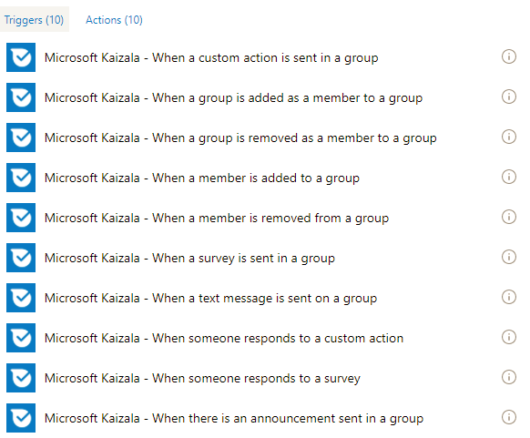

# Automatisieren von Geschäftsprozessen mit Kaizala-Fluss-Konnektor
## Einführung in Microsoft Flow
Microsoft Flow ist ein Dienst, mit dem Sie automatisierte Workflows zwischen Ihren bevorzugten Apps und Diensten erstellen können, um so Dateien zu synchronisieren, Benachrichtigungen zu erhalten, Daten zu sammeln und vieles mehr. [Höflichkeit: [Flow](https://docs.microsoft.com/en-us/flow/getting-started)]. In gewisser Weise könnten Sie einfach ein Flussdiagramm erstellen, das die Logik hinter den Kulissen ausführen würde – so einfach!
  Flow abstrahiert Dienste als Connectors, die als Proxy/Wrapper um den zugrunde liegenden Dienst dienen. Flow kommuniziert mit den Konnektoren und ermöglicht es Ihnen, die Ausgabe von einem Konnektor an einen anderen zu übertragen.  Auf diese Weise können Sie einen Fluss mit mehreren Diensten integrieren. Ein Connector kann Auslöser und Aktionen enthalten. Auslöser sind das Ereignis, das einen Fluss auslöst. Jeder Fluss beginnt mit einem Trigger. Beispiel eines Triggers: beim Empfang einer e-Mail. Aktionen sind die Funktionalitäten, die von den Diensten verfügbar gemacht werden. Beispiel einer Aktion: senden Sie eine e-Mail. Wenn Sie einen Connector in Flow hinzufügen, wenn der Connector ein zugrunde liegendes Konto für den Zugriff auf den Dienst/die Funktionalität benötigt, müssen Sie das Konto authentifizieren/konfigurieren, bevor Sie den Connector verwenden können. Diese Informationen werden als Verbindung gespeichert.
  Wenn Ihr Dienst bei Flow noch nicht verfügbar ist, können Sie einen benutzerdefinierten Fluss-Konnektor für Ihren Dienst erstellen!
## Kaizala-Fluss Verbinder
Kaizala ist als Connector auf Microsoft Flow verfügbar. Auf diese Weise können Sie Kaizala in ihren geschäftsworkflow integrieren. Und da Flow 200 + Connectors unterstützt, bietet dies die Möglichkeit, Kaizala-Lösungen mit Ihnen zu erstellen.
  Unten sehen Sie Screenshots der Liste der derzeit verfügbaren Auslöser und Aktionen im Kaizala-Fluss-Konnektor.
### Aktionen

### Löst

 
  Kaizala hat 2 Fluss Vorlagen veröffentlicht, die Sie als Ausgangspunkt verwenden können:
  1. [Hinzufügen eines SharePoint-Listenelements für jede Kaizala-Umfrageantwort](https://us.flow.microsoft.com/en-us/galleries/public/templates/a71f0ac3e35a40728b3e9ee27bf9dbcd/add-a-sharepoint-list-item-for-every-kaizala-survey-response/)
  2. [Senden Sie eine Ansage auf Kaizala, wenn Sie eine Outlook-e-Mail erhalten](https://us.flow.microsoft.com/en-us/galleries/public/templates/cb85f664dfb0421dbd937dd64618f791/send-an-announcement-on-kaizala-when-you-get-an-outlook-email/) .
## Beispielszenario
Zur Veranschaulichung des Kaizala-Fluss-Konnektors sollten Sie sich ein Szenario vorstellen: "E-Mail die auf Kaizala-Gruppe empfangene Textnachricht".
### Schritte:
  1. wechseln Sie [https://flow.microsoft.com](https://flow.microsoft.com/en-us/) zu und melden Sie sich mit Ihren Anmeldeinformationen an.
  2. Klicken Sie auf "meine Flows", und klicken Sie anschließend auf "aus leerem Text erstellen".
  4. Geben Sie einen Namen für Ihren Flow an.
  5. Suchen Sie im Suchfeld des Connectors nach Kaizala
  6. Wählen Sie den Kaizala-Fluss Verbinder aus dem Suchergebnis aus.
   7. Wählen Sie in den verfügbaren Triggern "Wenn eine Textnachricht an eine Gruppe gesendet wird" (Sie müssen sich an diesem Punkt bei Kaizala mit Ihrer Mobiltelefonnummer und OTP authentifizieren, die Sie erhalten)
   8. Fügen Sie nun eine Aktion zum Senden von e-Mails hinzu (Ich habe Outlook.com ausgewählt – senden Sie eine e-Mail-Aktion – Sie müssen sich bei Ihrem e-Mail-Konto authentifizieren)
  9. Geben Sie eine e-Mail-Adresse im Feld an ein.
 10. Klicken Sie auf das Feld Betreff – Sie werden feststellen, dass auf der rechten Seite ein Popup angezeigt wird, mit dem Sie eine Reihe von Werten abrufen können, die über den Trigger oben abgerufen wurden.
 
  11. lassen Sie uns den Namen des Absenders im Betreff und die Nachricht, die Mobiltelefonnummer im Textkörper der e-Mail haben. Dann sieht Flow wie folgt aus:
 

  12. Klicken Sie auf Flow erstellen
   Testen Sie den Fluss, indem Sie eine Textnachricht in der von Ihnen konfigurierten Gruppe senden.
### Beispiel Screenshot der Nachricht, die an die Gruppe gesendet wird:

### Beispiel Screenshot der empfangenen e-Mail:

