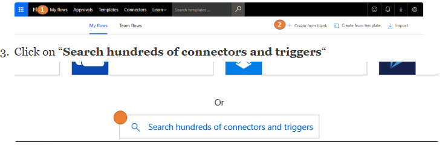

# Automatisieren der Geschäftsprozess mit Kaizala Fluss connector
## Einführung in die Microsoft-Datenfluss
Microsoft Flow ist ein Dienst, mit dem Sie automatisierte Workflows zwischen Ihren bevorzugten Apps und Diensten erstellen können, um so Dateien zu synchronisieren, Benachrichtigungen zu erhalten, Daten zu sammeln und vieles mehr. [alternativen: [Flow](https://docs.microsoft.com/en-us/flow/getting-started)]. In einigen Sinne könnten Sie nur ein Flussdiagramm erstellen, auf denen die Logik im Hintergrund – so einfach ausgeführt würde!
  Flow abstrahiert Services als Connectors, die als Proxy dienen / Wrapper für die zugrunde liegenden Dienst. Fluss kommuniziert mit dem-Konnektoren und ermöglicht es Ihnen, die Ausgabe von einem Anschluss an eine andere zu übergeben.  Dadurch können Sie eine Flow integrieren in mehrere Dienste erstellen. Ein Connector konnte Auslöser und Aktionen vorhanden ist. Trigger sind das Ereignis, das einen Fluss auszulösen. Jeden Fluss beginnt mit einem Trigger. Beispiel für einen Trigger: Wenn eine e-Mail-Nachricht empfangen wird. Aktionen sind die Funktionen, die die Dienste verfügbar macht. Beispiel für eine Aktion: senden eine e-Mail. Wenn Sie eine Verbindung hinzufügen auf Flow, benötigt der Connector eine zugrunde liegende Konto für den Zugriff auf den Dienst / Funktionalität – müssen zum Authentifizieren / konfigurieren Sie das Konto ein, bevor Sie den Connector verwenden können. Diese Informationen ruft als eine Verbindung gespeichert.
  Wenn Ihr Dienst noch nicht auf Flow verfügbar ist, können Sie einen benutzerdefinierte Flow Connector für den Dienst erstellen!
## Kaizala Fluss connector
Kaizala ist als Connector auf Microsoft Flow verfügbar. Dadurch können Sie zum Einbinden von Kaizala in der betrieblichen Abläufe. Und da Fluss unterstützt 200 Connectors – die Möglichkeit zum Erstellen von Lösungen mit diesen Kaizala anzeigt.
  Unten sind Screenshots die Liste der derzeit Auslöser und Aktionen im Kaizala Fluss Connector angezeigt.
### Aktionen

### Trigger

 
  Kaizala hat 2 Fluss Vorlagen veröffentlicht, dass Sie als Ausgangspunkt verwenden können:
  1. [Hinzufügen einer SharePoint-Listenelement für jedes Kaizala Umfrageantwort](https://us.flow.microsoft.com/en-us/galleries/public/templates/a71f0ac3e35a40728b3e9ee27bf9dbcd/add-a-sharepoint-list-item-for-every-kaizala-survey-response/)
  2. [eine Ankündigung auf Kaizala beim Abrufen einer Outlook e-Mails senden](https://us.flow.microsoft.com/en-us/galleries/public/templates/cb85f664dfb0421dbd937dd64618f791/send-an-announcement-on-kaizala-when-you-get-an-outlook-email/)
## Beispielszenario
Um Kaizala Fluss Connector zu veranschaulichen, wollen wir uns betrachten Sie ein Szenario: "Die Textnachricht Kaizala Gruppe empfangenen E-Mail".
### Schritte:
  1. Rufen Sie in [https://flow.microsoft.com](https://flow.microsoft.com/en-us/) und melden Sie sich mit Ihren Anmeldeinformationen
  2. Klicken Sie auf "Meine fließt", und klicken Sie anschließend auf "Erstellen von leeren"
  4. Geben Sie einen Namen für Ihr Nachrichtenfluss
  5. im Suchfeld Connector suchen Sie nach Kaizala
  6. Wählen Sie 6. den Connector Kaizala Fluss in den Suchergebnissen
   7 Wählen Sie aus den verfügbaren Trigger "Wann wird eine Textnachricht auf eine Gruppe gesendet" (Sie müssen zur Authentifizierung von Kaizala zu diesem Zeitpunkt mit Ihrer Mobiltelefonnummer und OTP, die angezeigt werden)
   8 jetzt Hinzufügen einer Aktion zum Senden von e-Mails (ich Outlook.com – Senden einer e-Mail-Aktion –, die Sie zum Authentifizieren, Ihre e-Mail-Konto benötigen haben)
  9. Geben Sie eine e-Mail-Adresse im Feld an
 10 Klicken Sie im Feld Betreff – sehen Sie ein Popup-Fenster auf der rechten Seite, die Ihnen eine Reihe von Werten aus der obigen Trigger abgerufen bietet
 
  11. wollen wir uns müssen der Name des Absenders in den Betreff und die Nachricht, die Mobiltelefonnummer im Textkörper der e-Mail. Klicken Sie dann sieht Fluss folgendermaßen aus:
 

  12 Klicken Sie auf Create-Datenfluss
   Fahren Sie fort, und Testen Sie den Ablauf durch Senden einer Textnachricht für die Gruppe, die Sie konfiguriert haben.
### Beispiel-Screenshot der für die Gruppe gesendet wird:

### Beispiel-Screenshot der empfangenen e-Mails:

