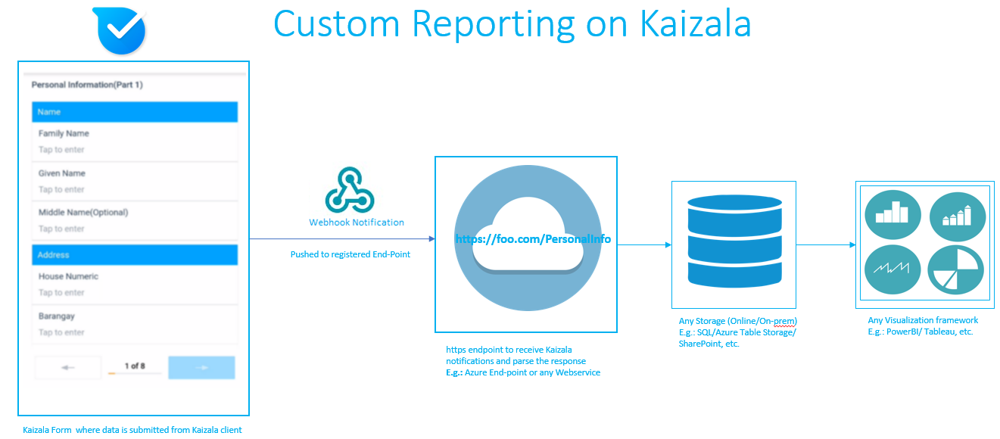
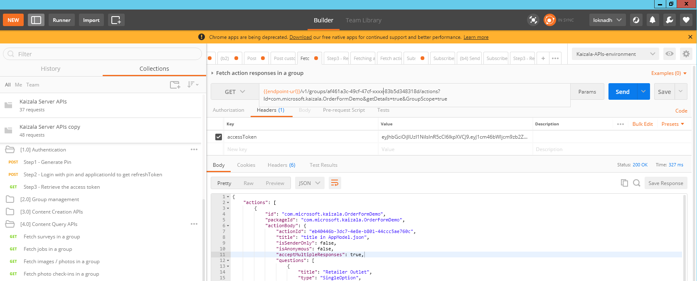

## Integrieren von Kaizala Daten an die vorhandenen dashboardsIntegrating Kaizala Data to your existing dashboards

Erstellen Sie benutzerdefinierten Bericht, oder schließen Sie Daten aus dem Kaizala der vorhandenen Dashboards mithilfe von Kaizala-APIs.Create custom report or plug your Kaizala data to your existing dashboards using Kaizala APIs. 
 Als Organisation Drittanbieter - Sie Kaizala Daten zum vorhandenen Dashboard schließen möchten, und führen Sie mithilfe der folgenden Methoden:As a third party organization - You want to plug Kaizala data to your existing dashboard, then you can do it using the following ways:
 1. abzurufen Sie Kaizala Daten über Power BI-Inhalten Pack und erstellen Sie einen benutzerdefinierten Bericht PowerBI1. Get Kaizala data through Power BI-Content Pack and create a Custom report on PowerBI
 2.Wählen Datenzugriff Kaizala über Connectors, und übergeben Sie auf vorhandenen Dashboard im Format, das ihn versteht.2.Access Kaizala data through connectors and pass on to  existing dashboard in the format that it understands. Sie können Daten mithilfe von Kaizala Connecters zugreifen:You can access data using Kaizala Connecters:  
 a.[APIs](https://docs.microsoft.com/en-us/kaizala/connectors/api) - Kaizala Connectors aktivieren 3. Partei Entwickler Kaizala in ihre Geschäftsprozesse durch bereitstellen, dass die Möglichkeit zum Ausführen einer curated Reihe von Aktionen in Kaizala mithilfe von REST-API-Aufrufe basierend integrieren.a.[APIs](https://docs.microsoft.com/en-us/kaizala/connectors/api)  - Kaizala Connectors enable 3rd party developers to integrate Kaizala into their business processes by providing the ability to perform a curated set of actions in Kaizala using REST based API calls. Der Bereich der API ist für externe Systeme zum Aufrufen des Endpunkt und Ausführen von Aktionen auf Abruf.The scope of the API is for external systems to call the end-point and perform actions on-demand. D. h., wird dies eine PULL-Modell sein, in denen einzelne Endpunkte aufgerufen werden, um bestimmte Aktionen mit Kaizala-API ausführen müssen.That is, this will be a PULL model – where individual endpoints need to be called to perform specific actions using Kaizala API's. 
 B.[Webhooks](https://docs.microsoft.com/en-us/kaizala/connectors/webhooks) - der PUSH-Modell, in dem Kaizala-Plattform von Aktionen ausgelöst werden kann, können mithilfe von Webhooks konfiguriert werden.b.[webhooks](https://docs.microsoft.com/en-us/kaizala/connectors/webhooks) - The PUSH model where Kaizala platform can trigger actions can be configured using webhooks.  
  Kaizala Connectors ermöglichen es 3. Partei Entwicklern integrieren Kaizala in ihre Geschäftsprozesse durch bereitstellen, dass die Möglichkeit zum Ausführen einer curated Reihe von Aktionen in Kaizala mithilfe von REST-API-Aufrufe basiert.Kaizala Connectors enable 3rd party developers to integrate Kaizala into their business processes by providing the ability to perform a curated set of actions in Kaizala using REST based API calls. Der Bereich der API ist für externe Systeme zum Aufrufen des Endpunkt und Ausführen von Aktionen auf Abruf.The scope of the API is for external systems to call the end-point and perform actions on-demand. D. h., wird dies eine PULL-Modell – sein, in denen einzelne Endpunkte aufgerufen werden, um bestimmte Aktionen Kaizala [APIs](https://docs.microsoft.com/en-us/kaizala/connectors/api)ausführen müssen.That is, this will be a PULL model – where individual endpoints need to be called to perform specific actions using Kaizala [APIs](https://docs.microsoft.com/en-us/kaizala/connectors/api). Das PUSH-Modell, in dem Kaizala Plattform Aktionen auslösen kann, kann mithilfe von [Webhooks](https://docs.microsoft.com/en-us/kaizala/connectors/webhooks)konfiguriert werden.The PUSH model where Kaizala platform can trigger actions can be configured using [webhooks](https://docs.microsoft.com/en-us/kaizala/connectors/webhooks). 

### Integration mit Webhooks:Integration Using Webhooks: 
 Dies ist eine Grundlage PUSH-Mechanismus.This is a PUSH based mechanism. Sobald Webhook auf bestimmten Aktion registriert ist, wenn der Benutzer Daten von dieser Aktion auf Kaizala-Anwendung – übermittelt sendet Kaizala Server eine Benachrichtigung (Nachricht HTTP POST) mit Antwort Nutzlast (JSON-Format) an den konfigurierten URL-Endpunkt.Once Webhook is registered on particular action, Whenever user submits data on that action on Kaizala Application - Kaizala Server will send a event notification (HTTP POST message) with response payload (JSON Format) to the configured URL endpoint. Nachdem Daten für Kunden Endpunkt informiert werden, Logik für die Analyse der Antwort Nutzlast sollte auslösen und Einfügen von Daten in den jeweiligen Tabellen im Speicher (Datenbank oder Sharepoint...), und Visualisierungen von Abfragen von Daten aus dem Speicher erstellt werden können.Once data is notified on customers endpoint, Logic for parsing the response payload should trigger and Insert data in to the respective tables in the storage (Database or sharepoint,..) and Visualizations can be built by querying data from the storage. Vorteil besteht darin, dass jede Organisation Kaizala für ihre benutzerdefinierte Dashboards Abrufen von Daten kann ohne Beeinträchtigung ihrer vorhandenen Arbeitsabläufe.Advantage of this is any Organization can get Kaizala data in to their Custom dashboards without disrupting their existing work flows. 
### Können an den oben beschriebenen Prozess Ausführen eines Drilldowns und im Detail angezeigt:Lets drill down in to the above process and see it in detail: 
#### Wie Sie eine Webhook für Endpunkt registrieren?How to register a webhook on endpoint? 
  Nachdem Sie einen URL-Endpunkt konfigurieren, auf dem die Kaizala Ereignisse benachrichtigt werden möchten, können Sie für eine Benachrichtigung auf die Gruppe oder eine bestimmte Aktion abonnieren.Once you configure a URL endpoint on which you wanted to notify the Kaizala events, You can subscribe for a notification on the group or a particular  action. Sie können die 3. Partei Rest-API-Clients wie Postman / erweiterter Rest Client usw., eine Webhook zu abonnieren.You can use the 3rd party Rest API clients like  Postman/ Advanced Rest Client, etc. to subscribe for a webhook. Signatur der Registrierung einer Webhook auf bestimmte Aktion wird unten angezeigt:Signature of registering a webhook on particular Action is given below: 
 Wechseln Sie zu [Kaizala API-Dokumentation!](https://docs.microsoft.com/en-us/kaizala/connectors/api)Go to [Kaizala API Documentation!](https://docs.microsoft.com/en-us/kaizala/connectors/api) und klicken Sie auf derand click on the 
 Durchlaufen Sie die Schritte zum Abrufen der AccessToken und eine Wekbhook registrieren.Go through the steps to get the AccessToken and register a wekbhook. 
 
 Wie Sie jetzt eine Webhook registriert haben, wird Kaizala Server benachrichtigen lassen Sie die Ereignisse auf der registrierten URL jedem Ereignis tritt auf.As you have now registered a webhook, Kaizala server will keep notifying the events on the registered URL every time event occurs. Ereignis Antwort befindet sich in der folgenden JSON-Format:Event response is in the below JSON format: 
 
  Beispiel-Ereignis Antwort im JSON:Sample Event Response in JSON:
  {   
  "objectId":"com.microsoft.kaizala.OrderFormDemo","objectId":"com.microsoft.kaizala.OrderFormDemo",
  "ObjectType": "ActionPackage","objectType":"ActionPackage",
  "EventType": "ActionResponse","eventType":"ActionResponse",
  "EventId": "75609730-f5d2-4f07-XXXX-ccca96dd9e76,""eventId":"75609730-f5d2-4f07-XXXX-ccca96dd9e76",
 "Daten": {   
"data":{   
  "ActionId": "eb40446b-3dc7-4e8e-XXXX-44ccc5ae760c,""actionId":"eb40446b-3dc7-4e8e-XXXX-44ccc5ae760c",
  "actionPackageId":"com.microsoft.kaizala.OrderFormDemo","actionPackageId":"com.microsoft.kaizala.OrderFormDemo",
  "packageId":"com.microsoft.kaizala.OrderFormDemo","packageId":"com.microsoft.kaizala.OrderFormDemo",
  "GroupId": "af461a3c-49cf-47cf-XXXX-83b5d348318d,""groupId":"af461a3c-49cf-47cf-XXXX-83b5d348318d",
  "ResponseId": "75609730-f5d2-4f07-XXXX-ccca96dd9e76,""responseId":"75609730-f5d2-4f07-XXXX-ccca96dd9e76",
  "IsUpdateResponse": false"isUpdateResponse":false,
  "Responder": "+911234567890","responder":"+911234567890",
  "ResponderName": "FooName","responderName":"FooName",
  "ResponderProfilePic": "","responderProfilePic":"",
  "IsAnonymous": false"isAnonymous":false,
  "ResponseDetails": {   
"responseDetails":{   
  "ResponseWithQuestions": [   
"responseWithQuestions":[   
  {   
 "Title": "Händler Steckdose","title":"Retailer Outlet",
 "Typ": "SingleOption","type":"SingleOption",
  "Optionen": [   
"options":[   
 {   
  "Title": "ABC Traders""title":"ABC Traders"
 },
  {   
 "Title": "BCD Händler""title":"BCD Distributors"
 },
 {   
 "Title": "EFG groß-""title":"EFG wholesale"
 }
 ],
  "Antwort": [   
"answer":[   
 "ABC Traders""ABC Traders"
 ]
  },
  {   
  "Title": "Reis 1KG","title":"Rice 1KG",
  "Typ": "Numerische""type":"Numeric",
 "Optionen": [   
"options":[   
  ],
  "Antworten Sie":1.0"answer":1.0
 },
  {   
 "Title": "Reis 5KG","title":"Rice 5KG",
  "Typ": "Numerische""type":"Numeric",
 "Optionen": [   
"options":[   
 ],
  "Antworten Sie":2.0"answer":2.0
  },
  {   
  "Title": "Gemischten Fruchtsaft 250ml","title":"Mixed Fruit Juice 250ml",
  "Typ": "Numerische""type":"Numeric",
  "Optionen": [   
"options":[   
  ],
  "Antworten Sie":4.0"answer":4.0
  },
  {   
  "Title": "Speicherort""title":"Location",
  "Typ": "Speicherort""type":"Location",
 "Optionen": ["options":[   
 
  ],
  "Antwort": {   
"answer":{   
  "Lt":99.1234567,"lt":99.1234567,
 "Lg":88.1234567,"lg":88.1234567,
  "n": "FooAddress""n":"FooAddress"
 }
 }
  ]
  }
  },
  "Kontext": "alle Daten der Rückruf zurückgegeben werden sollen, erforderlich ist."context":"Any data which is required to be returned in callback.Aktuellen Webhook Daten durch Aktualisieren angezeigt werden können:[: https://requestb.in/12786un1?inspect!](https://requestb.in/12786un1?inspect) Current webhook data can be seen by refreshing:[: https://requestb.in/12786un1?inspect!](https://requestb.in/12786un1?inspect)
  "FromUser": "+911234567890","fromUser":"+911234567890",
  "FromUserName": "FooName","fromUserName":"FooName",
 "FromUserProfilePic": """fromUserProfilePic":""
  }
  **Klicken Sie auf der registrierten Endpunkt** - Geschäftslogik zu analysieren, die Antwort Ereignis einfügen von Daten in den jeweiligen Speicher Tabellen haben.**On the Registered End Point** - Have business logic to parse the event response and insert data in to the respective storage tables. Wie Daten jetzt an Ihrem Ende verfügbar sind, Abfragen von Daten aus dem Speicher und Visualisierungen auf der vorhandenen Dashboards anzeigen.As data is now available at your end, Query data from storage and show visualizations on your existing dashboards. Bei diesem Ansatz - können Sie die Visualisierungen Kaizala Daten auf vorhandene Dashboards erstellen.With this approach - You can create the visualizations of Kaizala data on existing dashboards. Bei diesem Ansatz werden Sie die Daten in Echtzeit benachrichtigt abrufen werden mithilfe der Webhook-Endpunkt.In this approach you will be getting the data notified in Realtime using the Webhook end point.  
#### Wie kann ich PULL-Daten mit Kaizala-API?How to PULL data using Kaizala API's? 
Wenn Sie, Pull-Daten aus Kaizala in regelmäßigen Abständen möchten und Aktualisieren von Daten in Dashboard - Sie aufrufen können Kaizala API mit dem Verbinder und nicht ausgewählte Pull Daten für das gewünschte Aktion Paket aktualisieren von Daten in den Speicher und Dashboard zu aktualisieren.If you want to Pull data from Kaizala in regular Intervals and update data in the dashboard- then You can call Kaizala API's using Connectors and Pull data for the required Action Package, update data in to the Storage and refresh Dashboard. 
  
**Für das Abfragen eines Pakets Aktion der Antworten**- können Sie finden die Signatur API und die Antwort durch das Aufrufen der oben genannten Postman-Auflistung und Content-Abfrage-API--> Fetch Aktion Antworten in einer Gruppe, und Ersetzen Sie mit Ihrer Aktion-Gruppe Details zum Lösungspaket**For Querying the responses of an Action Package**- You can see the API signature and the response by Going to the Postman collection mentioned above and go to Content Query API's--> Fetch action responses in a group and replace with your group, action package details  

