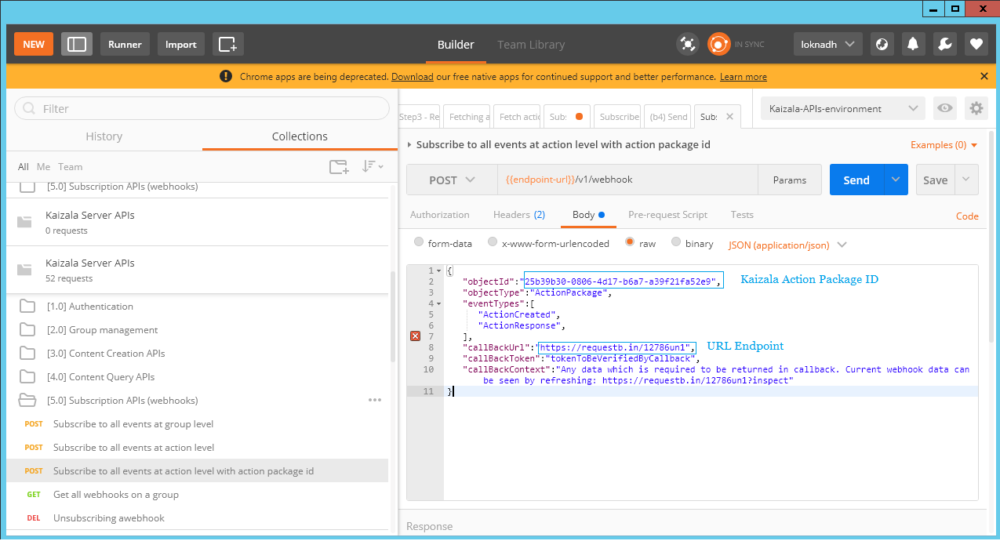

## Integrieren von Kaizala-Daten in vorhandene Dashboards

Erstellen Sie einen benutzerdefinierten Bericht, oder schließen Sie die Kaizala-Daten mithilfe von Kaizala-APIs an vorhandene Dashboards an. 
 Als Drittanbieterorganisation-Sie möchten Kaizala-Daten mit Ihrem vorhandenen Dashboard verbinden, können Sie dies auf folgende Weise tun:
 1. Abrufen von Kaizala-Daten über Power BI-Content Pack und Erstellen eines benutzerdefinierten Berichts auf PowerBI
 2. greifen Sie auf Kaizala-Daten über Connectors zu, und führen Sie das vorhandene Dashboard in dem Format aus, das es versteht. Sie können mit Kaizala Connecters auf Daten zugreifen:  
 a.[APIs](https://docs.microsoft.com/en-us/kaizala/connectors/api) -Kaizala Connectors ermöglichen Drittanbieterentwicklern, Kaizala in Ihre Geschäftsprozesse zu integrieren, indem Sie die Möglichkeit bieten, eine kuratierte Reihe von Aktionen in Kaizala mithilfe von Rest-basierten API-aufrufen durchzuführen. Der Anwendungsbereich der API ist für externe Systeme zum Aufrufen des Endpunkts und zum Ausführen von Aktionen bei Bedarf. Das heißt, es handelt sich dabei um ein PULL-Modell, bei dem einzelne Endpunkte aufgerufen werden müssen, um bestimmte Aktionen mithilfe der Kaizala-API auszuführen. 
 b. webhooks – das Push-Modell, mit dem die Kaizala-Plattform Aktionen auslösen kann, können Sie mit webhooks konfigurieren.  
  Kaizala-Connectors ermöglichen Drittanbieterentwicklern, Kaizala in Ihre Geschäftsprozesse zu integrieren, indem Sie die Möglichkeit bieten, eine kuratierte Reihe von Aktionen in Kaizala mithilfe von REST-basierten API-aufrufen durchzuführen. Der Anwendungsbereich der API ist für externe Systeme zum Aufrufen des Endpunkts und zum Ausführen von Aktionen bei Bedarf. Das heißt, es handelt sich dabei um ein PULL-Modell, bei dem einzelne Endpunkte aufgerufen werden müssen, um bestimmte Aktionen mithilfe von Kaizala- [APIs](https://docs.microsoft.com/en-us/kaizala/connectors/api)auszuführen. Das PUSH-Modell, mit dem die Kaizala-Plattform Aktionen auslösen kann, kann mit webhooks konfiguriert werden. 

### Integration mit webhooks: 
 Dies ist ein PUSH-basierter Mechanismus. Sobald webhook bei einer bestimmten Aktion registriert ist, sendet der Benutzer bei jeder Übermittlung von Daten zu dieser Aktion auf Kaizala Application-Kaizala Server eine Ereignisbenachrichtigung (HTTP-POST-Nachricht) mit der Antwort Nutzlast (JSON-Format) an den konfigurierten URL-Endpunkt. Sobald Daten am Kunden Endpunkt benachrichtigt werden, sollte die Logik zum Analysieren der Antwort Nutzlast Daten in die entsprechenden Tabellen im Speicher (Datenbank-oder SharePoint-,..) auslösen und in diese einfügen, und Visualisierungen können durch Abfragen von Daten aus dem Speicher erstellt werden. Vorteil ist, dass jede Organisation Kaizala-Daten in Ihre benutzerdefinierten Dashboards einbinden kann, ohne die vorhandenen Arbeitsabläufe zu unterbrechen. 
### Mit dieser Schaltfläche können Sie den oben beschriebenen Prozess einsehen und im Detail anzeigen: 
#### Wie kann ich einen webhook am Endpunkt registrieren? 
  Nachdem Sie einen URL-Endpunkt konfiguriert haben, auf dem die Kaizala-Ereignisse benachrichtigt werden sollen, können Sie eine Benachrichtigung für die Gruppe oder eine bestimmte Aktion abonnieren. Sie können die Drittanbieter-Rest-API-Clients wie Postman/Advanced Rest-Client verwenden, um einen webhook zu abonnieren. UnterZeichnung der Registrierung eines webhooks für eine bestimmte Aktion ist unten angegeben:
 Gehen Sie zu [KAIZALA-API-Dokumentation!](https://docs.microsoft.com/en-us/kaizala/connectors/api) und klicken Sie auf
 Gehen Sie die Schritte durch, um die Access Token zu erhalten und eine wekbhook zu registrieren. 
 
 Da Sie jetzt einen webhook registriert haben, wird Kaizala-Server weiterhin die Ereignisse auf die registrierte URL jedes Mal, wenn Ereignis auftritt. Die Ereignis Antwort befindet sich im folgenden JSON-Format: 
 
  Beispiel Ereignis Antwort in JSON:
  {   
  "objectId": "com. Microsoft. kaizala. OrderFormDemo",
  "ObjectType": "ActionPackage",
  "EventType": "ActionResponse",
  "Abend": "75609730-f5d2-4f07-XXXX-ccca96dd9e76",
 "Data": {   
  "action-Nr": "eb40446b-3dc7-4e8e-XXXX-44ccc5ae760c",
  "actionPackageId": "com. Microsoft. kaizala. OrderFormDemo",
  "Package-Nr": "com. Microsoft. kaizala. OrderFormDemo",
  "Group-Nr": "af461a3c-49cf-47cf-XXXX-83b5d348318d",
  "Antwort-Nr.": "75609730-f5d2-4f07-XXXX-ccca96dd9e76",
  "isUpdateResponse": false,
  "Responder": "+ 911234567890",
  "responderName": "FooName",
  "responderProfilePic": ""
  "isAnonymous": false,
  "responseDetails": {   
  "responseWithQuestions": [   
  {   
 "Title": "Händler-Outlet",
 "Typ": "SingleOption",
  "Optionen": [   
 {   
  "Title": "ABC Trader"
 },
  {   
 "Title": "BCD-Distributoren"
 },
 {   
 "Title": "EFG Wholesale"
 }
 ],
  "Answer": [   
 "ABC Trader"
 ]
  },
  {   
  "Title": "Rice 1KG",
  "Typ": "Numerisch",
 "Optionen": [   
  ],
  "Answer": 1.0
 },
  {   
 "Title": "Rice 5KG",
  "Typ": "Numerisch",
 "Optionen": [   
 ],
  "Answer": 2.0
  },
  {   
  "Title": "gemischter Fruchtsaft 250ml",
  "Typ": "Numerisch",
  "Optionen": [   
  ],
  "Answer": 4.0
  },
  {   
  "Title": "Location",
  "Type": "Location",
 "Optionen": [   
 
  ],
  "Answer": {   
  "lt": 99.1234567,
 "LG": 88.1234567,
  "n": "FooAddress"
 }
 }
  ]
  }
  },
  "Context": "alle Daten, die in Callback zurückgegeben werden müssen.Aktuelle webhook-Daten können durch Aktualisieren angezeigt werden[: https://requestb.in/12786un1?inspect:!](https://requestb.in/12786un1?inspect)
  "fromUser": "+ 911234567890",
  "fromUserName": "FooName",
 "fromUserProfilePic": ""
  }
  **Auf dem registrierten Endpunkt** : Geschäftslogik zum Analysieren der Ereignis Antwort und Einfügen von Daten in die entsprechenden Speichertabellen. Da Daten jetzt am Ende zur Verfügung stehen, werden Daten aus dem Speicher abgefragt und Visualisierungen auf Ihren vorhandenen Dashboards angezeigt. Mit diesem Ansatz können Sie die Visualisierungen von Kaizala-Daten in vorhandenen Dashboards erstellen. Bei diesem Ansatz werden die Daten mithilfe des webhook-Endpunkts in Echtzeit benachrichtigt.  
#### Wie kann ich Daten mithilfe der Kaizala-API abrufen? 
Wenn Sie Daten aus Kaizala in regelmäßigen Abständen abrufen und Daten im Dashboard aktualisieren möchten, können Sie die Kaizala-API mithilfe von Connectors aufrufen und Daten für das erforderliche Aktionspaket abrufen, um die Daten in das Speicher-und Aktualisierungs Dashboard zu aktualisieren. 
  
**Zum Abfragen der Antworten eines Aktionspakets**-Sie können die API-Signatur und die Antwort sehen, indem Sie zur oben erwähnten Postman-Auflistung wechseln und zur Inhaltsabfrage-API--> FETCH Action Response in a Group und replace with your Group, Action Paketdetails  

