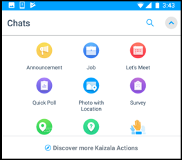

# Kaizala-AktionskartenKaizala Action Cards

Kaizala bietet Ihnen eine große Auswahl an Aktionskarten oder Mini-apps, die Ihre tägliche Arbeitsverwaltung einfach und effizient gestalten.Kaizala offers you wide range of action cards or mini apps that make your daily work management easy and efficient. Sie können die Out-of-Box (OOB)-Aktionskarten verwenden oder eigene angepasste Kaizala-Aktionen erstellen.You can use the Out-of-box(OOB) Action cards or create your own customized Kaizala Actions.

Folgende OOB-Aktionskarten sind verfügbar:Some of the OOB Action cards available are as follows:
- AnnouncementsAnnouncements
- Schnell Umfragen & UmfragenQuick Polls & Surveys
- Auftrag/AufgabenJob/Tasks
- BesprechungseinladungMeeting Invite
- Anwesenheits KarteAttendance Card
- Traning-KarteTraning Card
- Standort KarteLocation Card
- Weitere AktionenDiscover More Actions 

## AnnouncementsAnnouncements

Kaizala ermöglicht es Ihnen, Informationen über die Ansage Karte mit ihrer gesamten Organisation zu teilen.Kaizala enables you to share information with your entire organization in one go by means of Announcement card. Sie können Bilder, Tondokumente oder Videonachrichten sowie Dokumente in Kaizala-anSagen hinzufügen.You can add pictures, audio or video messages as well as documents in Kaizala Announcements.

Empfänger der Ankündigungen können diese Ankündigungen über likes and comments Feature einbinden.Receivers of the announcements can engage on this announcements through Likes and Comments feature.

![Ankündigungen] (Images/Actions1.png "Ankündigungen")

## Schnell Umfragen & UmfragenQuick Polls & Surveys

Kaizala bietet vordefinierte Aktionen für Umfragen und Umfragen, um schnell Daten aus dem Feld zu erfassen.Kaizala provides predefined Action for Polls and Surveys to quickly collect data from field. Die Datenaggregation ist direkt verfügbar, ohne dass etwas kompiliert werden muss.Data aggregation is available right there, without having to compile anything.
Während Umfragen einzelne Fragen unterstützen, unterstützen Umfragen mehrere Fragen und Fragetypen wie Multi-Choice, Date Type, numeric, Text etc.While Polls support single question, Surveys support multiple questions and question types like Multi-choice, date type, numeric, Text etc.

![Schnell Umfragen _AMP_ Umfragen] (Images/Actions2.png "Schnell Umfragen _AMP_ Umfragen")

## Auftrag/AufgabenJob/Tasks 
Kaizala ermöglicht es Ihnen, einem oder mehreren Einzelpersonen Aufträge oder Aufgaben zuzuweisen.Kaizala enables you to assign jobs or tasks to one or more individuals. Wenn Ihre Benutzer die Aufgaben ausführen, erhalten Sie eine Benachrichtigung.When your users complete the tasks, you get a notification. Außerdem können Sie den Status aller zugewiesenen Vorgänge unter ausStehende Aktionen im Profil **nach** verfolgen.Also, you can track status of all your assigned tasks under **Pending Actions** in Profile.

![Auftrag oder Aufgaben] (Images/Actions3.png "Auftrag oder Aufgaben")

 ## Anwesenheits KarteAttendance Card

Anwesenheits Karte ermöglicht das Sammeln von Standortkoordinaten mit oder ohne Foto von Mitgliedern Ihrer Gruppe.Attendance card enables you to collect location coordinates, with or without photo from members of your group. Dadurch wird sichergestellt, dass eine Person zu einem bestimmten Zeitpunkt an einem bestimmten Ort anwesend ist.This ensures a person is present at specific location at a specific time. Sie können den Bericht für dasselbe in Kaizala-Verwaltungsportal anzeigen.You can view the report for the same in Kaizala management portal.

![Anwesenheits Karte] (Images/ActionsAttendance.PNG "Anwesenheits Karte")
  
## Trainings KarteTraining Card
Kaizala ermöglicht es Ihnen, Schulungsinhalte zusammen mit Schulungsfragen/-Tests an Ihr Team zu senden.Kaizala enables you to send Training Content along with Training questions/quizzes to your team. Bericht für das gleiche ist auf Kaizala-Verwaltungs Portal verfügbar.Report for the same is available on Kaizala management Portal. Sie können Schulungen auf Kaizala schnell einrichten, wenn Schulungsinhalte und-Fragen bereit sind.You can setup Training on Kaizala quickly if training content and questions are ready.

![Trainings Karte] (Images/ActionsTraining.PNG "Trainings Karte")

## Standort KarteLocation Card

Kaizala bietet verschiedene standortbasierte Karten, die wie folgt aussehen:Kaizala provides various location based cards that are as follows:

1. Zum Nachverfolgen der aktuellen Position der gesamten Gruppe auf einer einzelnen Karte.To track on single map current location of your entire group.
2. , Um die Live-Standortkoordinaten eines oder mehrerer Mitglieder nachzuverfolgen.To track live location coordinates of one or more members.
3. Zum Nachverfolgen des Fotos mit dem Ort einer Person, um die Anwesenheit an einem Ort sicherzustellen.To track photo with location of a person to ensure presence at a location.

![Standort Karte] (Images/ActionsLocation.PNG "Standort Karte")

## Weitere AktionenDiscover More Actions

Weitere Kaizala-Aktionen finden Sie unter Discover.You can find many more Kaizala actions under Discover. Wenn Sie in Kaizala eigene angepasste Aktionen erstellen möchten, können Sie dies auch tun.If you would like to create your own customized actions in Kaizala, you can do that as well. 

![Weitere Aktionen] (Images/ActionsDiscoverMore.PNG "Weitere Aktionen")

In [diesem](../developer-platform.md) Abschnitt finden Sie weitere Informationen zum Anpassen und Erstellen Ihrer eigenen Aktionskarten.Refer to [this](../developer-platform.md) section for details on customizing and creating your own Action cards.
