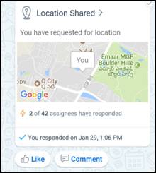

# Kaizala Aktion KartenKaizala Action Cards

Kaizala bietet Ihnen die Vielzahl von Aktion Karten "oder" Minisymbolleiste apps, die einfache und effiziente Verwaltung Ihrer täglichen Arbeit zu beeinträchtigen.Kaizala offers you wide range of action cards or mini apps that make your daily work management easy and efficient. Sie können die Karten Out-of-box(OOB)-Aktion verwenden oder Ihre eigenen benutzerdefinierten Kaizala Aktionen erstellen.You can use the Out-of-box(OOB) Action cards or create your own customized Kaizala Actions.

Einige der Aktion OOB-Karten lauten wie folgt:Some of the OOB Action cards available are as follows:
- AnnouncementsAnnouncements
- Schnelle Umfragen & UmfragenQuick Polls & Surveys
- Job-AufgabenJob/Tasks
- Meeting-EinladungMeeting Invite
- Anwesenheit-KarteAttendance Card
- Schulung-KarteTraning Card
- Standort-KarteLocation Card
- Ermittlung von weitere AktionenDiscover More Actions 

## AnnouncementsAnnouncements

Kaizala können Sie Informationen für die gesamte Organisation in eine Gehe über Ankündigung Karte freizugeben.Kaizala enables you to share information with your entire organization in one go by means of Announcement card. Sie können Grafiken, Audio- oder Videodatei Nachrichten sowie Dokumente in Kaizala Ankündigungen hinzufügen.You can add pictures, audio or video messages as well as documents in Kaizala Announcements.

Ereignisempfänger Ansagen können auf diese Ankündigungen über das Feature "gefällt mir" und Kommentare beteiligen.Receivers of the announcements can engage on this announcements through Likes and Comments feature.

![Ansagen] (Images/Actions1.png "Ansagen")

## Schnelle Umfragen & UmfragenQuick Polls & Surveys

Kaizala enthält vordefinierte-Aktion für Umfragen und Umfragen, um Daten aus dem Feld schnell zu erfassen.Kaizala provides predefined Action for Polls and Surveys to quickly collect data from field. Datenaggregation steht rechts vorhanden, ohne zu kompilieren.Data aggregation is available right there, without having to compile anything.
Umfragen unterstützt Umfragen Unterstützung der einzelnen Frage mehrere Fragen und Fragetypen wie Mehrfachauswahl, Date-Typ, numerisch, Text usw..While Polls support single question, Surveys support multiple questions and question types like Multi-choice, date type, numeric, Text etc.

![Schnelle Umfragen & Umfragen] (Images/Actions2.png "Schnelle Umfragen & Umfragen")

## Job-AufgabenJob/Tasks 
Kaizala können Sie eine oder mehrere Personen Aufträge oder Aufgaben zuweisen.Kaizala enables you to assign jobs or tasks to one or more individuals. Wenn Ihre Benutzer die Aufgaben ausführen, erhalten Sie eine Benachrichtigung.When your users complete the tasks, you get a notification. Darüber hinaus können Sie den Status der Ihnen zugeordneten Aufgaben unter **Ausstehende Aktionen** im Profil nachverfolgen.Also, you can track status of all your assigned tasks under **Pending Actions** in Profile.

![Auftrag oder Aufgaben] (Images/Actions3.png "Auftrag oder Aufgaben")

 ## Anwesenheit-KarteAttendance Card

Anwesenheit Karte ermöglicht Ihnen das Sammeln von Speicherort Koordinaten, mit oder ohne Foto von Mitgliedern der Gruppe.Attendance card enables you to collect location coordinates, with or without photo from members of your group. Dadurch wird sichergestellt, dass eine Person an bestimmten Position zu einem bestimmten Zeitpunkt vorhanden ist.This ensures a person is present at specific location at a specific time. Sie können den Bericht für den gleichen im Kaizala-Verwaltungsportal anzeigen.You can view the report for the same in Kaizala management portal.

![Anwesenheit-Karte] (Images/ActionsAttendance.PNG "Anwesenheit-Karte")
  
## Schulung-KarteTraining Card
Kaizala können Sie zusammen mit der Schulung Fragen/Quizfragen an Ihr Team Schulung Content senden.Kaizala enables you to send Training Content along with Training questions/quizzes to your team. Bericht für den gleichen ist auf Kaizala Management Portal verfügbar.Report for the same is available on Kaizala management Portal. Wenn die Schulungsinhalte und Fragen bereit sind, können Sie schnell Schulungen zu Kaizala einrichten.You can setup Training on Kaizala quickly if training content and questions are ready.

![Schulung-Karte] (Images/ActionsTraining.PNG "Schulung-Karte")

## Standort-KarteLocation Card

Kaizala bietet verschiedene Speicherort basierend Karten, die lauten wie folgt:Kaizala provides various location based cards that are as follows:

1. Auf einzelne Zuordnung aktuellen Speicherort des Ihre gesamte Gruppe verfolgen.To track on single map current location of your entire group.
2. Live Speicherort Koordinaten von einem oder mehreren Elementen zu verfolgen.To track live location coordinates of one or more members.
3. Foto mit Speicherort einer Person, um sicherzustellen, dass Anwesenheitsinformationen an einem Standort zu verfolgen.To track photo with location of a person to ensure presence at a location.

![Standort-Karte] (Images/ActionsLocation.PNG "Standort-Karte")

## Ermittlung von weitere AktionenDiscover More Actions

Finden Sie unter Übersicht über die Ermittlung viele weitere Kaizala-Aktionen.You can find many more Kaizala actions under Discover. Wenn Sie Ihre eigenen benutzerdefinierten Aktionen in Kaizala erstellen möchten, können Sie, die auch tun.If you would like to create your own customized actions in Kaizala, you can do that as well. 

![Ermittlung von weitere Aktionen] (Images/ActionsDiscoverMore.PNG "Ermittlung von weitere Aktionen")

Finden Sie ausführliche Informationen zum Anpassen und Erstellen eigener Aktion Karten [in diesem](../developer-platform.md) Abschnitt.Refer to [this](../developer-platform.md) section for details on customizing and creating your own Action cards.
