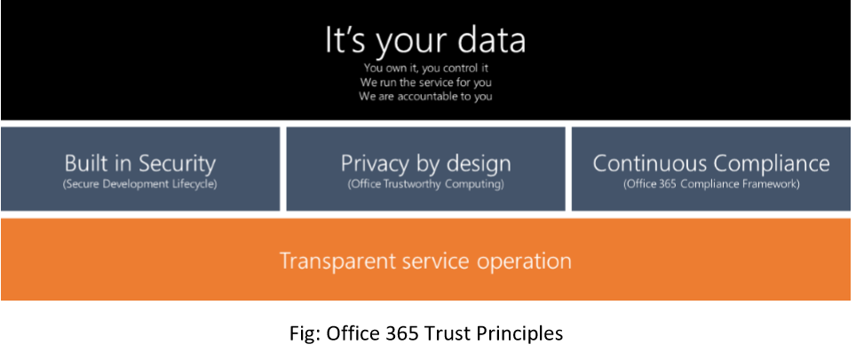

# Sicherheit & Compliance-Übersicht

Sicherheit und Compliance sind eine der wichtigsten Säulen für Microsoft Kaizala, die basierend auf den unten beschriebenen Office 365 Trust Principles entwickelt wurde –

  * Kaizala bietet Kunden vollständigen Besitz für Ihre Organisationsgruppen. 
  * Kaizala folgt den standardmäßigen SDL-Methoden (Security Development Lifecycle) für alle Phasen der Produktentwicklung, einschließlich Design, Entwicklung, Bereitstellung und Betrieb. Die bewährten Vorgehensweisen wie Verteidigungs Tiefe, Zugriff mit geringsten Rechten usw. werden angewendet.
  * Kaizala-Methoden für die Verwaltung von Office Trustworthy Computing (OTwC) zur Verarbeitung der Organisation und der einzelnen Daten 
  * Kaizala folgt Office 365 Compliance Framework für Datenverarbeitungs Standards für Speicherung, Aufbewahrung und Übertragung.
  * Kaizala wird auf der weltweiten Office 365/Azure Data Center-Infrastruktur gehostet, die mit dem transparenten Dienstbetrieb ausgeführt wird.
  
Dieser Abschnitt befasst sich mit den Vorgehensweisen für Sicherheits-, Datenschutz-und Compliance-Verfahren für Microsoft Kaizala, was nicht nur das Engagement von Microsoft für diese Punkte hervorhebt, sondern auch dazu beiträgt, dass technische und geschäftliche Entscheidungsträger besser verstehen, wie Microsoft verarbeitet Kundendaten mit größter Sorgfalt.

* [Sicherheit für endKunden](SecurityFeaturesforendcustomers.md)
* [Sicherheit](Security.md)
* [Datenschutz](Privacy.md)
* [Compliance](Compliance.md)

