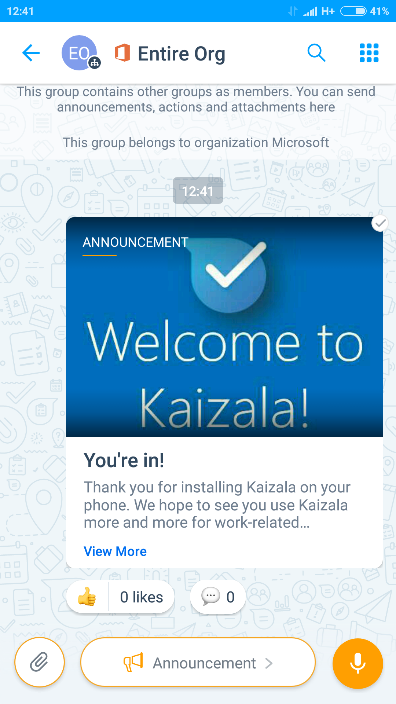

[3]: https://play.google.com/store/apps/details?id=com.microsoft.mobile.polymer&hl=en
[4]: https://itunes.apple.com/in/app/microsoft-kaizala/id1112208399?mt=8
[5]: http://manage.kaiza.la/
[7]: https://github.com/MicrosoftDocs/kaizala-docs
# Verwenden von Kaizala
###### Kaizala kann im [Google Play Store] [ 3] für Android oder [App Store] [ 4] für iPhones installiert werden.
##  Abrufen von Kaizala, die von ihren Organisations Benutzern installiert werden
###### Das Steuern der App-Installation in ihrer org wäre für den Erfolg dieses Projekts sehr wichtig. Hier finden Sie einige Methoden, die von anderen Kunden verwendet werden:
###### &nbsp;&nbsp;&nbsp;&nbsp;&nbsp;&nbsp;• Klicken Sie in der Kaizala-App auf Gruppenname, und klicken Sie auf alle einladen, um eine Textnachricht zu senden, um alle Mitglieder einzuladen.
###### &nbsp;&nbsp;&nbsp;&nbsp;&nbsp;&nbsp;• Senden Sie eine e-Mail an People Sharing Value Prop und einen Link zum herunterladen.
###### &nbsp;&nbsp;&nbsp;&nbsp;&nbsp;&nbsp;• Senden von Nachrichten an die Organisations-WhatsApp-Gruppen mit dem Download-Link.   
###### &nbsp;&nbsp;&nbsp;&nbsp;&nbsp;&nbsp;• Senden Sie Bulk-SMS an Personen mit dem Download-Link. 
###### &nbsp;&nbsp;&nbsp;&nbsp;&nbsp;&nbsp;• Entwerfen Sie Kaizala Poster, und platzieren Sie Sie an Stellen, an denen Sie von jedem angezeigt werden können.
###### &nbsp;&nbsp;&nbsp;&nbsp;&nbsp;&nbsp;• Anreize Personen zur Installation von Kaizala mit Early Bird Winner oder mit Quiz oder Best Picture Submission Survey, etc.
##  Suchen von Benutzern, die Kaizala/Benutzer Aktivierungsdaten installiert haben
###### Im Kaizala-Verwaltungs Portal können Sie eine CSV-Datei herunterladen, in der der Status der Kaizala für jeden Benutzer angezeigt wird.
###### &nbsp;&nbsp;&nbsp;&nbsp;&nbsp;&nbsp;1.   melden sie sich auf dem [Kaizala-verwaltungs Portal] [ 5] mit ihren Office 365-anmeldeinformationen oder Kaizala Pro-anmeldeinformationen an.  
###### &nbsp;&nbsp;&nbsp;&nbsp;&nbsp;&nbsp;2.   Klicken Sie Links auf die Registerkarte __Gruppen__ , und klicken Sie auf den Namen Ihrer Gruppe.  
###### &nbsp;&nbsp;&nbsp;&nbsp;&nbsp;&nbsp;3.   Sie können sehen, dass die Mitglieder registriert oder nicht registriert sind (Kaizala nicht installiert). Sie können auch die Option Benutzer > initiieren > Download verwenden, um diese Details in einer CSV-Datei abzurufen.   

##  Ermitteln, ob Benutzer Kaizala/Kaizala-Verwendungsdaten verwenden
###### Sie können überwachen, ob Benutzer Kaizala mithilfe des Kaizala-Verwaltungsportals verwenden.
###### &nbsp;&nbsp;&nbsp;&nbsp;&nbsp;&nbsp;1.   melden sie sich auf dem [Kaizala-verwaltungs Portal] [ 5] mit ihren Office 365-anmeldeinformationen oder Kaizala Pro-anmeldeinformationen an.  
###### &nbsp;&nbsp;&nbsp;&nbsp;&nbsp;&nbsp;2.   Klicken Sie Links auf die Registerkarte **Gruppen** , und klicken Sie auf den Namen Ihrer Gruppe.  
###### &nbsp;&nbsp;&nbsp;&nbsp;&nbsp;&nbsp;3.   Klicken Sie im linken Bereich auf Berichte, und klicken Sie auf Usage teleMetrie, um die Verwendung von Kaizala in ihren Gruppen zu überwachen.   

##  Senden Sie Ihre erste Nachricht

|Veröffentlichen einer Willkommens Ansage  

Sie können eine Willkommensnachricht an alle Benutzer in Ihrer Organisation senden, um Sie auf Kaizala zu übertragen.

Senden Sie diese Nachricht aus der oberen Gruppe als Ansage. Bild oder Audiodaten hinzufügen, um Sie ansprechender zu machen.

Incept People, um einige Kommentare oder wie die Ankündigung zu schreiben, um das Engagement gestartet. |||
|-------|-------|-------|
|**_Veröffentlichen einer Umfrage_** 

 Senden Sie eine kurze Umfrage, um mit ihren Benutzern zu beginnen. 
Öffnen Sie die Gruppe, von der Sie das senden möchten. Wenn Sie an alle Mitarbeiter senden möchten, senden Sie von der obersten Gruppe.
Klicken Sie einfach oben rechts auf das Aktionssymbol, und klicken Sie auf Schnellabfrage. Nehmen Sie eine Meinungsumfrage zu etwas, was vielen lieb ist. Wenn Sie eine Entscheidung treffen oder auf der Grundlage dieser Maßnahme handeln können – noch besser! Mundpropaganda wird sich ausbreiten, und die Benutzer werden mehr bereit zu laden. |||
###### Nachdem Sie eine kritische Masse Ihrer Organisation mithilfe von Kaizala haben, können Sie die Erstellung/Migration von benutzerdefinierten/Branchen-apps auf Kaizala oder das Integrieren von Kaizala-Daten in Ihre vorhandenen DB oder Workflows mithilfe der [Kaizala-Entwicklerplattform] auswerten.[7]
